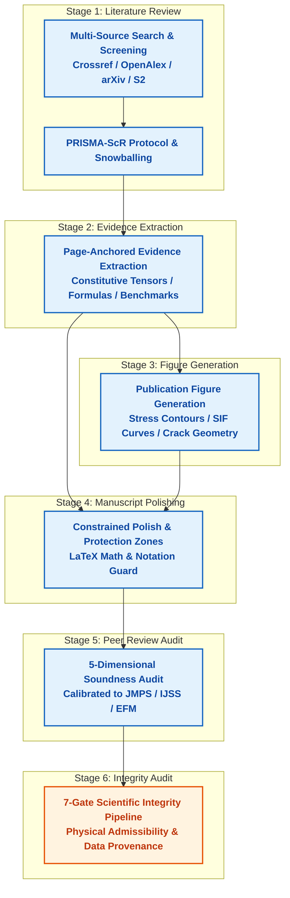

# Mechanics Agent Skills: Evidence-Anchored Solid Mechanics Research Suite

[](https://www.python.org/downloads/)
[](https://opensource.org/licenses/MIT)
[-success.svg)](https://docs.python.org/3/library/)
[-brightgreen.svg)](tests/)

A domain-tailored research and automation ecosystem engineered for autonomous agents and researchers working in Solid Mechanics, Fracture Mechanics, Elasticity, and Applied Mathematics.

---

## Overview

Engineering research in continuum mechanics presents unique requirements that generic academic search engines and general-purpose language models fail to meet. General search systems lack mechanics-aware taxonomies and miss critical constitutive laws, complex potentials, or singular asymptotic representations. Generalist language models frequently introduce subtle mathematical errors, such as misidentifying tensor symmetries, modifying index conventions, or altering sign conventions in energy release rate expressions.

Mechanics Agent Skills provides a unified, production-grade ecosystem of six standardized skills and a resumable workflow engine. The core framework runs with zero required external runtime dependencies, using standard Python libraries for literature search, citation snowballing, text extraction, manuscript polishing, peer review auditing, and scientific integrity verification. Optional extras provide hardware-accelerated PDF rendering, publication-standard vector figure generation, and high-throughput network transport.

### Core Capabilities

- Zero Runtime Dependencies: The core framework relies exclusively on the Python standard library (`urllib`, `sqlite3`, `dataclasses`, `re`, `json`, `hashlib`, `math`, `pathlib`).
- 6-Skill Standard Suite: Covers the research lifecycle from literature discovery to peer review auditing.
- Resumable Workflow Engine: Manages multi-stage DAG pipelines with deterministic SHA-256 hash invalidation, executing only modified stages and preserving unaffected upstream artifacts.
- 7-Gate Scientific Integrity Pipeline: Enforces mechanical and physical admissibility gates, including constitutive tensor positive-definiteness, stress intensity factor scaling, and boundary condition consistency.
- Protected Manuscript Polishing: Preserves inline LaTeX math, display equations, citations, and tensor notation while identifying vague physical phrasing and discipline clichés.
- Calibrated Peer Review: Evaluates manuscripts against top mechanics journal profiles (JMPS, IJSS, EFM, IJF, CMAME) across five dimensions of scientific soundness.
- Publication-Ready Figures: Generates vector and raster mechanics figures adhering to single-column (85 mm) and double-column (175 mm) standards with automated colormap audits.
- Self-Contained Distribution: Bundles each skill with vendored core libraries for direct installation into local and global agent stores (`~/.agents/skills`).

---

## Agent Skills Suite

The repository provides six standardized skills conforming to the Agent Skills specification:

| Skill | Directory | Primary Focus | Key Outputs |
|---|---|---|---|
| **mechanics-scoping-review** | [mechanics-scoping-review/](mechanics-scoping-review/) | PRISMA-ScR systematic review orchestration, multi-database search, 5D rubric scoring, and citation snowballing | PRISMA flowchart (`.mmd`), BibTeX library (`.bib`), screening audit log (`.json`), review draft (`.md`) |
| **openalex-database** | [openalex-database/](openalex-database/) | High-throughput exploration of the OpenAlex knowledge graph with polite pool compliance (10 req/s) | Works metadata, author profiles, institutional affiliations, citation graphs |
| **mechanics-evidence-extraction** | [mechanics-evidence-extraction/](mechanics-evidence-extraction/) | Deep extraction of constitutive tensors ($C_{ijkl}$, $S_{ijkl}$), energy release rates ($G, J, K$), and complex potentials | Page-anchored evidence cards (`.json`), Markdown synthesis matrix (`.md`) |
| **mechanics-figure** | [mechanics-figure/](mechanics-figure/) | Publication-ready mechanics visualizations adhering to international journal formatting standards | Vector SVG/PDF, 300+ DPI PNG, audit findings log, metadata manifest (`.json`) |
| **mechanics-paper-polishing** | [mechanics-paper-polishing/](mechanics-paper-polishing/) | Non-destructive manuscript polishing with protected mathematical zones and mechanics cliché detection | Protected zones analysis (`.json`), polished text, character-level diff audit (`.json`) |
| **mechanics-paper-reviewer** | [mechanics-paper-reviewer/](mechanics-paper-reviewer/) | Journal-calibrated simulated peer review and five-dimensional soundness evaluation | Soundness audit report (`.md`), review package (`.json`), revision comparison (`.json`) |

---

## End-to-End Workflow Architecture

The research lifecycle is orchestrated as a directed acyclic graph by `mechanics-workflow`:



### Resumable DAG Execution & State Invalidation

The workflow engine evaluates data dependencies at each stage:

- Every stage calculates an input hash combining upstream artifact signatures, manuscript contents, and stage options.
- When an upstream stage produces modified outputs, all downstream dependent stages are marked stale and automatically re-executed.
- Unchanged stages preserve their completed state, eliminating redundant calculations.
- Stage states, execution timestamps, artifact paths, warnings, and handoff summaries are recorded atomically in `workflow.manifest.json`.

---

## Seven-Gate Scientific Integrity Pipeline

The integrity engine evaluates manuscripts and extracted datasets against seven gates designed specifically for continuum mechanics:

1. **Gate G1: Constitutive & Symmetry Constraints**
   - Validates minor and major symmetries of stiffness ($C_{ijkl}$) and compliance ($S_{ijkl}$) tensors.
   - Verifies positive-definiteness of elasticity tensors through eigenvalue analysis.
   - Confirms square-root singularity scaling for asymptotic stress intensity factors ($\\sigma \\sim K r^{-1/2}$).

2. **Gate G2: Evidence Grounding & Citation Traceability**
   - Flags claims derived solely from unverified abstracts without primary literature backing.
   - Verifies bibliographic reference completeness and flags uncited numerical claims.

3. **Gate G3: Provenance & Data Traceability**
   - Computes deterministic SHA-256 digests of all raw simulation datasets and figure inputs.
   - Audits data availability statements and records explicit provenance hashes in publication manifests.

4. **Gate G4: Benchmark Independence**
   - Detects circular benchmarks where proposed models are validated solely against their own calibrations.
   - Ensures independent comparisons against canonical analytical baselines such as Westergaard or Sneddon solutions.

5. **Gate G5: Phenomenological Discrepancy Verification**
   - Screens for numerical artifacts or mesh convergence issues reported erroneously as novel physical phenomena.

6. **Gate G6: Dimensional & Assumption Consistency**
   - Identifies contradictions between kinematic assumptions such as plane stress versus plane strain.
   - Audits out-of-plane constraint definitions and boundary condition compatibility.

7. **Gate G7: Scope & Generalization Boundary**
   - Enforces explicit reporting of validity boundaries including small-scale yielding limits and linear elasticity cutoffs.
   - Flags unauthorized extrapolation beyond validated asymptotic or material regimes.

---

## Quick Installation

### Standard Installation (Zero Dependencies)

The core framework operates immediately with the Python standard library:

```bash
git clone https://github.com/academic-mechanics/mechanics-agent-skills.git
cd mechanics-agent-skills
pip install -e .
```

### Optional Extras

Install optional dependencies to enable specialized capabilities:

```bash
# Publication figure rendering (matplotlib, numpy)
pip install -e ".[figure]"

# Accelerated PDF extraction (PyMuPDF)
pip install -e ".[pdf]"

# High-throughput asynchronous HTTP transport (httpx)
pip install -e ".[http]"

# Complete development and testing environment
pip install -e ".[dev,figure,pdf,http]"
```

---

## CLI Reference

The package installs ten command-line entry points alongside the unified `mechanics-skills` dispatcher:

### Unified Dispatcher (`mechanics-skills`)

Run any subcommand through the primary entry point:

```bash
mechanics-skills <command> [options]
```

Supported subcommands: `search`, `citations`, `oa`, `extract`, `review`, `figure`, `polish`, `peer-review`, `integrity`, `workflow`.

---

### 1. Multi-Source Literature Retrieval (`mechanics-search`)

Searches across Crossref, OpenAlex, arXiv, and Semantic Scholar with automatic DOI deduplication and mechanics taxonomy expansion:

```bash
# Query literature across default databases
mechanics-search "anisotropic interface crack" --limit 15

# Expand query with continuum mechanics taxonomy terms
mechanics-search "Stroh formalism" --expand --format markdown

# Save results to JSON and Markdown summary table
mechanics-search "phase field fracture toughness" --output results.json --markdown summary.md
```

---

### 2. Citation Snowballing & Main Path (`mechanics-citations`)

Traverses forward and backward citation networks through OpenAlex, identifies developmental trajectories, and exports network diagrams:

```bash
# Analyze citation trajectory for a foundational mechanics paper
mechanics-citations "10.1016/0020-7683(83)90045-8" --limit 20

# Export citation network diagram to Mermaid
mechanics-citations "10.1016/0020-7683(83)90045-8" --format mermaid --mermaid network.mmd
```

---

### 3. Open Access PDF Discovery (`mechanics-oa`)

Locates verified legal Open Access PDFs using Unpaywall and OpenAlex fallback:

```bash
mechanics-oa "10.1016/j.engfracmech.2020.107000"
```

---

### 4. Evidence & Formula Extraction (`mechanics-extract`)

Extracts constitutive tensors, defect geometry parameters, energy release rate expressions, and benchmark comparison tables:

```bash
# Extract evidence cards from a research PDF
mechanics-extract paper.pdf --doi "10.1016/j.jmps.2021.104432" --output evidence.json --markdown matrix.md

# Extract evidence from plain text or OCR output
mechanics-extract document.txt --title "Stroh Formulation for Anisotropic Wedges" --format markdown
```

---

### 5. End-to-End PRISMA Scoping Review (`mechanics-review`)

Executes the complete PRISMA-ScR protocol, including multi-database search, 5D rubric screening, BibTeX generation, and flowchart synthesis:

```bash
mechanics-review "anisotropic interface crack fracture mechanics" \
  --limit 20 \
  --expand \
  --output-dir ./review_artifacts
```

Generated outputs in `./review_artifacts`:

- `prisma_flowchart.mmd`: Publication-ready PRISMA flowchart in Mermaid format.
- `references.bib`: Deduplicated, verified BibTeX records for included studies.
- `screening_log.json`: Screening audit log containing 5D rubric evaluation scores.
- `review_draft.md`: Narrative synthesis with structured evidence tables.

---

### 6. Publication Figure Generation (`mechanics-figure`)

Generates publication-standard mechanics visualizations with strict adherence to dimensional and accessibility requirements:

```bash
# Render figure from a FigureSpec JSON configuration
mechanics-figure render examples/figures/sif/spec.json --output-dir artifacts/figures

# Validate a FigureSpec before rendering
mechanics-figure validate examples/figures/sif/spec.json

# Generate a starter FigureSpec template for a specific figure type
mechanics-figure template sif_curve --output spec_template.json
```

Available templates: `sif_curve`, `stress_contour`, `interaction_heatmap`, `asymptotic_comparison`, `crack_geometry`.

---

### 7. Constrained Manuscript Polishing (`mechanics-polish`)

Improves manuscript prose while safeguarding mathematical expressions, citations, and physical notation conventions:

```bash
# Analyze manuscript for protected zones, cliches, and notation warnings
mechanics-polish analyze examples/polishing/manuscript.md --conventions examples/polishing/conventions.json

# Prepare a structured proposal generation package for language models
mechanics-polish prepare examples/polishing/manuscript.md --output-dir artifacts/polishing

# Validate edit proposals against protected zones
mechanics-polish validate examples/polishing/manuscript.md proposals.json

# Safely apply validated edit proposals and generate diff records
mechanics-polish apply examples/polishing/manuscript.md proposals.json --output polished_paper.md --diff diffs.json
```

---

### 8. Simulated Peer Review & Soundness Audit (`mechanics-peer-review`)

Conducts rigorous journal-calibrated peer review across five dimensions: Mathematical Rigor, Theoretical Consistency, Experimental/Computational Validity, Scope & Limits, and Literature Context:

```bash
# Audit a manuscript against a target journal profile (e.g. jmps, ijss, efm, ijf, cmame)
mechanics-peer-review audit examples/reviewer/manuscript.md --journal jmps --markdown report.md

# Prepare a comprehensive review package for reviewer agents
mechanics-peer-review prepare examples/reviewer/manuscript.md --journal jmps --output-dir artifacts/review_pkg

# Compare a revised manuscript against previous review findings
mechanics-peer-review compare previous_review.json revised_manuscript.md --output comparison.json

# Render an existing review audit JSON as a Markdown report
mechanics-peer-review report review_audit.json --output report.md
```

---

### 9. Seven-Gate Scientific Integrity Audit (`mechanics-integrity`)

Audits manuscripts or workflow run configurations through the complete 7-gate scientific integrity pipeline:

```bash
# Run integrity check on a manuscript
mechanics-integrity check examples/reviewer/manuscript.md

# Run integrity check on a workflow run configuration
mechanics-integrity check examples/workflow/run.json --format json --output integrity_report.json
```

Exit codes indicate audit readiness:

- `0`: Pass (Ready for author review).
- `2`: Needs evidence (minor warnings present).
- `4`: Blocked (critical physical or mathematical violations detected).

---

### 10. Resumable Research Workflow Engine (`mechanics-workflow`)

Executes and manages the end-to-end multi-stage research lifecycle:

```bash
# Execute full workflow from configuration
mechanics-workflow run examples/workflow/run.json --output-dir artifacts/workflow-run

# Run workflow in offline deterministic mode using local fixtures
mechanics-workflow run examples/workflow/run.json --offline

# Resume an existing workflow run from manifest
mechanics-workflow resume artifacts/workflow-run/workflow.manifest.json

# Check current execution status of a workflow run
mechanics-workflow status artifacts/workflow-run/workflow.manifest.json
```

---

## Standalone Skill Packaging & Distribution

Each skill can be packaged into an independent, self-contained directory that vendors `mechanics_skills` inside its `scripts/_vendor/` directory. This allows agent systems (such as Codex, Claude Code, Cursor, and OpenDevin) to invoke any skill directly without requiring package pre-installation.

### Rebuilding Bundles

To build self-contained bundles and zip archives for all six skills:

```bash
python tools/build_skill_bundles.py --out dist/skills
```

### Global Synchronization

To build and synchronize all skill bundles directly to the user's global agent skills store (`~/.agents/skills`):

```bash
python tools/build_skill_bundles.py --sync-global
```

Alternatively, use the standalone synchronization utility to inspect or dry-run changes:

```bash
# Inspect pending skill updates
python tools/sync_skills.py --source dist/skills --target ~/.agents/skills --dry-run

# Apply updates to target directory
python tools/sync_skills.py --source dist/skills --target ~/.agents/skills --apply
```

---

## Verification & Testing

The test suite validates deterministic offline behavior across all components with 100% mocked network isolation:

```bash
# Run complete test suite
python -m pytest tests/ -v
```

```text
============================= test session starts =============================
platform win32 -- Python 3.12.10, pytest-9.1.1, pluggy-1.6.0
collected 101 items

tests/test_citations.py ...................................             PASSED
tests/test_distribution.py ...                                          PASSED
tests/test_e2e.py .                                                     PASSED
tests/test_extraction.py ...                                            PASSED
tests/test_figure.py ..........                                         PASSED
tests/test_http.py ........                                             PASSED
tests/test_identifiers.py ....                                          PASSED
tests/test_integrity.py ...........                                     PASSED
tests/test_integrity_pipeline.py ........                               PASSED
tests/test_legacy_cli.py .....                                          PASSED
tests/test_polishing.py .........                                       PASSED
tests/test_providers.py ......                                          PASSED
tests/test_reviewer.py .......                                          PASSED
tests/test_screening.py .....                                           PASSED
tests/test_search.py ......                                             PASSED
tests/test_skill_contracts.py .                                         PASSED
tests/test_workflow.py ......                                           PASSED
tests/test_writing.py ....                                              PASSED

============================= 101 passed in 6.06s =============================
```

Test coverage includes:

- Multi-source provider parsing and error handling (Crossref, OpenAlex, arXiv, Semantic Scholar, Unpaywall).
- Deduplication keys, normalized DOIs, and fuzzy title matching.
- 5-Dimensional screening rubrics and PRISMA counter state transitions.
- Citation snowballing, SPC topological link weights, and main path extraction.
- Page-anchored evidence extraction from PDFs and plain text.
- Publication figure validation, DPI scaling, and colormap auditing.
- Mathematical protection zone boundaries, mechanics cliché detection, and safe edit application.
- Journal-calibrated peer review scoring, soundness auditing, and revision comparison.
- 7-Gate scientific integrity pipeline and physical admissibility checks.
- Workflow DAG scheduling, input hashing, and manifest persistence.
- Skill bundle discovery, vendoring, and global distribution synchronization.

---

## Documentation

For comprehensive architectural design, provider protocol constraints, and packaging guides, see:

- [System Architecture & Topology](docs/architecture.md): Microkernel structure, component interactions, 7-gate scientific integrity rules, and resumable DAG scheduling.
- [Academic Provider Policies & Etiquette](docs/provider-policy.md): Rate limits, polite headers, cursor pagination, and protocol requirements for Crossref, OpenAlex, arXiv, Semantic Scholar, and Unpaywall.
- [Standalone Packaging & Global Synchronization](docs/distribution.md): Vendoring mechanism, bundle generation, and non-destructive deployment to ~/.agents/skills.

---

## License

This project is licensed under the [MIT License](LICENSE).
