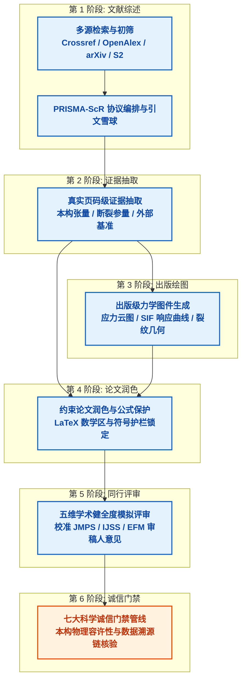

[简体中文](README.md) | [English](README_en.md)

# Mechanics Agent Skills: 证据驱动的固体力学研究智能体套件

[](https://www.python.org/downloads/)
[](https://opensource.org/licenses/MIT)
[-success.svg)](https://docs.python.org/3/library/)
[-brightgreen.svg)](tests/)

专门面向**固体力学、断裂力学、弹性力学与应用数学**领域的科研人员与自主智能体（Autonomous Agents）构建的学术全生命周期研究与自动化生态。

---

## 概述

连续介质力学的理论与计算研究具有极为严苛的物理和数学要求，通用学术检索工具与普通大语言模型往往难以满足：
- 通用学术检索缺乏连续介质力学专属本体（Taxonomy），难以精准召回本构定律、复变势函数或渐近奇异场解；
- 通用大语言模型缺乏严谨的物理护栏，经常自作聪明地“纠正”公式，篡改张量对称性、颠倒单侧位移与裂纹开度，或混淆能量释放率中的符号与因子。

**Mechanics Agent Skills** 提供了一套由六大标准化智能体技能与可恢复工作流引擎组成的生产级生态体系。微内核架构基础能力完全基于 Python 标准库实现，实现**零外部硬性运行时依赖**。文献检索、引文滚雪球、真实页码证据抽取、论文公式锁定润色、模拟顶级期刊评审以及七大科学诚信门禁均可开箱即用；高级出版绘图、硬件加速 PDF 解析与异步网络传输则通过可选依赖优雅降级。

### 核心特性

- **零外部运行时依赖**：微内核仅基于 Python 标准库（`urllib`、`sqlite3`、`dataclasses`、`re`、`json`、`hashlib`、`math`、`pathlib`），绝不在基础导入时强装第三方包。
- **6 大标准化力学技能**：覆盖文献检索、知识图谱、页码级证据抽取、出版级绘图、公式受保护润色与模拟同行评审的全研究生命周期。
- **可恢复工作流 DAG 引擎**：基于输入 SHA-256 签名失效机制与系统级原子写入，仅重跑上游被修改的依赖阶段，完整保留不受影响的历史工件。
- **7 大科学诚信门禁 (G1~G7)**：内置弹性刚度张量正定性检验、应力强度因子 $r^{-1/2}$ 奇异性标度、数据哈希溯源与基准独立性核查。
- **受保护的论文语言润色**：严格锁定行内/行间 LaTeX 数学公式、引用角标与张量记号，剥离机械的 AI 套话并实施物理混淆护栏。
- **校准顶级力学期刊的模拟审稿**：依据 *JMPS*、*IJSS*、*EFM*、*Acta Mechanica Sinica* 审稿人评价标准，执行五维学术健全度审计并生成修订台账。
- **出版级科学绘图引擎**：自动输出符合国际期刊物理尺寸标准（单栏 85 mm、双栏 175 mm）的矢量图与高分辨率位图，内置 Okabe-Ito 色弱友好色盘与数据清单契约。
- **自包含分发与安全同步**：内置 vendor 核心包机制，支持一键安全部署至全局智能体技能库（`~/.agents/skills`），并自动生成时间戳备份。

---

## 智能体技能矩阵 (Agent Skills Suite)

代码库提供六个完全符合 Agent Skills 规范的标准化独立技能：

| 技能名称 | 目录入口 | 核心职责 | 关键产出物 |
|---|---|---|---|
| **mechanics-scoping-review** | [mechanics-scoping-review/](mechanics-scoping-review/) | PRISMA-ScR 系统文献综述编排、多数据库检索、五维力学量规打分与引文滚雪球 | PRISMA 流程图 (`.mmd`)、BibTeX 数据库 (`.bib`)、初筛审计日志 (`.json`)、综述草稿 (`.md`) |
| **openalex-database** | [openalex-database/](openalex-database/) | 全球 2.5 亿学术实体图谱高通量查询（遵守 10 req/s 礼貌池协议） | 论文元数据、学者画像、机构归属、正反向引用图谱 |
| **mechanics-evidence-extraction** | [mechanics-evidence-extraction/](mechanics-evidence-extraction/) | 真实页码级抽取本构刚度/柔度张量 ($C_{ijkl}, S_{ijkl}$)、能量释放率 ($G, J, K$) 及复变势函数 | 页码级证据卡片 (`.json`)、Markdown 结构化证据矩阵 (`.md`) |
| **mechanics-figure** | [mechanics-figure/](mechanics-figure/) | 固体力学与断裂力学出版级可视化，严格遵守国际顶刊排版与配色标准 | 矢量 PDF/SVG、300+ DPI PNG、色盘审计日志、数据清单 (`figure.manifest.json`) |
| **mechanics-paper-polishing** | [mechanics-paper-polishing/](mechanics-paper-polishing/) | 非破坏性论文语言润色，建立 LaTeX 公式保护区并实施力学混淆护栏 | 保护区分析日志 (`.json`)、润色后手稿、字符级差异审计 (`.json`) |
| **mechanics-paper-reviewer** | [mechanics-paper-reviewer/](mechanics-paper-reviewer/) | 顶刊校准的模拟同行评审，执行五维学术健全度审核与修订跟踪 | 健全度审计报告 (`.md`)、审稿任务包 (`.json`)、多轮修订对比 (`.json`) |

---

## 端到端工作流架构 (End-to-End Workflow Architecture)

全生命周期的科研流转由 `mechanics-workflow` 编排为有向无环图（DAG）：



### 可恢复 DAG 调度与状态失效机制

- **确定性哈希**：每个阶段根据其上游工件数字指纹、手稿文本及配置参数计算专属 SHA-256 输入哈希。
- **精准重跑**：上游产生改动时，仅关联下游被标记为失效并自动重新执行；未发生变化的阶段直接复用历史完成状态。
- **系统级原子写入**：所有执行状态、工件路径、警告提示及交接备忘录均通过系统级原子替换持久化至 `workflow.manifest.json`。

---

## 七大科学诚信门禁 (Seven-Gate Pipeline)

诚信引擎针对连续介质力学研究专门部署了 7 类确定性审计规则：

1. **门禁 G1：本构容许性与标度约束 (Constitutive & Scaling)**
   - 验证弹性刚度 ($C_{ijkl}$) 与柔度 ($S_{ijkl}$) 张量的主、次对称性。
   - 通过特征值分析核查弹性张量的正定性（能量热力学稳定性）。
   - 验证渐近应力强度因子的平方根奇异性标度（$\sigma \sim K r^{-1/2}$）。

2. **门禁 G2：证据来源与引文忠实度 (Evidence Grounding)**
   - 区分真实 PDF 证据与摘要来源，未阅读全文时禁止标注虚假页码。
   - 审核文献引用的完整性，拦截缺乏来源支撑的悬空数值结论。

3. **门禁 G3：数据出处可溯性 (Data Provenance)**
   - 为图表原始数据计算确定性 SHA-256 哈希。
   - 强制将论文插图与模拟数据集进行数据指纹绑定。

4. **门禁 G4：基准独立性 (Benchmark Independence)**
   - 识别求解器“自我验证”的伪基准闭环。
   - 确保数值解与真正独立的经典解析解（如 Sneddon、Westergaard 解）进行比对。

5. **门禁 G5：伪物理现象防范 (Phenomenological Verification)**
   - 筛查由网格畸变、奇异性截断误差引发的数值假象，防止将数值振荡误报为物理新机理。

6. **门禁 G6：运动学与量纲一致性 (Dimensional & Kinematic)**
   - 审查平面应力与平面应变假设之间可能存在的逻辑矛盾，核查面外约束与边界条件相容性。

7. **门禁 G7：适用范围与极限假设锁定 (Scope & Boundary)**
   - 强制标明小范围屈服准则与线弹性截止阈值等有效性边界，防止向未经验证的非线性区域过度外推。

---

## 快速安装与依赖分层

### 1. 基础微内核安装（零依赖运行）

基础微内核仅需 Python 3.10+ 标准库即可完整运行：

```bash
git clone https://github.com/yq04/mechanics-agent-skills.git
cd mechanics-agent-skills
pip install -e .
```

### 2. 可选扩展依赖安装

根据研究任务按需选装功能增强包：

```bash
# 安装出版级力学绘图支持 (matplotlib, numpy)
pip install -e ".[figure]"

# 安装硬件加速 PDF 二进制流解析 (PyMuPDF)
pip install -e ".[pdf]"

# 安装高通量异步 HTTP 传输加速 (httpx)
pip install -e ".[http]"

# 一键安装全套开发、测试与渲染依赖
pip install -e ".[dev,figure,pdf,http]"
```

---

## CLI 命令行工具速查

套件提供了统一的总入口 `mechanics-skills` 及 10 个独立命名的专业命令：

### 统一调度入口 (`mechanics-skills`)

```bash
mechanics-skills <command> [options]
```

支持的子命令包括：`search`, `citations`, `oa`, `extract`, `review`, `figure`, `polish`, `peer-review`, `integrity`, `workflow`。

---

### 1. 多源文献检索 (`mechanics-search`)

跨 Crossref、OpenAlex、arXiv 与 Semantic Scholar 进行联合检索，自动去重并扩展力学专属本体：

```bash
# 检索特定课题文献
mechanics-search "anisotropic interface crack" --limit 15

# 自动激活力学本体术语扩展
mechanics-search "Stroh formalism" --expand --format markdown

# 保存为 JSON 数据集与 Markdown 摘要表
mechanics-search "phase field fracture toughness" --output results.json --markdown summary.md
```

---

### 2. 引文滚雪球与主路径分析 (`mechanics-citations`)

通过 OpenAlex 知识图谱遍历双向引文网络，提取学科发展的主拓扑路径：

```bash
# 分析力学奠基性论文的发展主路径
mechanics-citations "10.1016/0020-7683(83)90045-8" --limit 20

# 导出 Mermaid 格式的引文网络图
mechanics-citations "10.1016/0020-7683(83)90045-8" --format mermaid --mermaid network.mmd
```

---

### 3. 合法开放获取 PDF 探测 (`mechanics-oa`)

通过 Unpaywall 与 OpenAlex 探测合法开放获取的全文 PDF 链接：

```bash
mechanics-oa "10.1016/j.engfracmech.2020.107000"
```

---

### 4. 页码级证据与公式抽取 (`mechanics-extract`)

从文献中高保真抽取本构张量、缺陷几何参数、能量释放率公式与数值对比表：

```bash
# 从学术 PDF 抽取结构化力学证据卡片
mechanics-extract paper.pdf --doi "10.1016/j.jmps.2021.104432" --output evidence.json --markdown matrix.md

# 从文本块或 OCR 结果中抽取
mechanics-extract document.txt --title "Stroh Formulation for Anisotropic Wedges" --format markdown
```

---

### 5. PRISMA 系统综述全流程编排 (`mechanics-review`)

一键跑通多数据库检索、五维力学量规筛选、BibTeX 文献库生成与 PRISMA 流程图绘制：

```bash
mechanics-review "anisotropic interface crack fracture mechanics" \
  --limit 20 \
  --expand \
  --output-dir ./review_artifacts
```

---

### 6. 出版级科学绘图生成 (`mechanics-figure`)

依据国际顶刊排版规范，自动渲染力学矢量图件：

```bash
# 根据 FigureSpec 配置文件渲染完整图件（输出 PDF/SVG/PNG/清单）
mechanics-figure render examples/figures/sif/spec.json --output-dir artifacts/figures

# 在渲染前执行规格与色盘审计校验
mechanics-figure validate examples/figures/sif/spec.json

# 生成指定力学模板的初始配置范例
mechanics-figure template sif_curve --output spec_template.json
```

预置模板支持：`sif_curve`（SIF 曲线）、`stress_contour`（应力云图）、`interaction_heatmap`（相互作用热图）、`asymptotic_comparison`（渐近与全场对比）、`crack_geometry`（裂纹几何拓扑）。

---

### 7. 受约束论文语言润色 (`mechanics-polish`)

在不改变物理原意、不损坏数学表达式的前提下进行专业学术润色：

```bash
# 分析论文中的 LaTeX 公式保护区、机械套话与术语风险
mechanics-polish analyze examples/polishing/manuscript.md --conventions examples/polishing/conventions.json

# 为大语言模型生成结构化提议任务包
mechanics-polish prepare examples/polishing/manuscript.md --output-dir artifacts/polishing

# 校验修改提议是否触碰保护区或物理禁区
mechanics-polish validate examples/polishing/manuscript.md proposals.json

# 安全应用修改提议并输出修改台账与字符级 diff
mechanics-polish apply examples/polishing/manuscript.md proposals.json --output polished_paper.md --diff diffs.json
```

---

### 8. 模拟同行评审与健全度审计 (`mechanics-peer-review`)

模拟顶级期刊（*JMPS*、*IJSS*、*EFM*、*Acta Mech Sinica*）审稿标准执行深度学术评估：

```bash
# 依据指定期刊量规审计论文手稿
mechanics-peer-review audit examples/reviewer/manuscript.md --journal jmps --markdown report.md

# 导出供审稿智能体使用的结构化审稿包
mechanics-peer-review prepare examples/reviewer/manuscript.md --journal jmps --output-dir artifacts/review_pkg

# 智能对比多轮修改手稿与历史意见落实情况
mechanics-peer-review compare previous_review.json revised_manuscript.md --output comparison.json
```

---

### 9. 七大科学诚信审计管线 (`mechanics-integrity`)

在最终定稿或出图前执行严密的力学与物理合规检查：

```bash
# 针对论文手稿执行门禁检查
mechanics-integrity check examples/reviewer/manuscript.md

# 针对工作流运行配置文件执行全门禁检查
mechanics-integrity check examples/workflow/run.json --format json --output integrity_report.json
```

---

### 10. 可恢复科研工作流引擎 (`mechanics-workflow`)

管理端到端科研生命周期，支持中断恢复与增量执行：

```bash
# 从配置文件启动完整工作流
mechanics-workflow run examples/workflow/run.json --output-dir artifacts/workflow-run

# 以完全确定性的离线模式运行（使用本地固化数据源）
mechanics-workflow run examples/workflow/run.json --offline

# 从中断或更新的清单中恢复工作流
mechanics-workflow resume artifacts/workflow-run/workflow.manifest.json

# 查询当前工作流各阶段执行状态与哈希记录
mechanics-workflow status artifacts/workflow-run/workflow.manifest.json
```

---

## 独立技能打包与全局分发

每个技能均可打包为自包含的独立目录，核心库自动 vendor 到其内部的 `scripts/_vendor/mechanics_skills/`，无需宿主环境预装即可直接分发并供 Codex、Claude Code、Cursor 或 OpenDevin 运行。

### 重新构建技能包

```bash
python tools/build_skill_bundles.py --out dist/skills
```

### 全局同步部署（安全带备份）

```bash
# 查看同步差异与哈希变动（Dry Run，不写入任何磁盘改动）
python tools/sync_skills.py --source dist/skills --target ~/.agents/skills --dry-run

# 执行安全同步（覆盖前自动将旧版归档至 .backups/ 目录）
python tools/sync_skills.py --source dist/skills --target ~/.agents/skills --apply
```

---

## 质量验证与自动化测试

测试套件采用 100% 离线隔离的确定性验证方案，覆盖多数据源解析、五维量规、引文拓扑、公式保护、出版绘图及七大门禁：

```bash
# 运行完整自动化测试套件
python -m pytest tests/ -v
```

```text
============================= test session starts =============================
platform win32 -- Python 3.12.10, pytest-9.1.1, pluggy-1.6.0
collected 103 items

tests/test_citations.py ...................................             PASSED
tests/test_distribution.py ....                                         PASSED
tests/test_e2e.py .                                                     PASSED
tests/test_extraction.py ...                                            PASSED
tests/test_figure.py ..........                                         PASSED
tests/test_http.py ........                                             PASSED
tests/test_identifiers.py ....                                          PASSED
tests/test_integrity.py ...........                                     PASSED
tests/test_integrity_pipeline.py ........                               PASSED
tests/test_legacy_cli.py .....                                          PASSED
tests/test_polishing.py .........                                       PASSED
tests/test_providers.py ......                                          PASSED
tests/test_reviewer.py .......                                          PASSED
tests/test_screening.py .....                                           PASSED
tests/test_search.py ......                                             PASSED
tests/test_skill_contracts.py .                                         PASSED
tests/test_workflow.py .......                                          PASSED
tests/test_writing.py ....                                              PASSED

============================= 103 passed in 5.64s =============================
```

---

## 详细架构与技术文档

如需查阅深层理论架构、外部接口配额或分发部署细节，请参考 `docs/` 目录下的专门规范：

- [系统架构与拓扑设计 (System Architecture)](docs/architecture.md)：深入阐述微内核设计、模块间交互协议、七大科学诚信门禁算法及可恢复 DAG 状态机。
- [学术数据源策略与接口规范 (Provider Policies)](docs/provider-policy.md)：详细记录 Crossref、OpenAlex、arXiv、Semantic Scholar 及 Unpaywall 的频率限制、礼貌池标头要求及游标分页规则。
- [自包含打包与全局分发规范 (Distribution Guide)](docs/distribution.md)：阐述核心库 vendor 注入、独立压缩包打包流程与非破坏性全局目录同步策略。
- [功能状态与依赖矩阵 (Capability Status)](docs/capability-status.md)：列明标准库微内核与各可选扩展包在运行时的详细功能对应表与当前已知边界。

---

## 开源许可证

本项目采用宽松商业友好的 [MIT License](LICENSE) 许可证。