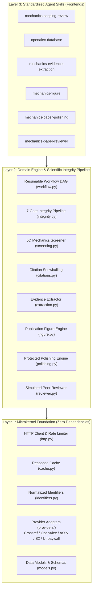

# Mechanics Agent Skills: System Architecture & Design Specification

> Document Version: 3.1.0  
> Target Audience: Autonomous Agents, Systems Architects, and Mechanics Researchers  
> Repository: https://github.com/yq04/mechanics-agent-skills

---

## 1. Architectural Philosophy & Core Tenets

Mechanics Agent Skills provides an evidence-anchored, domain-tailored research and automation ecosystem engineered for Solid Mechanics, Fracture Mechanics, Elasticity, and Applied Mathematics.

The architecture is governed by three non-negotiable principles:

1. **Zero External Runtime Dependency Microkernel**: The core library (`src/mechanics_skills/`) relies exclusively on the Python standard library (`urllib`, `sqlite3`, `dataclasses`, `json`, `re`, `hashlib`, `math`, `pathlib`). It never mandates external dependencies to execute literature queries, citation graph traversals, evidence extractions, or manuscript integrity audits.
2. **Graceful Degradation and Lazy Loading**: Advanced capabilities such as hardware-accelerated PDF text parsing (`pymupdf`), publication vector rendering (`matplotlib`, `numpy`), and high-throughput async transport (`httpx`) are isolated behind optional dependency extras (`[figure]`, `[pdf]`, `[http]`). Missing extras trigger structured diagnostic messages without crashing.
3. **Evidence-Anchored Integrity & Determinism**: Every assertion, parameter extraction, and figure generation step links to explicit data hashes, journal specifications, or verified literature anchors (strictly distinguishing `abstract` from real `pdf_page` citations).

---

## 2. System Topology

The ecosystem is structured into three discrete layers:

---

## 3. Core Engine Components (`src/mechanics_skills/`)

### 3.1 Data Source Adapters (`providers/`)
All external provider requests are mediated through normalized adapters adhering to provider-specific politeness protocols:
- **`crossref.py`**: Automatic `mailto` header injection, exponential backoff on HTTP 429, and deep cursor pagination.
- **`openalex.py`**: Adherence to OpenAlex polite pool standards (10 req/s), pagination limits (`per_page <= 100`), and cursor traversal.
- **`arxiv.py`**: Strict HTTPS enforcement, XML Atom parsing, and centralized throttling (max 1 query / 3 seconds).
- **`semantic_scholar.py`** & **`unpaywall.py`**: Verified Open Access PDF locating and canonical URL extraction.

### 3.2 5D Mechanics Screener (`screening.py`)
Evaluates literature records against five orthogonal continuum mechanics dimensions:
1. **Constitutive Model (C)**: Linear elasticity, anisotropic, viscoelastic, or plastic behavior.
2. **Defect Geometry (G)**: Cracks, inclusions, voids, notches, or interfaces.
3. **Potential Formulation (P)**: Complex potentials (Muskhelishvili, Stroh), stress functions (Airy, Westergaard).
4. **Physical Output (O)**: Stress intensity factors ($K_I, K_{II}, K_{III}$), energy release rate ($J, G$), COD.
5. **Methodology (M)**: Analytical, semi-analytical, boundary element, or finite element methods.

### 3.3 Citation Snowballing & Main Path Analysis (`citations.py`)
Constructs directed citation graphs using forward and backward OpenAlex links. Calculates Search Path Count (SPC) topological link weights to extract the developmental main path of foundational theories.

### 3.4 Page-Anchored Evidence Extraction (`extraction.py`)
Extracts structured mechanics entities:
- Stiffness and compliance tensors ($C_{ijkl}, S_{ijkl}$) with Voigt ordering.
- Fracture parameters ($K_I, J, G$) and sign conventions.
- Complex potential functions and boundary conditions.
- Benchmark comparison datasets with strict preservation of page numbers (`pdf_page: unknown` for abstract-only records).

### 3.5 Publication Figure Engine (`figure.py`)
Produces journal-ready vector and high-resolution raster visualizations:
- Enforces international standards: 85 mm (single-column) and 175 mm (double-column) physical widths.
- Employs accessible, colorblind-friendly Okabe-Ito colormaps.
- Produces a linked `figure.manifest.json` containing raw data hashes and rendering configurations.

### 3.6 Protected Polishing Engine (`polishing.py`)
Enhances manuscript prose while establishing immutable protection zones:
- Locks inline LaTeX math (`$...$`), display equations (`$$...$$`), citation keys (`\\cite{...}`), and tensor notations.
- Guards against AI misinterpretations: distinguishes single-sided displacement $w$ from crack opening displacement $\\mathrm{COD} = 2w$, small $k_I$ from capital $K_I = \\sqrt{\\pi} k_I$, and engineering shear strain $\\gamma$ from tensor shear strain $\\varepsilon_{12}$.
- Detects and strips discipline-inappropriate AI clichés (`delve`, `pivotal`, `foster`, `testament`).

### 3.7 Simulated Peer Reviewer (`reviewer.py`)
Simulates peer review for top mechanics journals (*JMPS*, *IJSS*, *EFM*, *IJF*, *CMAME*):
- Audits manuscripts across five soundness dimensions: Mathematical Rigor, Theoretical Consistency, Computational Validity, Scope & Limits, and Literature Context.
- Generates structured revision ledgers (`Revision Ledger`) to track revisions across rounds.

---

## 4. Seven-Gate Scientific Integrity Pipeline (`integrity.py`)

The integrity engine evaluates manuscripts and workflow artifacts against seven domain-specific gates:

| Gate | Focus | Verification Rule | Failure Mode |
|---|---|---|---|
| **G1** | Constitutive Symmetries & Scaling | Verifies tensor positive-definiteness ($C_{ijkl}$) and asymptotic $r^{-1/2}$ SIF singularity scaling. | `BLOCKED` |
| **G2** | Citation & Claim Grounding | Verifies primary literature anchors; flags claims grounded only in unverified abstracts. | `NEEDS_EVIDENCE` |
| **G3** | Data & Provenance Traceability | Matches raw simulation datasets with figure inputs via SHA-256 hashes. | `BLOCKED` |
| **G4** | Benchmark Independence | Isolates numerical self-consistency tests from true analytical baselines (e.g. Sneddon, Westergaard). | `NEEDS_EVIDENCE` |
| **G5** | Phenomenological Verification | Validates whether reported novel phenomena are numerical/mesh artifacts. | `BLOCKED` |
| **G6** | Dimensional & Kinematic Consistency | Detects incompatible kinematic assumptions (e.g. plane stress vs. plane strain). | `BLOCKED` |
| **G7** | Scope & Regime Boundary | Verifies reported limits of applicability (small-scale yielding, linear elasticity thresholds). | `NEEDS_EVIDENCE` |

---

## 5. Resumable Workflow Engine (`workflow.py`)

The end-to-end research lifecycle executes as a Directed Acyclic Graph (DAG) with deterministic stage invalidation:

1. **Deterministic Hashing**: Every stage computes an SHA-256 signature from its input parameters, code version, and upstream artifact hashes.
2. **Atomic State Storage**: Stages write progress and metadata atomically into `workflow.manifest.json`.
3. **Resumption**: Re-running a completed or interrupted pipeline verifies hashes and executes only modified or incomplete stages, bypassing finished upstream stages without data corruption.
