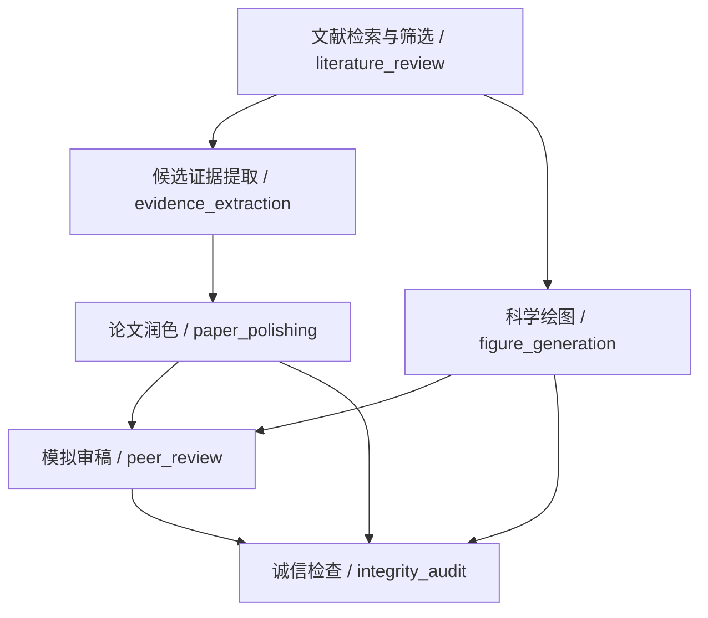

# 默认简体中文与完整英文 README 更新 Implementation Plan

日期：2026-09-21。规划者：GPT-6 Astra（astra-plan / software）。
本轮只写计划；未修改 README、业务源码或 Git 远端，未运行测试。

**Goal:** 将 GitHub 仓库首页更新为专业简体中文，并提供内容完整、能力口径一致、可互相切换的英文 README。

**Architecture:** 根目录 `README.md` 是 GitHub 默认中文入口，`README_en.md` 是完整英文对应页；两者采用相同结构、相同 CLI 示例与技术事实。现有 `docs/` 保留详细说明，只局部修正与 README 直接冲突的指标和能力描述，不引入文档网站、翻译框架或新业务功能。

**Hard constraints:** 以下引自当前 `HANDOFF.md` 和本次用户指令，不另造版本或测试结果。

- HANDOFF §1.2：“严禁复制、vendor 其任何源码或提示词文本。”——指 CC BY-NC 4.0 的 ARS；仓库自有内容保持 MIT，第三方可选依赖仍适用各自许可。
- HANDOFF §1.2：“核心库（`src/mechanics_skills/`）基础能力**仅依赖 Python 标准库**”。——README 说明“基础运行依赖为零”，同时列出绘图、PDF 与数值增强的可选要求，不写所有能力都无需第三方包。
- HANDOFF §5.6：“润色工具必须严格保护 LaTeX 区域与符号映射表，遇有歧义时标记为 `unknown` 或生成修改建议，绝对不可在未经人工确认下自动篡改公式。”
- HANDOFF §2.6：“`python -m pytest -q` **103 passed in 5.64s, 0 failed, 100% 绿色全通**。”——引用为最近记录的离线验证快照，统一展示 103/103，不伪装成本轮新运行结果、CI 状态或代码覆盖率。
- 用户：“更新GitHub上的仓库内容，尤其是README中英双语（默认简体中文）！”——父会话已获得本次文档更新和普通 Git 推送的任务授权；本计划不新增审批程序。
- 用户 AGENTS：“针对性测试或核心验证命令一旦通过（Exit 0），立即判定为验证完成并结束流程。”——本次文档改动只做定向静态验证，不跑全库回归。

## 明确不做

不修改 Python 业务代码、依赖声明、六个技能的程序入口和版本号；不执行真实检索、全文摄入、研究案例、绘图、全局同步或打包；不发布新 tag/Release、不重写 Git 历史。Astra 仅写本计划并退出，实施和发布由父会话完成。

不把当前 README 的英文逐字翻译为中文而保留旧错误；不把英文版写成简版，不将两种语言逐段混排进同一个 README。

## 事实依据与编写口径

本轮核对了 HANDOFF、README、architecture、capability-status，随后仅静态查看 `pyproject.toml`、CLI 参数、workflow DAG 和少量 integrity/figure/http 实现。初始工作区干净，最新本地提交 `f672afd`；未再次查询 GitHub 或运行测试。

| 内容 | 当前依据 | 最终文档应采用的口径 |
| --- | --- | --- |
| 版本与安装 | `pyproject.toml`：3.1.0、Python >=3.10、`dependencies=[]` | 不升级版本；使用 `python -m pip`；安装仓库地址为 `https://github.com/yq04/mechanics-agent-skills.git`。 |
| 测试 | HANDOFF：103；README 的旧日志仍写 `collected 101`；capability-status 仍写 101 | 删除拼接式日志，两个 README 及相关指标统一 103/103，注明最近记录与日期。 |
| extras | pyproject：httpx>=0.24.0、pymupdf>=1.22.0、matplotlib>=3.6.0、numpy>=1.22.0 | README 推荐只列 extras 与库名；capability-status 的最低版本与 pyproject 对齐，不提高依赖要求。 |
| 可选依赖导入 | figure/integrity 已使用 ImportError 保护 | 描述为“可选依赖与受保护导入”，不宣称所有路径都已经完全惰性加载。 |
| 六技能 | 六个根目录的 `SKILL.md` | 六技能名称、目录和职责均保留；不把独立 OA provider 当作第七技能。 |
| CLI | pyproject 的十个功能命令和独立 dispatcher | 明确“10 个功能命令 + 1 个统一入口”；`review` 是范围综述，`peer-review` 是模拟审稿。 |
| 工作流 | `workflow.py:STAGES/ARTIFACT_DAG` | 按下文真实六阶段依赖画图；citations/OA 是可独立调用工具，不能画成已经自动执行的阶段。 |
| 恢复 | 输入 hash 判定、上游重跑传播、Path.replace 保存 | 说明已有机制，不声称任意外部文件、所有输出和所有代码版本变化都会被完整识别；不承诺并发写安全。 |
| G1 | 数值矩阵检查与 SIF 归一化检查 | 不宣称已经自动拟合/证明全部应力场的 r^(-1/2) 奇异性、自动量纲分析或完整张量理论验证。 |
| G2–G7 | 出处检查、hash、文本规则与约定 | 标明规则/启发式和人工复核边界；无警告不等于科学证明或期刊认可。 |
| 审稿配置 | jmps/ijss/efm/acta_mech_sin/generic；代码标记 provisional_heuristic | 写“期刊主题取向的启发式配置”，不写官方校准；CLI 不接受 ijf/cmame，删除相关可用性暗示。 |
| HTTP | `http.py` 使用 `httpx.Client` | 写“可选 HTTPX 传输”，不承诺异步高吞吐。 |
| PDF | 提取器输出逐页文本并生成候选证据 | 不宣称当前已导出空间 bounding boxes 或可靠恢复所有 LaTeX；缺 PDF 组件时说明需安装 extra 或提供文本/OCR。 |

## 内容结构与双语写作契约

两个文件均以以下语言切换行开头，随后 H1、徽章和一句定位；文件路径、命令参数、JSON 键、技能名不翻译。

```markdown
[简体中文](README.md) | [English](README_en.md)
```

中文标题：`# Mechanics Agent Skills：证据驱动的力学研究技能套件`。
英文标题：`# Mechanics Agent Skills: Evidence-Anchored Research Skills for Solid Mechanics`。

中文开篇建议：“面向固体力学、断裂力学、弹性力学与应用数学，提供六个可独立使用的 Agent 技能，连接文献检索、候选证据提取、科学绘图、论文润色与模拟审稿。基础能力仅依赖 Python 标准库，研究结论与证据等级仍由研究者核验。”英文保持相同含义，避免 production-grade、guaranteed、verified references 等未经证实的强保证。

徽章只保留 Python 3.10+、MIT、基础运行依赖零、103/103 passing (offline)。测试徽章链接 `tests/`，旁边或验证章节明确“最近记录的离线验证：2026-09-21”；静态 shields 徽章不能伪装成 GitHub Actions 实时结果。LICENSE 和 docs 使用相对路径。

| 顺序 | README.md 标题 | README_en.md 标题 | 必须包含 |
| --- | --- | --- | --- |
| 1 | 项目定位 | Overview | 学科范围、研究者收益、基础微内核和可选增强、人工核验边界。 |
| 2 | 快速开始 | Quick Start | 正确仓库地址、基础安装、统一 CLI help、一个仓库自带的本地文本分析示例。 |
| 3 | 六大技能 | Six Agent Skills | 六行对应技能表：技能/用途/主要产物，链接每个 SKILL.md。 |
| 4 | 安装与可选能力 | Installation and Optional Capabilities | base、figure、pdf、http、dev；联网与本地执行的区别。 |
| 5 | CLI 使用指南 | CLI Guide | 10 行命令速查，随后分组完整保留支持的工作方式与示例。 |
| 6 | 可恢复工作流 | Resumable Workflow | 六阶段 Mermaid DAG、manifest、run/resume/status、示例数据性质和恢复边界。 |
| 7 | 证据与数学符号纪律 | Evidence and Notation Integrity | 摘要/全文、候选与已核验、三组数学约定。 |
| 8 | 七大科学诚信门禁 | Seven Scientific Integrity Gates | G1–G7 一一对应，评估方法及限制，0/2/4 退出码。 |
| 9 | 出版绘图 | Publication Figures | 五模板、85/175 mm 默认预设、Okabe-Ito、PDF/PNG/SVG、figure.manifest.json。 |
| 10 | 技能打包与分发 | Packaging and Distribution | 自包含 vendor、构建与 dry-run/apply 示例、备份与六技能范围。 |
| 11 | 验证状态与当前边界 | Verification and Current Boundaries | 103/103 最近记录、离线 fixture/mock、真实研究案例尚待完成、科学结论不由测试证明。 |
| 12 | 文档导航 | Documentation | architecture/provider-policy/distribution/capability-status。 |
| 13 | 许可证 | License | 自有源码/文档 MIT、独立实现、可选第三方组件各自许可。 |

允许按可读性合并相关子标题，但两语言信息必须对等。中文为自然简体中文，英文用准确学术工程表述；不翻译数学变量、引用键、路径及 CLI 选项。使用小表格和简洁段落，删除旧逐测试文件的冗长执行日志。

### 六技能的准确职责

| 技能与链接 | 中文职责 | English scope |
| --- | --- | --- |
| [mechanics-scoping-review](../mechanics-scoping-review/SKILL.md) | 多源检索、五维初筛、引文探索与 PRISMA-ScR 综述材料准备 | Multi-source retrieval, five-dimensional screening, citation exploration, and PRISMA-ScR review preparation |
| [openalex-database](../openalex-database/SKILL.md) | OpenAlex 学术实体、元数据与引文关系查询 | OpenAlex scholarly entities, metadata, and citation relationships |
| [mechanics-evidence-extraction](../mechanics-evidence-extraction/SKILL.md) | 本构、几何、势函数和断裂参量的候选证据卡与矩阵 | Candidate evidence cards and matrices for constitutive models, geometry, potentials, and fracture parameters |
| [mechanics-figure](../mechanics-figure/SKILL.md) | 可追溯的力学图件与输出清单 | Mechanics figures with provenance manifests |
| [mechanics-paper-polishing](../mechanics-paper-polishing/SKILL.md) | 公式/引用保护、术语检查、修改建议校验与应用 | Protected math and citations, terminology checks, and validated edit proposals |
| [mechanics-paper-reviewer](../mechanics-paper-reviewer/SKILL.md) | 五维健全性检查、模拟审稿任务包与修订对比 | Five-dimensional soundness checks, simulated review packages, and revision comparison |

上表链接相对本计划位于 plans/；写入根目录 README 时去掉开头 `../`。5D 文献初筛是 C/G/P/O/M，与审稿五维检查不是同一体系。

### 十个 CLI 命令与示例要求

统一入口是 `mechanics-skills <command> [options]`；CLI 速查表列下列映射，两语言命令完全一致。

| 功能命令 | 子命令 | 核心用途 |
| --- | --- | --- |
| mechanics-search | search | 多源检索与查询扩展 |
| mechanics-citations | citations | 引文遍历与主路径输出 |
| mechanics-oa | oa | 候选开放访问链接定位 |
| mechanics-extract | extract | PDF/文本候选证据抽取 |
| mechanics-review | review | 范围综述材料生成 |
| mechanics-figure | figure | template / validate / render |
| mechanics-polish | polish | analyze / prepare / validate / apply |
| mechanics-peer-review | peer-review | audit / prepare / compare / report |
| mechanics-integrity | integrity | check |
| mechanics-workflow | workflow | run / resume / status |

快速开始可直接使用以下块；中文/英文只翻译块外解释，不改变参数。

```bash
git clone https://github.com/yq04/mechanics-agent-skills.git
cd mechanics-agent-skills
python -m pip install -e .
mechanics-skills --help
mechanics-polish analyze examples/polishing/manuscript.md --conventions examples/polishing/conventions.json
```

可选安装示例：`python -m pip install -e ".[figure]"`、`".[pdf]"`、`".[http]"`，开发验证用 `".[dev,figure,pdf,http]"`。图模板示例也放在 figure extra 段落内；当前模板生成函数依赖 NumPy，不能承诺无 extra 可生成所有模板。

保留以下功能示例，按主题编排，避免十余段重复解释：

```bash
mechanics-search "anisotropic interface crack" --limit 15 --output results.json --markdown summary.md
mechanics-search "Stroh formalism" --expand --format markdown
mechanics-citations "<paper-doi>" --limit 20 --mermaid network.mmd
mechanics-oa "<paper-doi>"
mechanics-extract paper.pdf --output evidence.json --markdown matrix.md
mechanics-extract document.txt --title "Mechanics source text" --format markdown
mechanics-review "anisotropic interface crack fracture mechanics" --limit 20 --expand --output-dir review_artifacts
mechanics-figure template sif_curve --output spec_template.json
mechanics-figure validate examples/figures/sif/spec.json
mechanics-figure render examples/figures/sif/spec.json --output-dir artifacts/figures
mechanics-polish prepare examples/polishing/manuscript.md --output-dir artifacts/polishing
mechanics-polish validate examples/polishing/manuscript.md proposals.json
mechanics-polish apply examples/polishing/manuscript.md proposals.json --output polished_paper.md --diff diffs.json
mechanics-peer-review audit examples/reviewer/manuscript.md --journal jmps --markdown report.md
mechanics-peer-review prepare examples/reviewer/manuscript.md --journal jmps --output-dir artifacts/review_pkg
mechanics-peer-review compare previous_review.json revised_manuscript.md --output comparison.json
mechanics-peer-review report review_audit.json --output report.md
mechanics-integrity check examples/reviewer/manuscript.md
mechanics-integrity check examples/workflow/run.json --format json --output integrity_report.json
mechanics-workflow run examples/workflow/run.json --offline --output-dir artifacts/workflow-run
mechanics-workflow resume artifacts/workflow-run/workflow.manifest.json
mechanics-workflow status artifacts/workflow-run/workflow.manifest.json
```

正文必须说明：`<paper-doi>` 需替换为真实 DOI；paper.pdf、document.txt、proposals.json 与 previous_review.json 等是读者需提供或由前一步生成的材料，不能声称仓库自带。网络查询需要网络及相应 provider 配置；OA 入口是链接定位，不承诺下载并验证全部 PDF。示例工作流是离线流程演示，其曲线与文献 fixture 不能作为科研基准；不要用无法核实的具体 DOI 增强可信感。

### DAG、科学门禁与数学约定

Mermaid 节点 ID 在两语言中一致，只翻译标签；使用实际 `ARTIFACT_DAG` 的八条边：



README 中文仅用中文自然标签，英文对应翻译；内部 stage 名可放说明中。handoff 是最终汇总产物，citations/OA 是独立工具，不冒充额外调度阶段。正文说明已记录输入 hash 与 manifest 的阶段复用/重跑，新增或外部变更超出已跟踪输入时仍需核对；无需在 README 展开内部缺陷审计。

| Gate | 中文标题 | English title | 当前可支持的说明 |
| --- | --- | --- | --- |
| G1 | 本构与数值约定 | Constitutive and numerical consistency | 检查给定刚度矩阵的对称性/正定性和 SIF 归一化疑点；矩阵计算需要 NumPy。 |
| G2 | 引用与证据来源 | Citation and evidence grounding | 检查摘要来源标记、引用与措辞线索；不能保证所有引文存在或结论已对源核验。 |
| G3 | 数据溯源 | Data provenance | 生成数据/hash 记录与来源提示；hash 证明记录身份，不证明数据正确。 |
| G4 | 基准独立性 | Benchmark independence | 标记自我验证措辞和缺失独立基准线索，实际独立性需人工核验。 |
| G5 | 数值伪象风险 | Numerical-artifact risk | 对“异常现象即新机理”等可疑表述作启发式提示，不自动求解或诊断网格误差。 |
| G6 | 方法与运动学一致性 | Method and kinematic consistency | 检查平面应力/平面应变等文本约定冲突。 |
| G7 | 理论假设与适用域 | Assumptions and applicability | 检查给定对称性、近似与稿件陈述之间的适用域疑点。 |

退出码准确写为：0 为工具检查后可进入作者复核，2 为需要补充证据，4 为发现阻塞项；不要把 0 翻译成“科学结论已证实”。两 README 都说明多数门禁包含启发式，无告警并非全面数学证明。

数学区至少包含：对称张开约定下 $\mathrm{COD}=2w$；对应归一化下 $K_I=\sqrt{\pi}\,k_I$，典型定义 $K_I=\sigma\sqrt{\pi a}$、$k_I=\sigma\sqrt{a}$；小应变定义下 $\gamma_{12}=2\varepsilon_{12}$。这些是明确约定下的映射，不写成适用所有几何与符号体系的普适公式。保护 LaTeX、引用键和作者约定，不为翻译擅自更名。

绘图区列出 `stress_contour`、`sif_curve`、`interaction_heatmap`、`asymptotic_comparison`、`crack_geometry`。85 mm 单栏与 175 mm 双栏属于套件预设，最终按目标期刊要求确认；Okabe-Ito 用于可访问颜色表达，PDF/SVG 与 PNG、数据/配置 hash 和 `figure.manifest.json` 同时介绍。不把某套尺寸写成所有期刊的硬标准。

## 阶段

### Phase 1: 保存原文并建立中文版

**Status:** pending

**Files:**
- Create: 根目录外的临时备份，保存当前 `README.md` 原文；如预期整文件更新 ancillary docs，也先备份。
- Modify: `README.md`，按上文结构重写简体中文主页。

开始前只查看当前 Git 状态；如有新增并发修改，保留并局部合并，不 restore/reset。采用唯一临时备份路径，先备份再整页更新，满足 AGENTS 对未备份覆盖的限制；不需要因此另请用户批准普通文档更新。

**验证:** `rg -n '^#|103/103|简体中文|English|G[1-7]|85|175|Okabe-Ito' README.md`；预期出现中文结构、切换入口与全部必备技术项。该步是草稿定位，最终验收集中一次完成。

**反模式:** 将默认页仍保留为英文；仅增加中文摘要；逐句照搬旧宣传；用自动翻译改坏变量或 CLI 参数。

### Phase 2: 创建完整英文对应页

**Status:** pending

**Files:**
- Create: `README_en.md`。
- Modify: `README.md`，仅为中英一致性作必要调整。

英文不是旧 README 的无审阅副本，应与新版中文使用同一组事实、表格行、命令、目录链接、数学约定与局限。切换文字严格使用 `[简体中文](README.md) | [English](README_en.md)`，两个文件各出现一次并放在顶部。

**验证:** `rg -n '^## |103/103|G[1-7]|85|175|Okabe-Ito|mechanics-' README.md README_en.md`；预期两语言章节对应、六技能/十命令/七门禁完整，手动核对语义一致即可，不写翻译一致性测试框架。

**反模式:** 英文删掉能力限制、安装要求或分发步骤；中文更新后英文保留旧测试数；两边数学定义不一致。

### Phase 3: 最小同步相关说明

**Status:** pending

**Files:**
- Modify: `docs/capability-status.md`，仅修正 101→103、extras 版本、HTTPX 同步传输、PDF 候选边界与期刊配置/门禁过强表述。
- Modify: `docs/architecture.md`，仅同步实际六阶段依赖、恢复机制和门禁能力口径。
- Modify: `HANDOFF.md`，局部新增双语入口与本次文档交付说明，纠正与本次首页直接冲突的能力描述；保留历史纪律和真实提交记录，最新版本状态以实际 Git 为准，不编造新 commit hash。
- Retain: `docs/provider-policy.md`、`docs/distribution.md` 的深入细节，除非实施中发现与 README 新链接/命令直接冲突且能静态确认；不扩展到政策研究或重写。

**验证:** `rg -n '101|asynchronous|bounding.box|Calibrated|r\^\{-1/2\}|README_en' README.md README_en.md docs/capability-status.md docs/architecture.md HANDOFF.md`；命中需逐项解释，旧的失实指标或能力承诺应消除，真实数学背景/历史上下文不机械替换。rg 无匹配的 Exit 1 是正常搜索结果。

**反模式:** 为消除文档矛盾顺手改功能、升级依赖、宣称真实案例已完成；把无相应 CLI 支持的期刊写成可用选项。

### Phase 4: 一次文档验收并更新 GitHub

**Status:** pending

**Files:**
- Publish: 已核对的 `README.md`、`README_en.md`、上述实际修改的文档和本计划；只 stage 任务相关文件。

在一次静态审阅中核对相对链接存在、代码围栏闭合、Mermaid 八条边与实际 DAG 一致、两语言命令参数一致、103/103 与历史验证标记一致。不要执行命令示例中的联网、全套测试、构建或同步。

**验证:** stage 明确文件后运行 `git diff --cached --check`；预期 Exit 0。配合 `git diff --cached --stat` 确认只有本次文档范围，`git diff --cached --name-only` 检查没有凭据或业务文件。出现文档格式错误只修相关位置并复验；通过即止。

发布时先核对分支、远端身份与上游。仅读取所需远端信息，避免输出带认证信息的 URL；不得读取凭据文件。当前资料指向 origin/master 和 yq04/mechanics-agent-skills，实际状态如不同先调查，不盲推。

提交建议：`docs: add Chinese default README and complete English documentation`。用户已明确要求更新 GitHub，在目标一致且本次变更核对完成后执行普通 `git push origin master`（仅在实际分支确为 master 时）。远端有新增提交时检查差异并按正常非破坏流程整合，禁止 force push、reset 或丢弃并发修改。

推送成功后仅做一次远端分支 SHA 与新 commit 的只读对账；最终报告给出中文主页和英文页的 GitHub 链接，说明文档静态检查通过、本轮未重跑测试。若 GitHub 发布遇到实际认证/网络阻塞，保留本地可审阅提交并明确报告原因，不宣称已经更新远端。

**反模式:** 用 `git add .` 收入其他会话内容；创建新发布 tag；无授权强推；在用户已授权普通更新后再次要求例行确认。

## 验证总入口

本次是文档更新；验证采用“内容对应 + 本地路径 + staged diff”一次收口，不新增测试文件，不运行 `pytest`。最终唯一格式闸门为 `git diff --cached --check`，验证通过后进入已授权的普通发布流程，不追加全库审查。

完成定义：GitHub 默认页为简体中文；English 切换可达完整英文页且互链正确；六技能、十工具、七门禁、数学护栏、绘图预设和实际 DAG 两语言一致；103/103 清楚标注最近记录；相关深层文档无本次确认的直接矛盾；远端提交核对成功。

本计划交付：明确双语内容结构、准确措辞、命令和四阶段更新流程。遗留：父会话尚需实施并推送。设计偏差：将旧 README 的部分“全面验证/异步传输/完整十步自动工作流”表述修正为现有实现的实际边界；不更改运行功能。
