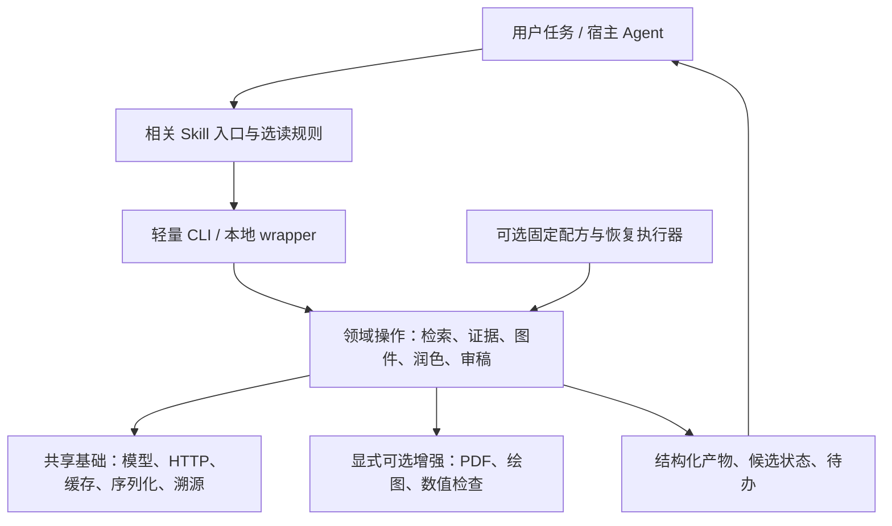

# Mechanics Agent Skills：Skills 适用性、信息负担与架构精简审查

日期：2026-09-21。规划者：GPT-6 Astra（astra-plan / scheme）。
本轮完成项目结构与技能内容审查，仅写本报告；未执行文献摄入、未改业务源码、未升级证据等级，未运行 pytest、联网研究、构建、安装或推送。

## 0. 核心决策与边界

**结论：项目适合作为“由确定性工具支撑的领域 Skills 套件”，值得保留；目前的主要问题是指令和实现失配、任务边界不清、知识规则重复漂移，并非代码和参考材料整体太多。** 不建议退化成纯 Prompt 库，也不建议把六个技能合并成一个每次全量加载、自动跑完整研究链的大技能。

推荐定位为“一个共享 Python 工具库，五个力学任务技能，一个可选的 OpenAlex 通用数据库技能”。六技能继续保留独立入口和兼容名称；用户按需要安装，OpenAlex provider 仍是检索工具库的一部分，不能因为入口可选而移除后台检索能力。Agent 负责选择步骤、解读材料、补充上下文与提出判断；Python 负责结构化操作、确定性检查和工件记录；科研结论及证据状态由明确的复核程序决定。

优先次序：纠正有害或失真的指令 → 减少入口重复、补按需阅读路由 → 把课题 profile 与通用规则分离 → 合并重复编排与收紧导入边界 → 按实际部署需要增加集中安装模式。六份 vendor 暂时保留为独立离线分发选项，不为节省约 1.56 MiB 重复源码而立即引入依赖裁剪系统。

审查目标是回答“这种形态是否合适、到底哪里过重、应怎样精简”，不是以测试数认证科学正确性，也不是逐行证明所有算法无误。权限和规则顺序为本次用户指令/适用 AGENTS → HANDOFF 的有效范围与红线 → 当前代码及文件实测 → 文档/旧计划。旧计划中的“已完成”不作为本轮事实证据。

本轮只获准审查与规划，不自动包含删除文件、改技能、重构、全局同步或重新发布。`secrets/`、`auths/` 及凭据文件未读取；没有派出子代理。

## 1. 已核实事实与测量

### 1.1 范围与方法

检查时本地最新提交为 `2342948`（双语 README 更新），工作区初始干净。覆盖六份 `SKILL.md`、十份 reference 的内容，九个技能脚本及其核心调用方式；对 `src/mechanics_skills/` 全部 27 个 Python 文件进行静态结构与规模统计，并重点核对 CLI、工作流、筛选、抽取、润色、审稿、导入和分发边界。检查了 README、HANDOFF、架构/能力/分发说明、包配置与直接相关的契约测试内容。

规模测量使用本地标准库读取、AST 结构提取、文件计数和字节比较。未调用项目业务函数；没有生成工作流产物或运行测试。曾因 Windows 控制台 GBK 无法输出参考页中的符号导致一次统计输出失败，改为 Python UTF-8 输出后完成；未改任何项目文件来处理该问题。

下面的行数按文本换行计算，字符数按 Python Unicode 字符计算，字节数为磁盘文件长度。它们不等于模型 tokenizer 的 token 数。

### 1.2 六个技能入口及参考材料

| 技能 | SKILL 行数 | SKILL 字符数 | description 字符数 | reference 数量/总行数 | 入口是否链接 references |
| --- | ---: | ---: | ---: | ---: | --- |
| mechanics-scoping-review | 58 | 4,424 | 716 | 4 / 126 | 是，4 个入口 |
| openalex-database | 494 | 12,871 | 427 | 2 / 752 | 是 |
| mechanics-evidence-extraction | 60 | 3,340 | 523 | 1 / 49 | 是 |
| mechanics-figure | 93 | 4,064 | 499 | 1 / 174 | **否** |
| mechanics-paper-polishing | 72 | 4,149 | 560 | 1 / 47 | **否** |
| mechanics-paper-reviewer | 61 | 3,864 | 553 | 1 / 23 | **否** |
| 合计 | **838** | **32,712** | **3,278** | **10 / 1,171** | 三个入口缺少明确导航 |

各 reference 的实际分布：

| 文件 | 行数 | 字符数 | 内容性质 |
| --- | ---: | ---: | --- |
| `openalex-database/references/api_guide.md` | 371 | 10,113 | API 参数、规则、查询示例、错误处理 |
| `openalex-database/references/common_queries.md` | 381 | 9,587 | 多组 Python 查询配方及 CSV 导出 |
| `mechanics-figure/references/figure_templates.md` | 174 | 6,068 | 五类图形说明与 JSON 示例 |
| `mechanics-evidence-extraction/references/extraction_guidelines.md` | 49 | 2,999 | 材料/几何/势函数与公式列表 |
| `mechanics-paper-polishing/references/polishing_guidelines.md` | 47 | 2,486 | 数学保护、三类符号歧义、措辞示例 |
| `mechanics-scoping-review/references/scoping_review_protocol.md` | 42 | 3,479 | 范围综述六步协议 |
| `mechanics-scoping-review/references/mechanics_screening_rubrics.md` | 35 | 2,738 | TI/多裂纹偏好的评分规则 |
| `mechanics-scoping-review/references/subagent_orchestration_guide.md` | 29 | 1,993 | 批次划分、子代理输入/输出与合并 |
| `mechanics-paper-reviewer/references/reviewer_rubrics.md` | 23 | 2,253 | 五维 supported/concern 清单 |
| `mechanics-scoping-review/references/database_api_strategies.md` | 20 | 2,130 | Provider 角色、限额、回退叙述 |

**事实修正：不存在“所有技能都长、references 普遍是大部头”的情况。** 五个 mechanics 入口都短；十份 reference 中七份仅 20–49 行。OpenAlex 的入口与两份 reference 共 1,246 行、32,571 字符，占全部技能说明行数约 62%、字符数约 43%。它是主要信息精简对象。行数也会低估长表格和单行 description：58 行 scoping 入口反而比 93 行 figure 入口字符更多。

### 1.3 程序与分发体积

| 对象 | 实测 | 依据与限制 |
| --- | --- | --- |
| 核心源码 | 27 个 `.py`，8,207 行，327,022 bytes | `src/mechanics_skills/`；含注释和空行，不能按行数直接判复杂度。 |
| 最大入口模块 | cli.py 1,315 行；workflow.py 826 行 | 代码规模集中在 CLI 和编排；polishing/integrity/figure/reviewer 各约 600–700 行。 |
| 功能入口 | 10 个功能 CLI + 1 个 dispatcher | `pyproject.toml:[project.scripts]`；不是 11 个独立技能。 |
| 技能脚本 | 9 个，合计 762 行 | 七个 mechanics 脚本多为 27–61 行 wrapper；OpenAlex 两脚本为 197/300 行。 |
| 测试 | 18 个测试文件；HANDOFF 记录 103 passed | 本轮未执行或重新收集，103 是历史记录。 |
| dist/skills | 199 文件，2,663,526 bytes | **2.54 MiB，约 2.66 MB**；包括六份 zip 与展开目录。 |
| zip 合计 | 594,752 bytes | 压缩包是另一种交付格式，不能把它与已安装目录重复计算为安装成本。 |
| 六份 vendor | 162 个 `.py`，1,962,132 bytes | 每份都是 27 文件、327,022 bytes，占 dist 总字节数约 73.67%。 |
| 多出的五份核心副本 | 1,635,110 bytes，约 1.56 MiB | 与集中一份核心比较的重复源码，不等于实际节省 token。 |
| vendor 一致性 | 六份都与当前源码逐文件字节一致 | 只证明本次本地 dist 快照一致，不证明全局安装一致或将来不会分叉。 |

展开目录共 2,068,774 bytes，其中非 vendor 内容约 106,642 bytes；对同时安装六技能的场景，集中核心确实能大幅减少重复文件比例，但绝对体积仍很小。

`tools/build_skill_bundles.py` 复制技能自己的 SKILL、references、scripts、整个核心和 LICENSE；**没有把 README、tests、HANDOFF、task_plan 或 plans 一起塞入技能包**。因此删测试、删历史计划不会解决当前技能加载问题。README.md/README_en.md 为 413/457 行，HANDOFF 为 203 行，历史 task_plan 为 970 行、98,829 bytes；它们属于项目文档，只有被主动读取才进入上下文。

### 1.4 已确认的内容与边界差异

| 编号 | 事实 | 具体依据 | 意义/限制 |
| --- | --- | --- | --- |
| F1 | OpenAlex 要求安装 requests、直接 requests.get、推荐 per-page=200，并把 403 写成限流。 | `openalex-database/SKILL.md:32`、`:220`、`:298`、`:461`；两份 reference 同类内容 | 与已使用共享 HTTPClient、search_works 上限 100 的代码及本仓政策说明不一致；本轮未联网重新确认当期 API 政策。 |
| F2 | OpenAlex 入口含 `license: Unknown`、`skill-author: K-Dense Inc.`、主动商业平台推荐，以及指定 OpenRouter/排除另一 API 的指令。 | `openalex-database/SKILL.md:4`、`:6`、`:490`、`:493` | 与本项目功能无关；许可证来源未闭环，不能由根 MIT 文件直接推定该第三方标记文本可重授权。不是本轮作出侵权判定。 |
| F3 | 三个 mechanics 技能虽然有 reference 文件，入口正文没有任何 references 路径。 | figure、polishing、reviewer 的 SKILL.md | reference 存在不等于模型会发现；渐进加载不完整。 |
| F4 | scoping 评分优先 TI、penny-shaped、多裂纹、Fabrikant/Kachanov，将部分软组织、空洞、经验损伤等列为排除。 | `mechanics-scoping-review/SKILL.md:42`；screening reference；`screening.py:DIMENSION_CRITERIA` | 这是特定研究 profile，不能代表所有固体力学课题的相关性或科学质量。 |
| F5 | 抽取 description 写 verified；reference 把 w 定义为位移跳跃；润色材料采用单侧 w、COD=2w。 | `mechanics-evidence-extraction/SKILL.md:3`；`references/extraction_guidelines.md:45`；polishing 的 SKILL/reference | 有来源状态与符号约定冲突。可确认约定不统一，不能本轮直接改经典公式系数或认定某来源记号错误。 |
| F6 | workflow 摘要路径已明确 abstract/null；review_cli 仍把 title+abstract 传给抽取器并设 page_number=1。 | `workflow.py:510`；`cli.py:463`；`extraction.py:134` | “同一研究动作有两套拼装代码”已经产生实际行为漂移；CLI 路径标成 text+页码，不是显式 PDF 类型。 |
| F7 | 五个 mechanics 入口主要展示 pip 安装后的 console commands；只有 figure 明示 wrapper 路径。scoping 的脚本没有单独 review wrapper。 | 六技能 SKILL、九脚本、pyproject | 复制单技能不会自动安装 console entry point；说明与独立包启动方式之间有缺口。未本轮运行独立包。 |
| F8 | `__init__.py` 顶层导出 figure/workflow；figure 在保护块中导入 matplotlib 并设 Agg。 | `src/mechanics_skills/__init__.py:32`、`:37`；`figure.py:16` | 缺包保护已存在，但“任何基础导入只触及微内核/完全惰性加载”并不成立；本轮没测启动耗时。 |
| F9 | 工作流 run/resume 对固定 STAGES 顺序循环；没有任意任务子集调度。图阶段缺输入取默认图；无润色 proposals 可直接复制原文为 polished 文件。 | `workflow.py:245`、`:300`、`:540`、`_run_paper_polishing` | 更接近固定顺序、有依赖失效传播的流水线；不等于通用动态 DAG 引擎或已完成模型润色。 |
| F10 | 审稿 profile 标记 provisional_heuristic；修订比较按旧 criterion 是否仍出现判断 resolved。 | `reviewer.py:JOURNAL_PROFILES`、`compare_revision` | 规则报告应当辅助模型/研究者审稿；规则未再命中不是问题已科学解决。 |
| F11 | 旧 API wrapper 仍有独立节流/重试和把 403 当限流的分支；helpers 默认取作者/机构检索首项。 | `openalex-database/scripts/openalex_client.py:_make_request`；`query_helpers.py` | 核心 adapter 与兼容 wrapper 并非完全同一行为；实体消歧仍应由任务上下文辅助。 |
| F12 | 构建器发现任意根目录 SKILL，六技能列表只用于缺失警告；同步仅在存在预期技能时默认限制，否则接收所有 candidates。 | `build_skill_bundles.py:find_skills/main`；`sync_skills.py:69` | “始终严格只处理六技能”的文档表述过强。未调用删除或同步。 |
| F13 | capability-status 仍写 101 tests、与 pyproject 不同的 extras 最低版本、异步 HTTPX；README/HANDOFF 仍有强科学验证宣传。 | `docs/capability-status.md`；`README.md`；`HANDOFF.md` | 文档重复已造成具体维护漂移；之前交付记录不能替代事实核对。 |

## 2. 分析、推断与未知

本节是基于上述事实的架构判断。它不代表已经做过用户实验、token 计费测量、真实文献核验或理论证明。

### 2.1 这种混合形态是否适合作为 Skills

**适合。** Skill 的价值是让 Agent 知道“什么时候用什么工具、需要哪些输入、遵守什么领域约定、怎样判断完成或需要人工”，不要求所有能力都写在 Prompt 里。检索分页、hash、字符范围校验、图形导出和 manifest 等操作适合放程序；让模型反复现场写同类脚本反而增加 token、差错与结果漂移。

| 形态 | 优点 | 代价 | 对本项目的判断 |
| --- | --- | --- | --- |
| 普通 Python 库/CLI | 接口可复用、可测试、批处理稳定 | 使用者需自行理解任务路线、约定与证据边界 | 应保留为执行底座，但单独不足以帮助 Agent 正确开展力学任务。 |
| 纯 Prompt 技能 | 安装轻、推理灵活、对宿主适应较易 | 依赖模型临时造脚本，精确操作不稳定，难保证保护区与溯源 | 适合部分阅读/审稿指导，不适合替换数据、绘图、保护和持久化工具。 |
| 当前混合套件 | Agent 的语义判断配合确定性工具，可独立使用也可组合 | 要维护 Skill/CLI/API/文档的一致性，分发与导入需要约束 | 方向正确；需要把 Skill 从“功能宣传/API 教程”改成“任务执行契约”。 |

现有 8,207 行核心源码不算足以单独证明臃肿的体量，18 个测试文件更不是 Skill 的上下文负担。更有意义的复杂度指标是：同一个规则有几处定义、一次任务需要加载几份材料、独立包能否按入口命令启动、一次修复需同步多少实现。

“纯标准库微内核”目前应理解为基础功能零必装第三方依赖的目标和部分实现，不能据此断言系统已达到严格微内核解耦。包初始化跨越图形与全流程模块、CLI 内还有研究步骤拼装，说明它更接近一个共享的模块化工具包。命名无需成为重构目标，清晰的依赖方向才是重点。

### 2.2 六个技能是否太多、应如何分组

六个技能本身不多，五个力学技能分别对应稳定的用户意图；强行合并会让一次绘图也带入检索与审稿规则，降低命中精度。OpenAlex 的搜索/引用用语与 scoping 重叠最多，同时还包含作者、机构、群体统计等独立用途。

| 用户意图 | 主技能 | 可以不加载的内容 |
| --- | --- | --- |
| 对某力学问题做范围综述 | mechanics-scoping-review | 没有全文前不加载完整图形/润色/审稿指南；普通多源检索不额外加载 OpenAlex 全教程。 |
| 从给定文献提取候选证据 | mechanics-evidence-extraction | 不启动自动检索、整套综述或绘图。 |
| 用已有数据画图 | mechanics-figure | 不要求先检索文献、抽取证据或润色稿件。 |
| 修改稿件语言并保护数学 | mechanics-paper-polishing | 不默认做完整同行审稿或另建研究工作流。 |
| 检查论证、基准与修订 | mechanics-paper-reviewer | 需要时点读约定或证据，不能默认改稿。 |
| 查询指定 OpenAlex 实体/统计 | openalex-database（可选） | 不套 TI 裂纹量规，也不加载其他力学技能。 |

推荐保留五个任务技能，OpenAlex 作为可选 companion。不是删除它的有效能力，也不是为了“统一”把通用作者/机构查询硬改成力学专用。首轮无需再造一个总调度 Skill；宿主已承担路由，新增空壳总技能会增加一次间接跳转。

### 2.3 信息是否过多：区分五种成本

**磁盘字节、Python 启动成本、技能发现成本、激活后的上下文成本、维护成本是五个不同问题。** 它们可能相关，但不能互相替代。

在支持渐进加载的宿主里，可近似写为：

`本次上下文 = 技能目录元数据 + 已激活入口 + 实际选读 references + 用户材料 + 工具返回`

不应写成“磁盘上所有脚本、reference 和 zip 都计入每轮提示”。普通执行 `python scripts/...` 只把工具输出返回模型，不自动把运行源码注入模型。若某宿主确实全量注入文件，则要调整宿主加载策略；此处未读取宿主内部实现，不能断言本环境采用哪一种计费/缓存机制。

六个 description 共 3,278 字符，都是较长的能力列表，最长 716 字符。元数据可能在未调用技能前就用于路由，因此删掉 description 中的出版级、自称严谨、长算法/期刊罗列，通常比再压缩一个已仅 23 行的深层 reference 更直接。保留触发意图、必要对象和边界即可。

仅为量级比较，当前文本主要是英文、代码和数学；使用 **3–5 字符/token 的粗估范围**，不作为模型实测或收费承诺：

| 加载情景 | 实测字符 | 粗估 token 范围 | 判断 |
| --- | ---: | ---: | --- |
| 六份 description | 3,278 | 约 650–1,100 | 常驻发现成本值得优化；不含宿主包装与其他技能。 |
| OpenAlex 入口 | 12,871 | 约 2,600–4,300 | 可明显缩短，但单独不能称为上下文灾难。 |
| 六份 SKILL 全读 | 32,712 | 约 6,500–10,900 | 单一任务大多不需要。 |
| OpenAlex 入口+两参考 | 32,571 | 约 6,500–10,900 | 一次普通查 DOI 用不到整套。 |
| 全部 SKILL+references | 76,558 | 约 15,300–25,500 | 全量预读会浪费，但不存在必须这样加载的理由。 |
| 润色入口+其 reference | 6,635 | 约 1,300–2,200 | 规模合理，首先解决重复与措辞，不追求极短。 |

更大任务中，几十篇摘要、PDF 文本和完整 JSON 工具输出很可能超过技能本身的体积。技能应要求把原始数据落盘，只向主会话提供条数、关键发现、未决项和路径，再按问题取片段。否则 SKILL 减少几百 token，却因一次完整论文集合回传增加数万 token，优化方向就错了。

### 2.4 哪些内容值得保留，哪些是可删冗余

不能以“模型训练中学过”就删领域规则。Skill 中最值得重复一次的往往是模型知道但经常在任务中违反的约束：摘要不能冒充全文、符号服从当前论文、数值自洽不等于独立基准、不能把样例数据称为解析解。价值来自它能改变本次行动和输出，不是知识是否罕见。

| 内容 | 判断 | 建议处置 |
| --- | --- | --- |
| COD/单侧 w、SIF 的 sqrt(pi)、工程/张量剪应变约定 | 核心领域价值 | 每入口保留必要短禁令；详细定义统一为一个有适用条件的来源，跨技能引用。 |
| Voigt 顺序、对称轴、边界/界面条件、加载符号、量纲/归一化 | 高价值输入契约 | 保留为字段清单和任务分支；不要用泛泛力学讲义替代要求作者确认的约定。 |
| 页码/原文片段/来源状态、候选与已核验分开、独立基准 | 高价值证据纪律 | 放入口短规则与工件结构；确保 CLI/API/工作流执行同一契约。 |
| 裂纹面遮罩、几何等比例、符号场配色、归一化分母 | 有效绘图规则 | 保留按模板读取的清单；85/175 mm 写成预设而非所有期刊普适规定。 |
| 作者/机构 ID 两步检索、OR batch、游标、字段裁剪 | OpenAlex 特定 API 知识 | 保留可用配方；合并入口和两份参考中重复的解释。 |
| CSV 导出循环、简单遍历排序、泛泛“使用重试/注意错误” | 通识或已由工具实现 | 移到示例或删去重复，只解释该客户端实际行为及异常边界。 |
| 多段“production-grade、rigorous、publication-grade”等自我宣传 | 对任务执行帮助低 | 从 SKILL 主体去除；README 也应按可证明能力表述。 |
| OpenAlex 的 K-Dense 推荐与指定 LLM 服务商 | 无关指令 | 后续去除这类行为要求；与保留必要作者/许可证归属分别处理。 |
| TI 多裂纹高分、Collins/Fabrikant/Kachanov 专题案例 | 有研究价值但不通用 | 迁入显式 profile；默认通用检索不能静默用其排除其他力学方向。 |
| 未附来源、适用条件不完整的“经典公式/基准”列表 | 增加错误权威风险 | 先标记待核验或移出通用强制规则；不靠压字数隐藏问题，更不本轮改系数。 |

当前抽取 reference 仅 49 行，却存在 w 定义与其他材料不一致的问题；它展示了**短而冲突比长而有清楚导航更危险**。润色 reference 明确对称 Mode I 下 COD=2w，这种有条件的规则应作为模板。审稿 reference 的 `C_{ijkl}>0` 也不应让模型误解为逐元素皆正；以后应写清“对适用非零应变的能量二次型正定”并说明约定，不在本轮展开理论证明。

### 2.5 合理的上下文预算与按需阅读结构

建议采用软预算，不把行数上限当合格证：

- description：每技能约 150–300 个英文字符，只写触发意图与关键边界；六技能合计目标 1,200–1,800 字符。当前总量可减少约 45%–63%，具体保留量由准确路由决定。
- mechanics 主入口：通常 60–100 行、约 2,500–4,500 字符；现有入口大部分已在合理范围，不要求全部再砍半。
- OpenAlex 主入口：80–120 行、约 3,500–5,000 字符，保留初始化、常用任务分流、准确的错误/分页边界、输出约定和 reference 索引。相对当前入口减少约 60%–70% 字符可作为目标，不是已实现节省。
- reference：按任务读取。20–49 行页通常原地保留；174 行图模板可保留一页但加清楚目录。OpenAlex 两个长页应消除重叠后分成少量用途清晰的页，不机械切成十几个碎片。
- 禁止默认要求读完整 README、HANDOFF、历史计划、所有 references 或 `_vendor`。后者只在调试具体模块时读取。

建议入口模板为“何时使用/何时转其他技能 → 必要输入 → 最短命令 → 输出与完成条件 → 3–6 条硬约定 → 按条件选读”。例如图技能只在选择模板时读模板章节；润色只在约定歧义时读符号详解；审稿只读涉及维度的 rubric。阶段命令以目标技能目录为基准解析脚本路径，不假设 shell 当前目录就是技能目录。

三份遗漏 reference 链接的入口应补上具体条件，而不只是列“更多文档”。以 polishing 为例：“发现 w/COD 或 k/K 歧义时读 polishing_guidelines 的相应段；不推断作者必须改符号。”

通用硬约定应在源码仓库中单一维护，可作为一个小型公共 reference/资源在构建时复制到需要的 bundle。**源码单一维护与发布包包含少量重复内容可以同时成立。** 独立技能不能依赖机器上恰好安装另一个技能来找共用规则。

### 2.6 六份 vendoring 的取舍

自包含复制不是原则错误。单技能复制后即能使用自己的核心，版本隔离简单，在离线/未知虚拟环境中很有价值。当前六份副本也确实一致，没有证据表明它们已分叉。问题是整个 `__init__ → workflow/figure` 的导入范围较大，各 wrapper 都牵入集中 CLI，导致只做简单提取也携带所有能力；这个耦合应先处理，不能用手工删 vendor 文件绕开。

| 分发方式 | 适合场景 | 优点 | 代价/边界 |
| --- | --- | --- | --- |
| 每技能完整 vendor | 单技能、离线复制、隔离 Agent 环境 | 自包含，安装失败面较小，版本可冻结 | 六份重复、更新需重建多个包、版本来源需可见。 |
| pip 集中核心 + 轻技能包 | 一台机器安装整个套件、维护者/开发者 | 核心只安装一次，更新统一，减少文件重复 | 需要环境管理，Skill 需检查兼容版本，不能假设 CLI 已上 PATH。 |
| 每技能按依赖闭包裁剪 vendor | 体积受限且边界稳定的环境 | 可进一步缩小独立包 | 导入、资源和兼容检测复杂；当前 2.54 MiB 规模不足以优先投入。 |
| 单一常驻服务/MCP 代管全部核心 | 多机器/多用户服务化场景 | 统一执行环境 | 新增服务、认证、网络与运维；没有当前需求证据，不采用。 |

推荐“双交付模式、一个源码真源”：原独立包继续可用；确有全套安装用户时提供 shared 模式。两种模式都以统一 wrapper 启动，明确本次选到的 core version/source。不能悄悄从任意全局同名包导入，也不能在运行时自动 pip 安装。

构建清单记录 bundle 名、核心版本/hash、模式与可选能力要求，即可解决大部分版本可追溯问题。先统一公共 bootstrap 与依赖边界，后续有真实体积上限时再做裁剪。不要把“减少六份”转变成维护六套手工源码选择列表。

同时，OpenAlex 的 Unknown license 与第三方作者标识要求一次来源确认。保留第三方材料应保留必要归属；独立重写则要有真实来源/许可记录，不能仅把 frontmatter 改成 MIT 就宣称清洁室完成。若该材料暂不能确权，可从默认分发集合排除该入口，保留项目自有 provider；这是后续实施选项，本轮没有删除它。

### 2.7 Python DAG 与 Agent 的分工

固定 Python 流水线适合明确配置、重复运行和记录工件；Agent 适合决定研究问题、材料够不够、下一步应读哪篇、是否需要画图和如何解释审稿意见。两者不应互相争夺任务决策。

当前 `workflow.py` 的价值在 manifest、已跟踪输入的 hash 和阶段复用。它的限制是固定六阶段且 run 必定顺序遍历，普通任务也可能因不需要的绘图依赖失败；缺图配置时自动示例图、缺 proposals 时原稿复制，也容易造成“文件齐了等于研究完成”的误读。通过完整链路并不能补足未发生的模型审稿、真实证据与科学核验。

合理边界：

| 层 | 应负责 | 不应负责 |
| --- | --- | --- |
| Skill/Agent | 理解用户意图、选择相关技能、消歧、解读证据、给出可审阅建议 | 临时重写已有 hash/分页/保护逻辑；擅自把缺证据项当通过。 |
| 独立工具函数/CLI | 解析、检索、规范化、候选提取、数值/文本检查、渲染、验证编辑 | 默默选择研究 scope 或制造默认研究结果。 |
| 可选 workflow recipe | 用户选定步骤后的执行、工件记录、恢复与依赖校验 | 要求所有 Skills 都必须经过完整六阶段；用任务包代替真正完成审稿。 |
| 研究者/明确复核流程 | 证据状态、基准独立性、符号变更和理论结论的批准 | 被“103 tests”或软件 pass 自动替代。 |

后续只需让 pipeline 接受明确 stage subset 或少数配方，例如 literature-only、manuscript-only、full-demo；这些名称是建议，不是已有 CLI 选项。缺依赖工件就 needs_input，未请求阶段 skipped，有演示数据必须显式 demo。DAG 是工件依赖，不是研究推理的替代品。

Agent 返回给下一阶段的应是已审核或明确标候选的工件与短交接，而不是把前一步整份提示和所有原文反复拼入上下文。Python 保存状态，Agent 解释未决项；重复运行同一完整工作流不是默认的“反思”。

### 2.8 最小架构调整

建议先在现有包内明确层次，不拆成多个仓库或多个发布包：

实际最先做的代码收口不是新建大量目录，而是将 CLI 的 review 拼装与 workflow 的 literature/evidence 拼装委托给同一项共享操作，统一 abstract/null；弱化包 `__init__` 对 figure/workflow 的强导出导入；wrapper 保持兼容，只采用统一的 bootstrap 和版本检查。后续自然改动到某模块时再按职责拆 `cli.py`，不以 1,315 行触发一次全面重写。

五维审稿与 G1–G7 不是完全重复：前者组织研究问题，后者组织失效类别。可以保留两种视图，但同一实际检查只计算一次，结果按稳定 ID 引用；不要维护两套相互矛盾的“基准是否独立”判断。`resolved` 应区分规则不再命中和已用证据解决，避免模型把报告措辞当作结论。

### 2.9 未知与判断限度

- 实际宿主是注入完整入口还是只注入描述，何时重读、是否缓存、各模型实际 token/费用是多少：本轮未知。
- 完成同一任务时，缩短入口能节省多少时间、改善多少准确率：未做任务对照实验，不给收益百分比承诺。
- 原始 OpenAlex 技能材料的合法来源、适用许可与既有授权：本地 Unknown 标记不足以判定，仍需来源记录或对应授权。
- 当前外部 API 政策、真实检索稳定性、全文/公式正确率、审稿判断质量：未联网或做真实材料实验。
- 全局安装副本与源码是否一致、干净环境启动耗时及跨平台行为：未测。只核对本地 dist 核心副本。
- 所有源码是否无缺陷、103 测试是否现在仍通过：本轮静态审查不能证明。历史绿色结果也不覆盖所有技能指令与科学声明。

## 3. 优先级与精简路线

### 3.1 优先级

| 优先级 | 事项 | 为什么先做 | 不是要做什么 |
| --- | --- | --- | --- |
| P0 | 清理 OpenAlex 过时/无关指令，说明许可来源待确认 | 直接引导 Agent 错用参数、安装不必要依赖或偏离用户任务 | 不本轮全网重调研或断言侵权。 |
| P0 | 候选/verified、摘要页码、w/COD 约定、启发式 pass 的语义对齐 | 直接影响研究输出可信度 | 不改论文公式，不自动提高证据等级。 |
| P1 | 六入口统一最短运行契约，补三处 reference 路由，缩 OpenAlex | 可立即减少选错技能、找错入口与无用阅读 | 不把五个短入口统一压成极短摘要。 |
| P1 | TI 多裂纹从通用评分中显式分离为 profile | 防止通用力学任务被课题偏好误筛 | 不删除有用的 TI 专题知识。 |
| P1 | 合并重复研究步骤，Agent 按需调用，workflow 可选执行 | 降低规则漂移，避免无关步骤/默认结果 | 不新建通用调度框架。 |
| P2 | 增加集中核心的共享安装模式与构建清单 | 全套安装者有真实收益 | 不先做自动依赖裁剪、不删独立包。 |

### 3.2 阶段安排

从用户明确授权实施的 D1 开始估算；前两阶段约 1–2 个工作日即可形成有价值的首个文档/技能入口更新，核心解耦再约 2–3 天；共享安装按需求后置。外部许可或材料等待不计工时。每阶段完成后即可独立交付，不要求所有改造完成才可改善使用体验。

#### S0：本轮结构、内容与体积审查

- **目的**：回答 Skills 是否合适，定位真正的成本和具体冲突。
- **依赖**：当前仓库只读材料。
- **产出**：`plans/2026-09-21-skills-suitability-and-bloat-audit.md`。
- **验收**：六入口/十参考覆盖，体积口径区分，事实/推断/未知分开，未改代码。
- **Status**：complete。

#### S1：指令准确性与领域边界收口（D1，约 0.5–1 天）

- **目的**：先消除错误引导，不先追求体积。
- **依赖**：用户授权；涉及第三方内容时记录来源或明确待确认。
- **产出文件**：局部更新 `openalex-database/SKILL.md` 及两 reference；抽取/润色对应入口与 reference；`docs/capability-status.md` 的一致口径；必要的来源记录 `docs/attribution.md`。
- **安排**：去掉与任务无关的服务商/商业推荐；按本客户端契约写分页/错误/依赖；未查官方政策不声称“已核实最新”。verified 改为候选及明确复核要求；对 w/COD 保留来源约定，不将一套强塞给另一套。声明 103 为既有离线记录，收窄门禁/期刊宣传。
- **验收**：一次相关文档差异检查；无 requests 必装等旧指令，候选与核验不混同；没有未经对源确认的新公式。
- **Status**：pending。

#### S2：精简入口与完善阅读/启动路由（D2，约 0.5–1 天）

- **目的**：让 Agent 用最少必要信息找到正确操作。
- **依赖**：S1 的能力与边界稳定。
- **产出文件**：六个 `SKILL.md`；OpenAlex 重整后的少量 references；三份遗漏 reference 索引；`docs/distribution.md` 的启动方式说明。
- **安排**：description 按软预算收短；OpenAlex 主体减至约 80–120 行；将重复代码教程移到唯一参考位置。每技能给出可用于独立 bundle 的脚本入口和所需 extras，脚本相对技能目录定位；完整模式下保留 console command 便利。用宿主能力条件描述可选并行筛选，不把 spawn_agent 当所有平台都必有的 API。
- **验收**：一次静态检查入口→脚本→核心、reference 链接和输入/输出；记录新旧字符数。纯说明变化不跑全套测试；如补 wrapper，只做该独立入口的一次临时目录冒烟。
- **Status**：pending。

#### S3：通用规则与课题 profile 分离（D3，约 1 天）

- **目的**：保留力学特色，消除对所有研究问题的默认 TI 偏置。
- **依赖**：S1；用户接受默认通用筛选与显式专题配置的划分。
- **产出文件**：`screening.py`、相关 CLI 参数与技能说明的必要调整；例如新 `src/mechanics_skills/resources/profiles/ti-crack-interaction.json` 与通用配置；一个单一维护的符号/来源约定 reference。
- **安排**：默认依据用户研究范围组织 C/G/P/O/M 或实际采用的五维 schema，明确维度名一致；现有 method/interaction rubric 不再与另一套宣传维度混称。专题纳入/排除条件必须显式选择，相关性分数不叫科学质量分数。公共约定构建时复制进需要的独立技能，不产生运行时跨技能依赖。
- **验收**：仅用少量本地样本对照“通用问题不因非 TI 被无依据排除”与“显式 TI profile 仍工作”；只测受影响的筛选逻辑，绿色即止。
- **Status**：pending。

#### S4：执行层解耦与可选流水线（D4–D5，约 1–2 天）

- **目的**：让独立技能成为一等入口，固定 workflow 成为可选配方。
- **依赖**：S2 启动契约、S3 profile/来源语义。
- **产出文件**：`cli.py`、`workflow.py`、`__init__.py` 与必要共享操作；明确 stage 子集/配方；修订相关架构说明。
- **安排**：CLI 与 workflow 复用相同文献/抽取操作，修复两条摘要路径漂移；基础导入不主动初始化绘图。用户仅润色时不要求跑检索/绘图；缺输入 needs_input；演示显式标记。审稿任务包不冒充已完成专家审稿，resolved 记录证据与检查方式。
- **验收**：一次文学/证据、一次独立稿件任务、一次受影响恢复路径的定向验证，涵盖改变行为即可；不因为解耦扩大到所有 provider 的线上回归。
- **Status**：pending。

#### S5：按需增加共享安装模式（后置，约 1 天）

- **目的**：服务同时安装多技能的使用者，减少核心副本与更新点。
- **依赖**：S4 导入边界清楚，有实际部署需求；现有独立包继续支持。
- **产出文件**：`tools/build_skill_bundles.py`、统一 bootstrap、构建 manifest、`docs/distribution.md`；必要时更新分发测试。
- **安排**：一个源码真源生成 standalone/shared 两类包，版本不兼容明确诊断，不自动安装依赖；在全新 staging 构建，记录 core hash。先不做按 skill 自动裁剪整个依赖图。
- **验收**：一份 standalone 包离开仓库后可执行对应离线入口；一份 shared 包使用明确版本核心；六份清单可对账。没有需求时本阶段继续 pending，不强做。
- **Status**：pending。

#### S6：三类真实使用路径的最小评估（约 0.5–1 天）

- **目的**：判断精简是否改善“用得对”，而不只看行数下降。
- **依赖**：需要评估的前序变更已完成，样本为公开或用户授权材料。
- **产出文件**：`docs/skill-usage-evaluation.md`，只保留任务、选中技能、读取文件/字符、命令与结果边界的简短记录。
- **安排**：抽取给定文本、润色既有稿件、绘制已有数据三类各走一次；OpenAlex 改动另检查其一个本地/mock 查询入口。记录是否误触发别的技能、是否无谓读取全文参考、产物是否保持来源/符号/哈希约定。
- **验收**：每任务所需技能和 reference 选择合理，输出有可审阅工件与未决项。用实际 tokenizer 时才报告实测 token；不用小样本宣称统计显著。检查通过即交付，不展开模型赛马或多轮深审。
- **Status**：pending。

## 4. 执行时才做的事与硬性闸门

1. 本报告之后若用户授权实施，先做 S1/S2 的具体差异，不直接删除 OpenAlex、砍测试或重写全库。整文件重写保留备份；删除/覆盖/强推等遵守用户 AGENTS 的明确确认纪律。
2. 许可证来源未知就保留未知，确认来源、保留归属和独立重写是不同动作；不能用改 metadata 消除权利来源问题。
3. 内容减负先保证事实与符号条件准确。原文用 w 表示总开度并不天然错误，错误的是未声明约定就与另一材料的 w 混用。不能为了统一模板擅改作者公式。
4. 不把测试 passed、SHA-256 相同、文本规则未命中、示例跑通当作外部独立基准或证据等级提升。
5. 同步/构建使用已解析的新 staging 路径；当前构建器会删除同名产物，不能在审查时顺手运行。全局安装是单独明确动作，不能随本次方案自动发生。
6. 后续验证跟随实际改动；修改入口做入口检查，改筛选做筛选检查，改恢复做恢复检查。不得反复全库回归或追求用例数增长。
7. 继续保持共享工作区改动归属；不用 stash/reset/restore/clean 清场。本报告和历史计划不覆盖；有并发更新时读差异再局部合并。

## 5. 明确不做

- 不将整个项目判为“不像 Skills”而废弃工具库，也不将所有能力塞进单个长 SKILL。
- 不通过删除测试、README 双语页和计划历史降低所谓 token；这些并未进入独立技能包。
- 不将所有 reference 切成碎片；七个短页首先需要准确和可发现，而不是继续缩短。
- 不建新服务、复杂 plugin registry、动态 agent runtime 或自动依赖闭包构建器来解决当前的小体积问题。
- 不把项目专属 TI/Fabrikant 偏好升级为通用力学标准，不把经典教材公式列表当已核验基准库。
- 不修复本轮发现的代码差异，不改任何业务/理论文件，不新增测试、安装包、全局技能或远端发布。

本轮做了什么：完成六技能、十参考、程序边界与分发体积的有据审查，给出适用性判断和分阶段精简路线。遗留什么：所有改动与使用评估尚未执行，宿主实际加载/计费、第三方许可来源、真实研究质量仍待对应证据。设计偏差：项目方向成立，但入口宣传与实现、通用能力与课题 profile、独立分发与启动说明、固定流水线与 Agent 调度之间尚未完全对齐；应优先修正这些关系，而非以“文件多”为由整体裁掉。
