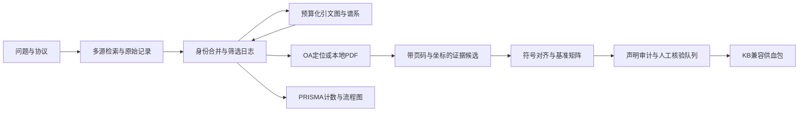
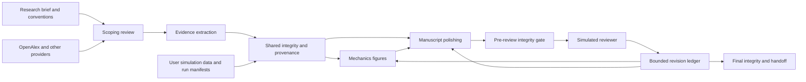

# Mechanics Agent Skills：证据驱动的架构与分阶段实施方案

日期：2026-09-21。状态：§1–11 保留第一轮 Phase 1–5 原始计划；v3.0.0 已有实现，实际交付差异见 §12。第二轮 Phase 6–9 规划已完成，尚未实施。执行者：Gemini；Astra 仅承担架构规划。

当前执行入口：从 **§12「第二轮升级：实测基线与范围修订」** 开始。旧计划中的四技能组合、首次包版本和未落地模块仅为历史设计，不作为本轮已实现事实；本轮目标是三个现有技能加三个新技能，共六个。

## 1. 目标、范围和关键决策

将当前两个检索技能升级为可安装、可复现、可降级的固体力学研究工具链，打通“检索 → 筛选 → 引文图 → 全文定位 → 证据矩阵 → 声明审计 → 知识库供血”。核心价值是可定位、可比较、可追溯的证据，不是自动生成看似完整的综述。

保留并深化 `mechanics-scoping-review`、`openalex-database`，增加 `mechanics-evidence-extraction` 和 `mechanics-claim-audit`。四个技能共享一个 Python 核心包，各自保持清晰的触发条件和渐进加载文档。不要为每个数据库、图算法、文件格式另造技能。

通用套件面向固体力学、断裂力学、弹性和应用数学；首个严格领域配置 `ti-penny-cracks` 对应 LBM_Fabrikant 当前研究：线弹性、三维 penny-shaped 裂纹、TI、Fabrikant 势、Kachanov 方法和匹配渐近。该配置明确排除 LBM/流体方法与接触力学，不能因仓库名或旧知识库描述而重新引入。通用套件的其他配置不必继承这项项目专属排除。

五项优先决策：

1. 核心 Python 包零第三方运行时依赖；`urllib` 必然可用，`httpx` 为可选传输实现。不得运行中自动安装依赖。
2. 科学对象、API 原始响应、人工决定分别保存；所有派生表格来自版本化 JSON。
3. 提取器只产出候选公式/字段/表格单元，不自动声称恢复了可靠 LaTeX、证明了定理或完成外部独立验证。
4. KB E 等级、研究项目 Grade E 等级、Rivet 运行时声明状态必须分开建模，禁止按数字或名称自动互转。
5. 测试随功能阶段引入，第五阶段做集成和发布收口；不把前四阶段变成没有测试的积累。

## 2. 已核实的现状与来源

### 2.1 本仓库事实

2026-09-21 只读检查确认：

| 位置 | 事实 | 设计影响 |
|---|---|---|
| `openalex-database/scripts/openalex_client.py` | 顶层 `import requests`；默认 `per_page=200`；把 403 当限流；未专门处理 429；请求参数可能被原地修改 | 统一 transport、能力配置、错误分类；保持旧公共方法兼容 |
| `mechanics-scoping-review/scripts/search_mechanics_papers.py` | 实际只实现 Crossref/OpenAlex/arXiv；文档声称的 Semantic Scholar 尚无实现 | 将 S2 视为新增适配器，不是已有实现的小修 |
| 同上 | arXiv 使用 HTTP、无 Accept；无 DOI 的 arXiv 把 URL 塞进 DOI；OpenAlex 无 DOI 条目被丢弃；不同来源去重规则不一致 | HTTPS、显式 Accept、分离 identifiers、稳定合并与版本关联 |
| 三个 mechanics 脚本 | 硬编码虚构联系邮箱；失败常返回空数组；进度与数据混在 stdout | 真实可选联系配置、结构化 partial/error、stderr 日志 |
| `find_oa_pdf.py` | `pdf_url` 可能实际是 landing page，尚无下载或格式验证 | 分离 URL 类型、下载验证和文本提取 |
| `traverse_mechanics_citations.py` | 一跳，有限条目，无图截断元数据 | 预算化 BFS、游标、边来源、可说明的图分析 |
| 两个 `SKILL.md` | 前者含非标准顶层 `when_to_use/version`；后者过长且有旧 API 政策和 `requests` 安装说明 | 标准 frontmatter、短入口、深内容放 references |
| 根目录 | 有 MIT `LICENSE`，无 `pyproject.toml`、测试目录 | 建立 Python 打包和按风险分层测试 |

当前解释器探针：Python 3.12.10；`requests` 未安装，`httpx`、`pymupdf`/`fitz`、`pytest` 可发现。此事实只描述当前机器，不成为部署依赖。

arXiv 406 是主会话报告的症状；这里已确认 HTTP 和请求头缺陷，但未证明 406 的唯一原因。实施中需保留 HTTPS/Accept 修正后的实际状态与错误，代理、出口和服务状态仍可能导致失败。不能在尚未复测时宣称修复成功。

### 2.2 三个本地项目的可复用契约

| 项目和已读文件 | 应继承的实践 | 不应复制的内容 |
|---|---|---|
| `D:/1_Research/Develop_Research/AGENTS.md`；`src/context/claims.ts`；`src/context/claim-export.ts`；`src/agent/hooks/external-claim-tracking-hook.ts` | 稳定静态提示、证据引用、工具能力边界、worker 结论需核验、版本化导出 | 整套 CVM/AgentLoop；将 durable/confidence 当学术证据等级 |
| `D:/1_Research/LBM_Fabrikant/06_Subtopic_Fabrikant_Kachanov_TI/00_Project_Control/CLAIMS_LEDGER.md` | 参数域、允许措辞、未闭合依赖、撤回/隔离状态；本地测试不等于独立证明 | 历史伪基准、隔离区材料；从 README 成绩宣称推导可信度 |
| 同项目 `02_Python_Solver/single_crack_ti_baseline.py` | 正应力/压力符号、单侧位移/COD、TI 柔度参数及适用域需要进入数据结构 | 直接复制求解器并把其输出作为自身正确性的独立证据 |
| `D:/1_Research/Mechanics/KB_HANDOFF.md` §3–4；`AGENTS.md`；`_scripts/quality_sweep.py` | citekey 不变、Crossref 元数据出处、PDF SHA-256、原语言引文、页/式/表/提取行号、E 分级、单向供血 | 批量改写个人 Zotero 库、自动把 AI 摘要升级 verified |

重要差异必须写入接口：

- Mechanics KB：E0 未证/被拒；E1 内部一致；E2 本地数值/代数自洽；E3 跨已发表来源对源核验；E4 外部独立验证。
- LBM_Fabrikant 当前 ledger：Grade E3 严格解析定理或认证 CAP；E2 条件渐近/本地支持；E1 候选猜想/未闭合接口；E0/REJECTED 隔离或未证。即使局部条目措辞存在历史差异，也要保留原文、来源和审计疑点，不能默默“统一”。
- Rivet `ContextClaim`：运行时记忆对象，含 `active/durable/stale/conflicted` 等状态，`confidence` 不是科学证据等级。

KB 的 `quality_sweep.py` 实际是七项格式/状态检查 Q1–Q7，并非七阶段科学核验。它不能验证引用是否真的存在、公式是否正确或证据是否独立。新审计器兼容其结构检查，同时增加内容来源核对。

发现 KB_HANDOFF 中仍有历史 LBM 描述；以本次明确任务范围和客户现行 ledger 隔离规则为准。本次不修改三个外部项目。

### 2.3 官方生态/API 依据

以下页面于 2026-09-21 通过 agent-reach 的 Jina Reader 路由读取；落地时将政策版本和来源记录进 `docs/provider-policy.md`，不能把随时间变化的配额写成永久承诺。

- Agent Skills 规范：<https://agentskills.io/specification>。标准 frontmatter、description ≤1024 字符、metadata 值为字符串、主文件建议 <500 行/<5000 tokens、脚本自包含或明确声明依赖、按需读取 references。
- OpenAlex 当前认证：<https://help.openalex.org/api/authentication/>，页面标注更新 2026-08-19。匿名基础请求可用；免费 key 提高 daily budget 10 倍；`per_page` 最大 **100**；OR filter 最多 100；sample 最多 10000；普通翻页最多 10000，更多用 cursor；429 可能表示日预算耗尽或速率超限。
- OpenAlex quickstart：<https://help.openalex.org/quickstart/>。旧 `docs.openalex.org` 路径经读取多次返回首页，正式文档链接改用当前 help 路径。
- Crossref：<https://www.crossref.org/documentation/retrieve-metadata/rest-api/access-and-authentication/>；<https://www.crossref.org/documentation/retrieve-metadata/rest-api/tips-for-using-the-crossref-rest-api/>。使用真实 mailto 和标识客户端的 User-Agent；429 退避；403 不应默认按限流无限重试；缓存和游标减少重复请求。
- arXiv：<https://info.arxiv.org/help/api/user-manual.html>；<https://info.arxiv.org/help/api/tou.html>。Atom 查询需正确构造；同一使用者所有机器合计最多每三秒一次请求，单连接。由检索协调器统一调用，不能让并行筛选 worker 各自发起 arXiv 请求。

Semantic Scholar 的当期额度、Unpaywall 联系参数规则及 PyMuPDF 当前许可细节在相应阶段启动时核对官方文档。未检查的细节不能写成已核实事实。

## 3. 技能边界和端到端流程

| 技能 | 触发/输入 | 负责 | 输出/边界 |
|---|---|---|---|
| `mechanics-scoping-review` | 研究问题、scope profile、种子标识 | 协议、查询计划、多源检索、筛选记录、snowball、图分析、综述证据矩阵编排、PRISMA 计数 | protocol/search/screening/graph JSON + Markdown；不自认全文已读或证明已完成 |
| `openalex-database` | OpenAlex 实体检索/引文/统计查询 | OpenAlex 适配器与通用实体查询助手 | provider 原生结果或通用记录；不内置 TI 偏好或完整综述工作流 |
| `mechanics-evidence-extraction`（新增） | DOI/work ID、本地 PDF、提取文本、页范围 | OA 定位/取回、页面提取/渲染、mechanics 特征、公式候选、基准表候选及对齐 | 文档 manifest、candidate evidence、review queue；不做“扫描公式自动正确还原”承诺 |
| `mechanics-claim-audit`（新增） | evidence/claims、已有 bib/notes、指定证据体系 | 引文锚点、符号约定、独立性、勘误影响审计、KB/Zotero 映射、供血包 | audit JSON/MD、claim 草稿、只读兼容报告和 staging bundle；不直接改个人库 |



Skills 主文件目标约 100–180 行，只包含“何时使用、输入、最短可运行命令、状态解释、按需 reference 索引”。版本放 `metadata.version`；触发描述纳入 description，去掉顶层 when_to_use。不得把项目绝对路径写成通用技能的运行前提。`allowed-tools` 仅在宿主支持时使用，不能把 frontmatter 当实际安全沙箱。

Rivet 集成先提供宿主无关 CLI/JSON 契约和能力清单。静态技能说明不注入日期、API 原始响应或长证据正文；变化的数据只通过 run artifacts/摘要传递，保留 prefix cache 的稳定性。后续可在 Rivet 侧注册 hook/工具白名单，但这不是本仓库五阶段的必要运行条件。

## 4. 目录、打包与独立技能分发

保留所有现有脚本路径作为兼容入口；共享实现落到 `src/mechanics_skills/`，禁止四个技能各维护一套 HTTP/去重代码。

```text
pyproject.toml
uv.lock
README.md
docs/
  architecture.md
  provider-policy.md
  migration-v2-to-v3.md
  distribution.md
src/mechanics_skills/
  __init__.py
  cli.py
  config.py
  models.py
  errors.py
  http.py
  cache.py
  identifiers.py
  serialization.py
  providers/{__init__,base,crossref,openalex,arxiv,semantic_scholar,unpaywall}.py
  search.py
  screening.py
  graph.py
  graph_analysis.py
  reporting.py
  retrieval.py
  extraction/{__init__,pdf,text,features,tables,conventions}.py
  claims.py
  audit.py
  interop/{__init__,bibtex,obsidian,zotero,rivet}.py
  resources/
    profiles/{general-solid-mechanics,ti-penny-cracks}.json
    terms/mechanics_terms.json
    schemas/{run,work,screening,graph,document,evidence,claim,audit}.schema.json
mechanics-scoping-review/{SKILL.md,references/,scripts/}
openalex-database/{SKILL.md,references/,scripts/}
mechanics-evidence-extraction/
  SKILL.md
  references/{extraction_protocol,mechanics_fields,benchmark_conventions}.md
  scripts/{extract_mechanics_evidence,build_benchmark_matrix}.py
mechanics-claim-audit/
  SKILL.md
  references/{evidence_schemes,kb_interoperability,runtime_adapters}.md
  scripts/{audit_mechanics_claims,export_kb_bundle}.py
tools/{build_skill_bundles,validate_skills}.py
tests/{fixtures/,test_http.py,test_identifiers.py,test_providers.py,...}
.github/workflows/test.yml
```

建议首个新包版本 `0.1.0`（Python 包首次发布），技能版本另用 `metadata.version` 跟踪。不要以“改进较大”为由假造既有 PyPI 版本历史。

`pyproject.toml` 起始规格：

```toml
[build-system]
requires = ["hatchling>=1.26,<2"]
build-backend = "hatchling.build"

[project]
name = "mechanics-agent-skills"
version = "0.1.0"
description = "Evidence-anchored tools for solid and fracture mechanics research"
readme = "README.md"
requires-python = ">=3.10"
dependencies = []

[project.optional-dependencies]
http = ["httpx>=0.27,<1"]
pdf = ["PyMuPDF>=1.24,<2"]
graph = ["networkx>=3.2,<4"]
kb = ["bibtexparser>=1.4,<2", "PyYAML>=6,<7"]
dev = ["pytest>=8,<9", "jsonschema>=4,<5", "build>=1,<2", "PyYAML>=6,<7"]

[project.scripts]
mechanics-skills = "mechanics_skills.cli:main"
mechanics-search = "mechanics_skills.cli:search_main"
mechanics-citations = "mechanics_skills.cli:citations_main"
mechanics-oa = "mechanics_skills.cli:oa_main"
mechanics-extract = "mechanics_skills.cli:extract_main"
mechanics-claims = "mechanics_skills.cli:claims_main"
mechanics-openalex = "mechanics_skills.cli:openalex_main"

[tool.hatch.build.targets.wheel]
packages = ["src/mechanics_skills"]

[tool.pytest.ini_options]
testpaths = ["tests"]
markers = ["live: explicit network smoke tests", "integration: installed CLI workflow"]
addopts = "-m 'not live'"
```

依赖下界与 Python 3.10 的兼容性在首次 resolver/build 时确认；`uv.lock` 固定开发/CI 解析，库的 pyproject 保留兼容范围。维护者用 `uv sync --extra dev --extra http --extra pdf --extra graph --extra kb`；消费者用 `pip install .` 或 `pip install '.[pdf,kb]'`。base 包不导入 extras 模块；缺额外包时返回结构化 `missing_dependency` 及明确安装命令。零依赖指运行时，不指构建后端。

必须解决“复制单个技能目录后共享包消失”的问题：

1. 源码 checkout：旧 wrappers 查找固定仓库相对 `src/`，从包导入实现；不依赖 cwd、不扫描任意父目录。
2. pip/uv 安装：使用已安装的 `mechanics_skills` 和 console scripts。
3. 单技能 bundle：`tools/build_skill_bundles.py --out dist/skills` 将同版本 core 自动复制到各产物的 `scripts/_vendor/mechanics_skills/`，wrapper 优先固定 vendor 路径。分发 zip 包含该技能 references、资源和所需许可证。
4. vendor 只在构建产物生成，不把四份核心实现提交为人工维护源码。bundle manifest 记录 core 版本与文件 hash；孤立临时目录测试必须通过。

PyMuPDF 有其独立许可约束；仅作为可选安装依赖，不把其二进制打包进标称 MIT 的 skill zip。核查现有 openalex skill 的来源和授权，保留 attribution；顶层 MIT 不能替代上游授权核实。

## 5. 核心数据与执行契约

### 5.1 单一 JSON 真源

实现 `models.py` 的 stdlib dataclasses 和显式验证；JSON Schema 2020-12 作为公开契约，开发测试用 jsonschema，运行时不强制依赖它。对象序列化固定字段/稳定排序，UTF-8；不使用 NaN/Infinity。内容 ID 用稳定输入 hash，时间只进入 run metadata。

| 类型 | 必填/关键字段 |
|---|---|
| `RunManifest` | schema_version、run_id、tool_version、started_at、profile/version/hash、参数、effective HTTP backend、状态、warnings/errors、每来源状态、输入/输出 hashes、truncation |
| `WorkRecord` | record_id、title、identifiers `{doi,openalex,arxiv,semantic_scholar}`、authors、year 可空、publication_type、versions/relations、source_records、field_provenance、citation_counts 按来源/日期 |
| `ScreeningDecision` | record_id/report_id/study_id 可空、stage、include/exclude/uncertain、reason_code、relevance_score 可空、evidence_basis、reviewer/model、protocol_version、timestamp、supersedes |
| `CitationEdge` | citing_id、cited_id、provider、retrieved_at、source_response_hash；canonical 方向始终 citing → cited |
| `DocumentManifest` | document_id、record_id、sha256、document_version、source_url/local path、license 可未知、page_count、extraction_engine/version/options、page map、text_hash |
| `EvidenceCandidate` | id、document_id、kind、原文 quote、anchors、raw_value、normalized_value 可空、mechanics_context、extraction_method、candidate/reviewed/ambiguous 状态 |
| `ClaimRecord` | claim_id、citekey 可空、text、source_evidence_ids、context、evidence_assessment `{scheme,scheme_version,level,rationale}`、verification_records、counterevidence/errata、ai_draft/reviewed/rejected/superseded |
| `AuditFinding` | code、severity、object_id、定位、expected/observed、remediation；不得把无法验证记录成通过 |

`Anchor` 同时保存 `pdf_page_index`（0-based）、`pdf_page_number`（1-based 展示）、`printed_page_label`（可罗马数字/未知）、bbox（页面坐标）、equation/table label、extracted_text_line_span、text artifact hash。不同 PDF 版本的页码不可互用。行号必须绑定固定版本提取件。

DOI 规范化去合法 resolver 前缀/`doi:`、空白和大小写；避免无差别去尾部标点损坏合法 DOI。无 DOI 时优先 OpenAlex/arXiv 等稳定 ID；只剩标题时产生明确 local ID，保留不确定性。自动合并限于确定标识一致；模糊标题匹配仅给候选。相同标题但不同 DOI 不自动吞掉；preprint 和 published version 建 relation 并保留不同文本。

### 5.2 输出和运行状态

- CLI `--format json|markdown`；JSON 输出 stdout 只含一个合法 JSON，日志发 stderr。`--output` 是权威完整结果，Markdown 用同一对象生成，正确转义 pipe、换行、链接和 Mermaid 标签。
- 状态 `ok/partial/failed/invalid_input`；exit 0=所有请求阶段成功（允许真实零结果），2=输入/配置错误，3=至少一个请求来源失败或预算截断而其余可用，1=没有可用结果且执行失败。缺 extra 若该功能被请求则 2。
- `partial` 不等于空结果；`no_pdf` 不等于 `closed_access`；`not_retrieved` 不等于全文排除。
- run 下 `manifest.json`、`search.json`、`screening.jsonl`、`graph.json`、`documents/`、`evidence.json`、`claims.json`、`audit.json`、相应 Markdown。大文件摘要只输出计数与路径。
- 默认创建新的 run 目录；已存在非空输出不静默覆盖，追加决定为新事件并引用 supersedes。先写临时文件再原子完成，不触碰外部项目原件。

建议函数：

```python
normalize_doi(value: str | None) -> str | None
merge_records(records: list[WorkRecord]) -> MergeResult
write_artifact(path: Path, data: object, *, overwrite: bool = False) -> ArtifactRef
render_markdown(result: object) -> str
validate_record(kind: str, payload: dict) -> list[ValidationIssue]
```

### 5.3 HTTP、缓存与 API 差异

```python
class HttpTransport(Protocol):
    def get(self, url: str, *, params: Mapping[str, object] | None = None,
            headers: Mapping[str, str] | None = None,
            timeout_s: float = 30.0) -> HttpResponse: ...

class HttpClient:
    def __init__(self, transport: HttpTransport, policy: RetryPolicy,
                 limiter: RateLimiter, cache: ResponseCache | None = None,
                 *, clock: Callable, sleep: Callable, random: Callable): ...
    def get_json(self, url: str, *, params=None, headers=None) -> JsonResponse: ...
    def get_bytes(self, url: str, *, params=None, headers=None,
                  max_bytes: int = 50_000_000) -> HttpResponse: ...

make_transport(backend: Literal['auto', 'urllib', 'httpx']) -> HttpTransport
class OpenAlexClient:
    def __init__(self, email: str | None = None, requests_per_second: float = 1,
                 *, http: HttpClient | None = None, api_key: str | None = None): ...
    # 保留 search_works/get_entity/batch_lookup/paginate_all/sample_works/group_by
```

`auto` 仅按是否安装选择 httpx，否则 urllib；显式 httpx 缺失报错。请求开始后不因 HTTP 失败切 backend 重复消耗配额。实现相同超时、TLS 校验、代理默认行为、redirect 上限、状态/bytes/header 契约和 `close()`。urllib 的 HTTPError 要转换为响应状态，使重试逻辑不依赖第三方异常类型。

重试只针对幂等 GET 的 timeout、连接临时失败、429、500/502/503/504，最大尝试数与总时间预算同时约束。Retry-After 支持秒数和 HTTP-date，若等待超过剩余预算则返回 partial，不能截短服务端要求后提前再试。指数退避加可注入 jitter；401/403/404/406 与普通输入 4xx 分类并停止，406 不做无界 header/UA 轮换。日预算为零时停止并记录 reset，不能用指数退避等待一天。

缓存 key=规范化 URL+排序查询+表示相关 headers+provider schema version，不包含 key/email 原值。认证缓存作用域隔离，序列化前删除认证字段。元数据默认 TTL 24h，可配置；PDF/text 按内容 hash 永久复用；429/5xx 不缓存为成功，失败有显式时间与分类。保存原始响应和检索时间支持重放，不把“当前 API 顺序”当可复现性。

| Provider | 具体实现要求 |
|---|---|
| Crossref | `--email`/`MECHANICS_EMAIL` 为真实配置，缺失时走匿名并提示，不能伪造；UA 含项目标识；mailto；metadata 原始 JSON；cursor；合法 date/null 容错 |
| OpenAlex | 可选环境 `OPENALEX_API_KEY`，优先 bearer header；mailto 仅联系用途；不再宣称邮箱自动 10×；按当前 100 page limit 分页；兼容旧 per_page=200 调用时显式夹到 100 并警告，整体 requested limit 仍由分页满足；保存实际页大小 |
| arXiv | HTTPS export endpoint；标识 UA、`Accept: */*`；urlencode 完整语法、quote phrases、Atom namespaces；error entry 检测；arxiv ID/版本/DOI/PDF link 分开；每 3 秒一次单连接 |
| Semantic Scholar | 实现新的 `/graph/v1/paper/search` 适配器；可选 key；明确 fields、offset/next 分页；429/Retry-After 使用共享策略；无权限不影响其他来源 |
| Unpaywall | 真实 email 未提供时明确 skipped/config_missing，仍可用 OpenAlex fallback；区分 `url_for_pdf` 与 landing URL；不将未知 license 标成可再分发 |

API 密钥只由环境/宿主注入读取，不读取秘密文件、不写日志、命令示例或 cache。配置优先级 CLI > 环境 > 默认值。HTTP 403 不再被错误标为通用 rate limit。

## 6. 检索、筛选与引文图的领域设计

### 6.1 可审阅查询扩展

`resources/terms/mechanics_terms.json` 按 concept ID 保存 primary/aliases/broader/related/exclude、适用 profile、说明。区分同义词与相关方法：Kachanov 面积平均/简化相互作用近似不自动等同所有 self-consistent 均匀化；Fabrikant 势不自动等同 Papkovich–Neuber。

概念组至少包括 transverse isotropy/TI elastic solid、penny-shaped/circular disk crack、Fabrikant potential、Papkovich–Neuber、Green–Sneddon、Hankel transform、dual integral equations、Fredholm equation、Kachanov interaction、SIF/stress intensity factor、COD/crack opening displacement、matched asymptotic expansion、microligament。

```python
expand_query(query: str, profile: ScopeProfile, *, max_variants: int = 8) -> QueryPlan
compile_query(plan: QueryPlan, provider: str) -> list[ProviderQuery]
search(plan: QueryPlan, providers: list[PaperProvider], *, budget: QueryBudget) -> SearchResult
score_relevance(work: WorkRecord, rubric: ScreeningRubric) -> ScoreResult
```

默认 `--expand off` 保持原查询语义，`--profile ti-penny-cracks --expand controlled` 才执行受预算约束扩展。提供 `--dry-run` 输出每个来源的实际 query，避免指数笛卡尔积。缺摘要记 unknown，不默认排除；排除规则只在指定 profile 应用，出现“contact”一词不等于论文研究接触力学。

筛选分 title/abstract 和 full-text 两阶段，原因码固定，分数表示相关性而不是证据可靠性；人工/agent 评价保存依据和 uncertainty。综述不声称“高 citation=可信”。启用子代理由主任务授权/宿主决定，单 agent 可完成所有功能；worker 只接收记录 ID、固定 rubric 和结果 schema，主进程负责联网、预算与合并。

### 6.2 图分析的精确定义

```python
build_citation_graph(seeds: list[str], provider: CitationProvider,
                     *, direction: str = 'both', max_depth: int = 1,
                     max_nodes: int = 500, max_edges: int = 3000,
                     max_requests: int = 100) -> CitationGraph
main_path_spc(graph: CitationGraph) -> MainPathResult
build_cocitation_graph(graph: CitationGraph, *, min_shared: int = 2) -> WeightedGraph
cluster_cocitations(graph: WeightedGraph, *, seed: int = 0) -> ClusterResult
render_citation_mermaid(graph: CitationGraph, *, max_nodes: int = 60) -> str
```

有界 BFS 记录 visited、方向、每层 frontier、边证据、缺 metadata 的 stub、分页和截断原因；已见节点仍可增加新边。默认一跳兼容旧行为。references 与 citations 都不能只取第一页后称“完整图”。节点/边/request 预算独立，checkpoint 可续跑，幂等去重。

canonical 图边为 citing → cited；谱系展示/main-path 明确采用反向 cited → citing。循环不按年份悄悄丢边：保留原图，对 strongly connected components 缩点成 DAG，再计算 Search Path Count：正向入路数 F(v)、反向出路数 B(v)，边权 SPC(u,v)=F(u)×B(v)。在 DAG 上用动态规划找总 SPC 最大 source-to-sink 路径，固定 ID 打破平局；输出 SCC 成员/版本关系，不在 SCC 内虚构唯一时间序列。使用整数计数，说明结果仅针对已检索子图，不能称为学科完整主脉络。

co-citation 定义为检索 corpus 中同一 citing work 共同引用两目标的次数；bibliographic coupling 是另一种边，不能混用。对过长参考文献列表设置显式 pair-work budget。基础加权图用 stdlib；聚类使用可选 networkx 的确定性算法或固定 seed Louvain，缺 extra 返回图和 `clustering_unavailable`，不能把 connected components 冒称社群发现。

Mermaid 默认最多 60 节点并显示 omission count；GraphML 可依赖 graph extra，JSON/CSV edge list 永远可用。标题使用安全短标签、稳定 node ID、方向图例；timeline 不推断缺失年份。

### 6.3 PRISMA 与研究设计

`build_prisma_counts(decisions, retrieval_events, linkage) -> PrismaCounts`；`render_prisma_mermaid(counts) -> str`。

PRISMA-ScR 是报告规范，脚本不能以生成流程图宣称完成系统综述。协议应包含研究问题、来源/日期/查询、纳排标准、复筛/争议处理、限制说明。统计来自事件而非手填数：各来源 records、去重、screened、排除、reports sought/not retrieved、全文纳排和理由、included reports。只有真实建立 report→study 映射时才输出 included studies；不可把 paper/work/report/study 强行当同一计数单位。snowball 等其他识别渠道分支单列，重复来源不重复计入最终纳入量。

## 7. PDF、公式和基准证据引擎

### 7.1 获取与提取

```python
discover_oa(work: WorkRecord, *, email: str | None = None) -> list[OALocation]
retrieve_pdf(location: OALocation, destination: Path,
             *, max_bytes: int = 50_000_000) -> RetrievalResult
extract_pdf(path: Path, *, pages: list[int] | None = None,
            ocr: Literal['off', 'auto'] = 'off') -> DocumentExtraction
render_anchor(path: Path, anchor: Anchor, *, dpi: int = 180) -> Path
extract_mechanics_features(doc: DocumentExtraction, profile: ScopeProfile) -> list[EvidenceCandidate]
extract_benchmark_tables(doc: DocumentExtraction, *, pages=None) -> list[BenchmarkCandidate]
```

优先用户本地合法 PDF，再选择 OA 直链；验证 redirect 最终 MIME、`%PDF-` 签名、大小上限、hash、打开状态。landing page 不伪装 PDF，返回 retrieval task；不自动绕过付费/验证码。下载失败保留元数据与原因。只对显式授权本地输入读取；下载目录与 artifacts 不进 git。

PyMuPDF `get_text('dict')`/blocks/words 保留 page/bbox/span 和 raw text，提取件固定排序但不假设多栏自动阅读顺序完美。`find_tables()` 有条件尝试，无表格结构时保留候选区域。扫描页/乱码率/私用字/缺字触发 review queue；可用本地 Tesseract OCR 时按需调用，缺 OCR 返回 `needs_ocr` 和页面图，不伪造空的成功提取。OCR 不自动恢复可靠公式。

Mechanics KB 当前正式提取 SOP 用 liteparse；新技能使用 PyMuPDF 提取和渲染不意味着替换其规范。支持导入已有 liteparse 文本 + 页/行 map + SHA sidecar；保持原有行号。没有原 PDF 时，只能验证文本锚点，图像复核标记 unavailable。

### 7.2 Mechanics 字段而非泛泛摘要

`MechanicsContext` 必须容纳：

- medium：isotropic/TI/orthotropic/general anisotropic、线弹性与小变形假设、静态/动态、TI 对称轴方向、坐标系。
- constitutive：原始 `c_ij/C_ijkl/S_ij` 符号、matrix entry candidates、Voigt ordering、engineering/tensor shear convention、单位、材料常数数值/来源。五独立常数 TI 关系只在约定明确时检查，不自动补全缺失数据。
- geometry：圆盘/椭圆、半径 a、等径与否、共面/非共面、法向、无限体/半空间/有限体、距离符号原定义（中心距 d、净间隙 h、h/a 等）。
- boundary conditions：均匀/非均匀压力、traction-free、远场载荷、对称面、法向与应力符号；从正文与图表抽取出处，缺失即 unknown。
- representation：Fabrikant、Papkovich–Neuber、Green–Sneddon、Hankel/dual-integral/Fredholm，仅作为有出处的 method tags，不当作互换理论。
- outputs：Mode I/II/III、COD/单侧位移、应力/能量、SIF 定义、角度原点、单位、归一化。
- validity：精确/渐近/近似/数值、参数域、极限方向、余项声明、耦合物理（压电/MEE）是否适配纯弹性 profile。

关键词/正则用于定位候选，不能仅看到符号 `c11` 就判定 TI、仅看到 K 就判定 SIF。公式候选保留 raw span/crop、方程号、邻近定义；人工转录的 LaTeX 单独字段，带转录者/来源/确认状态。任何代数验证只运行事先实现的函数，不 eval 文献公式字符串。

### 7.3 基准矩阵与约定检查

`BenchmarkCandidate` 保存 source/table/cell anchors、row/column headers、原始数值字符串、解析 Decimal 数值（或区间）、有效位数、单位、参数、field quantity、归一化分母、理论/数值类型、误差/容差出处。

```python
compare_benchmarks(left: BenchmarkRecord, right: BenchmarkRecord,
                   *, convention_map: ConventionMap | None = None) -> ComparisonResult
build_evidence_matrix(records: list[BenchmarkRecord]) -> EvidenceMatrix
```

只在几何、载荷、材料、SIF/COD 定义和参数全部可比较时计算差异，否则 `not_comparable` 并说明缺项；参考值为零时报告 absolute error，relative error 留空。不得用浮点等号当文献数值一致性证明。

首批必须覆盖历史高价值歧义：`k_I = K_I/sqrt(2*pi)`、单侧 `w(0+)` 与总 `Δw` 的因子 2、不同 H/能量公式归一化、中心距与净韧带距离。转换只由带来源和适用域的 convention map 启用。2.77577 等本地 ledger 数字可用作审计需求线索，不能未读原表就作为 verified fixture。

本仓库不是新求解器工程。可提供导入外部 verification report 的契约（代码 commit/hash、输入、输出、误差、方法、来源依赖），或少量有原始来源的封闭公式检查；不复制客户完整求解器，不将同一表达式计算两遍标为独立验证。

## 8. Claim 审计和知识库互操作

```python
audit_claims(claims: list[ClaimRecord], documents: list[DocumentManifest],
             *, policy: EvidencePolicy, artifact_root: Path) -> AuditReport
read_bibliography(path: Path) -> Bibliography
match_citekeys(works: list[WorkRecord], bib: Bibliography) -> CitekeyMatchResult
export_kb_bundle(claims: list[ClaimRecord], bib: Bibliography, *, out_dir: Path,
                 mapping: ZoteroMapping | None = None) -> ExportManifest
render_obsidian_claim(claim: ClaimRecord, *, scheme: str = 'mechanics-kb') -> str
to_rivet_proposal(claim: ClaimRecord, *, session_id: str, turn: int) -> dict
```

审计层分开报告：结构完整、锚点可解引用、引文匹配、mechanics 约定、证据独立性、状态升级权限、勘误传播。至少检查 quote 原文/省略号规则、页/行范围、hash 过期、缺语境、证据体系缺失、错误 E 映射、无来源 numerical assertion、被 superseded/errata 影响的 claims。引文空白归一化可容忍，修改数学符号不可偷偷容忍。

默认 candidate 为 `ai_draft`、E0 或尚未定级（显式 scheme 中允许的空值）；完整提取并不等于 E2。自动审计结果只提出推荐等级及证据，不能升级 KB `verified`；该状态按 KB 现行规范需要人工终审。`read` 也必须满足全文阅读及合格 claim，不因程序提取完成自动赋值。

KB 兼容导出：

- 只读导入 `D:/1_Research/Mechanics/_exports/master.bib`、可选 `_inbox/_setup/citekey_map.json`、选定 paper notes；路径全由 CLI/config 提供，测试用 fixture，不硬编码。
- 现有 citekey 永远保留；跨库 DOI 冲突进入 collision report。未知 citekey 可建议但不代替 BBT 的永久分配；未知 Zotero key 用 `pending_import`，不得编造。
- 用成熟可选 bibtexparser 解析嵌套 braces、宏、Unicode、重复 key；拒绝以简单正则重写整份 master.bib。导出所选子集和原始字段 provenance，不改变书目主档。
- 输出 `bundle/notes/`、`bundle/claims.json`、`bundle/references.bib`、`bundle/citekey_map.json`（只含确知映射）、`bundle/audit.md`、`bundle/manifest.json`。claim 草稿放 `## AI draft claims` 等独立区，不能伪装 unread/skimmed 笔记中的正式 `### C-...` 卡，以兼容 Q7。
- 正式 claim 卡使用 KB 原标题格式、原语言引文、锚点、E 级、语境和 provenance。数学公式乱码区不生成具体公式引文。
- Zotero 首版采用 BBT/.bib/映射文件互操作和导入包，不写 SQLite、不控制整个个人库。若后续用户要求 API 写入，再单独实现带 collection 范围和实际权限的 adapter；不在本轮规划中默认新增写权限。
- 供血方向维持 published evidence → KB → 研究项目；客户未发表推导只能在项目自身 evidence domain，不能回灌为外部独立文献。
- Rivet adapter 输出 proposal 和科学 claim artifact path/hash；不把其 `confidence` 推算成 E 分级，不直接导入 durable store。确认宿主接受契约后才对接 `ClaimExportData.version=1`。

## 9. 五阶段执行路线、文件和验收

每阶段先做最小纵向可运行切片，再补该阶段明确边界。现有文件常规局部编辑；如果需要替换整份已有文件，先保留备份。各阶段只修改本仓库；不执行 stash/reset/clean 等清场操作。用户只要求规划时，停在本计划，不擅自开始实现。

### Phase 1 — 打包、依赖适配、已知 API 缺陷

新增 `pyproject.toml`、lock、`src/mechanics_skills/{__init__,cli,config,models,errors,http,cache,identifiers,serialization}.py`、`providers/{base,crossref,openalex,arxiv,unpaywall}.py`、初始 schemas；修改五个旧 scripts 为兼容入口；新增 `tools/build_skill_bundles.py`。文档更新安装方法和 provider policy。

顺序：搭建 core/import 路径 → 建 transport/错误状态和注入式时钟 → 迁移 OpenAlex 方法 → 迁移已有搜索/OA/一跳引文 → IDs/provenance 和新 JSON 模式 → bundle。此阶段不实现复杂图或 PDF 自动分析。

旧 Python 方法的返回结构尽量保持，新增结构化 CLI 不悄悄改变旧 `--output` list 的消费者；通过 `--schema-version 1|2` 或 `--legacy-output` 提供一次明确迁移窗口并写迁移文档。新 API 的权威结构为版本化 envelope。旧 per_page=200 明确警告并安全限幅/分页。

目标测试：`tests/test_http.py`（两 backend 契约、429 秒/日期、预算耗尽、403 不循环、超时、非法 JSON）、`test_identifiers.py`（无 DOI、arXiv URL、重复 DOI/冲突标题）、`test_providers.py`（新 OpenAlex 页上限、mailto、arXiv Atom/error entry）、`test_legacy_cli.py`（help/import/legacy 输出）。fixture transport 不联网。

验收命令：

```powershell
python -m pip install -e '.[dev,http]'
python -m pytest tests/test_http.py tests/test_identifiers.py tests/test_providers.py tests/test_legacy_cli.py -q
python tools/build_skill_bundles.py --out dist/skills
```

额外一次 stdlib 隔离 smoke：`python -S mechanics-scoping-review/scripts/search_mechanics_papers.py --help`；临时 venv 安装 base wheel 后在仓库外执行 help/doctor，确认不需要 requests。arXiv 406 只做一次有限 live 请求观察；如外部仍失败，记录 partial 与准确状态，不把网络受限当 core 测试失败，也不反复轰炸。

完成条件：base CLI/import 在无 requests/httpx 环境可用，三来源任一失败仍有可审计结果，所有失败不返回成功空清单。

### Phase 2 — 领域检索与引文图引擎

新增 `providers/semantic_scholar.py`、`search.py`、`screening.py`、`graph.py`、`graph_analysis.py`、`reporting.py`、terms/profiles；更新现有四份 scoping references 和 OpenAlex references。实现受控扩展、来源分页、record merge、两阶段筛选日志、PRISMA、预算化 BFS/SPC/co-citation/Mermaid。

目标测试：`test_search.py`（查询上限、原查询保留、来源 partial、PII/credential 不落盘）、`test_screening.py`（unknown、exclude reason、report/study 区分）、`test_graph.py`（diamond DAG、cycle/SCC、stub、已见节点新边、深度/预算/重复页）、`test_reporting.py`（计数守恒、其他识别渠道、标签转义、截断标识）。SPC 用手算小图 oracle，不能从同一算法生成 expected。

```powershell
python -m pytest tests/test_search.py tests/test_screening.py tests/test_graph.py tests/test_reporting.py -q
mechanics-search 'penny-shaped crack interaction' --profile ti-penny-cracks --expand controlled --dry-run --format json
```

完成条件：保存实际 queries/来源状态；图导出明确方向/截断；缺 graph extra 仍能导出 JSON、SPC 与 Mermaid；无法聚类有明确降级。

### Phase 3 — 全文、公式候选与证据/基准矩阵

新增 `retrieval.py`、`extraction/` 模块、Document/Evidence schemas 和 `mechanics-evidence-extraction/`；实现 PDF 验证/hash、页面块/文本/map、渲染、特征定位、表格候选、convention map 和 matrix。新增 `claims.py` 的候选结构，暂不写外部 KB。

fixture 使用本项目生成的微型 PDF/人工标注 JSON 和授权公开摘录，不提交用户私有书籍。最小 PDF 含两栏正文、一个有编号公式的文本候选、简单表格、印刷页与 PDF 页错位；另造扫描页/损坏文件。合成 fixture 只测试软件，不作为科学基准证据。

目标测试：`test_retrieval.py`（HTML 假 PDF、超大小、redirect、404）、`test_pdf_extraction.py`（hash/page/bbox/行号、扫描降级）、`test_mechanics_features.py`（TI 轴/边界条件/unknown）、`test_benchmarks.py`（单侧/总 COD、k/K、有/无映射、缺单位和角度、零参考误差）。

```powershell
python -m pip install -e '.[dev,pdf]'
python -m pytest tests/test_retrieval.py tests/test_pdf_extraction.py tests/test_mechanics_features.py tests/test_benchmarks.py -q
mechanics-extract tests/fixtures/pdfs/mechanics_sample.pdf --output artifacts/phase3/evidence.json
```

完成条件：每个候选可追到固定版本文档的页/区域；每个 benchmark 数值有表头/参数/归一化；扫描公式不被自动标 verified。选一个代表性页面人工看 crop 验证坐标即可，不做全书视觉回归。

### Phase 4 — Claim 审计、BibTeX/Zotero/Obsidian 桥接

新增 `audit.py`、`interop/{bibtex,obsidian,zotero,rivet}.py`、Claim/Audit schemas、`mechanics-claim-audit/`；读入既有 bib/notes/映射，导出只读 staging bundle。写清三种声明体系与 human review 状态边界。

目标测试：`test_claim_audit.py`（缺引文/越界页/hash 变化、不同 evidence scheme、errata/supersedes、本地复算不能 E4）、`test_bibtex.py`（宏/嵌套 braces、Unicode、重复键、永久 citekey）、`test_kb_export.py`（ai_draft 不伪装正式 claim、pending_import、输入原件 hash 不变、相同输入同内容结果）、`test_rivet_adapter.py`（proposal 保留证据路径而不声称 durable）。

```powershell
python -m pip install -e '.[dev,kb]'
python -m pytest tests/test_claim_audit.py tests/test_bibtex.py tests/test_kb_export.py tests/test_rivet_adapter.py -q
mechanics-claims audit tests/fixtures/claims/valid.json --format json
mechanics-claims export-kb tests/fixtures/claims/valid.json --bib tests/fixtures/bib/master.bib --output artifacts/phase4/bundle
```

完成条件：bundle 结构可被 KB 读懂，输入库零改动；错误引文和不当证据升级能明确阻断 ready-for-import；未知映射和原文乱码保持 pending。

可选真实兼容探针仅只读抽查一篇 note 和 bib 子集；不运行会修改 KB exports 的 ingest/quality sweep，不替外部库做无关治理。运行 KB 原审计脚本若有必要只用其 `--no-save`，也不能把全库既有问题算成本项目新失败。

### Phase 5 — 离线集成、分发检验、文档与发布候选

新增 `tests/test_pipeline_e2e.py`、`test_distribution.py`、`test_skill_contracts.py`、CI workflow；完善 README/architecture/distribution/migration、四个 SKILL 和 references。必要的 targeted tests 已在前四阶段通过，此阶段不再“从零补测试”。

一次离线 E2E：fixture APIs → search → dedup/screen decisions → citation graph → fixture PDF → evidence → claims/audit → KB staging → PRISMA/Markdown。检查真正用户可见不变量：书目 ID贯通、引用可解、各阶段计数一致、失败来源保持 partial、文献和 claim 证据不被升级。

CI 覆盖 Windows Python 3.12、Linux Python 3.10/3.12；base-without-extras 与 all-extras 两种安装；只允许本地 fake transport/loopback 测试，默认禁止真实网络。live smoke 明确 `-m live` 单独运行，最大每来源一条/少量请求，不作为 PR 默认门槛。每个矩阵格只跑适用测试，extras 不可用的测试明确 skip。

```powershell
python -m pytest tests/test_pipeline_e2e.py tests/test_distribution.py tests/test_skill_contracts.py -q
python tools/validate_skills.py
python -m build
python tools/build_skill_bundles.py --out dist/skills
```

分发验收在临时目录安装 wheel/复制单个 bundle，清除工作树路径依赖，运行 help、fixture command、resource/schema 访问。确保 sdist 含必要源码、wheel 含 resources、zip 含正确 references 和 attribution。若有 skills-ref validator，可作为开发工具核对，不变成运行依赖。

完成条件：四个技能用标准 frontmatter；文档命令可运行；所有 JSON/Markdown 来自同一结果；发布候选文件可审阅。此计划不包含未经用户指示的 GitHub 发布/PyPI 上传/个人 Zotero 写入。

## 10. 风险、明确降级和不做的事

| 风险 | 处理及验收 |
|---|---|
| API 策略漂移、OpenAlex 文档旧路径 | provider-policy 保存 URL/核实日期/限制；能力集中配置；实测 4xx 透明失败，不散落常数 |
| arXiv 406 原因未完全定位 | HTTPS+Accept 是候选修正；一次 live probe 留证；若仍不可达则 partial，不绕过限流 |
| PDF 公式/表格错识别 | raw text/crop/anchor 先行，转录待核；不宣称确定数学语义 |
| 多源 DOI/版本误合并 | 标识确定性优先、保留别名/版本、不用标题单字段静默丢弃 |
| citation graph 天生不完整 | 限制/缺边/采样范围写入每个输出；SPC/社群只解释所见图 |
| 评分和证据等级混淆 | relevance_score 与 evidence_assessment 不共享字段；不同体系 namespaced |
| 假独立验证/客户推导回灌 | verification dependency/provenance 明确；KB/project domains 隔离 |
| 已有个人笔记/Zotero 被覆盖 | 只读输入+staging 输出+输入 hash 验收；apply 功能不在本轮默认范围 |
| 独立技能失去共享依赖 | generated vendor bundle 或已安装 package 两种明确交付，孤立目录测试 |
| 过度工程/过量测试 | 不建新 Agent runtime/数据库服务/LLM provider；先离线纵向切片；阶段测试通过即止 |

不在五阶段内承诺：可靠通用 OCR→LaTeX、自动证明定理、全量学术知识图谱、默认联网 LLM 提取、客户求解器重写、实时 Zotero 双向同步、CVM 内核改造。后续只能基于明确需求单独立项。

## 11. 完成交付清单与当前遗留

实施结束应交付：可安装包与四个可分发技能；统一 HTTP/错误/配置；可回放检索与图；页级 evidence/benchmark matrix；namespaced claim audit；只读 KB bundle；对应阶段测试与离线 E2E；清晰能力/降级/迁移文档。

本次规划已完成本仓库与三个项目的关键接口核对、官方 Skills/API 规范核对和五阶段实施设计；尚未修改运行代码或执行新测试。实现前仍需核对 S2/Unpaywall 当期政策与可选依赖授权、执行 arXiv 有限复测。设计相对初始任务的调整：新增两个 companion skills；测试前移到各阶段；将 OpenAlex 旧 polite-pool/page-size 假设改成当前官方策略；将“自动公式抽取”限定为有锚点的候选和核验队列；将三套不等价声明体系明确隔离。

## 12. 第二轮升级：实测基线与范围修订

### 12.1 本轮目标和完成定义

将已有检索、引文、提取、综述工具扩展为力学研究工作台：研究问题与范围 → 文献与证据 → 有数据出处的出版图 → 保留数学含义的论文润色 → 模拟审稿 → 有界修订。重点是固体力学、断裂力学、连续介质力学、弹性及应用数学中的可追溯推理，不能以模板数量、生成字数或漂亮图形代替科学质量。

本轮保留 `mechanics-scoping-review`、`mechanics-evidence-extraction`、`openalex-database`，新增 `mechanics-figure`、`mechanics-paper-polishing`、`mechanics-paper-reviewer`。旧计划中的独立 `mechanics-claim-audit` 没有出现在当前源码；其本轮必需的来源、锚点、声明检查收敛到共享 `integrity.py`，不额外增加第七个技能。旧计划的 Zotero/Obsidian/Rivet 互操作仍属于后续工作，不把未实现部分悄然计作完成。

成功标准：六个技能均可单独使用并共享契约；现有 CLI 保持用途；新能力可离线演示；图数据和公式约定可追溯；自动检查、模型判断、研究者确认分开记录；不把模拟审稿结果映射为投稿录用概率；同一输入的确定性工件可重复生成。

### 12.2 2026-09-21 源码核对与必须修正的落差

| 已核对位置 | 当前事实 | 本轮处理 |
|---|---|---|
| `pyproject.toml` | 版本 3.0.0；Python ≥3.10；`dependencies=[]`；pdf/http/dev extras；六个 console entries | 延续 stdlib 核心；可选绘图 extra；不按 README 的 Python 3.9 徽标降级代码 |
| `src/mechanics_skills/{models,extraction,writing,cli}.py` | 扁平模块及 `PaperRecord`、`EvidenceCard`；未出现旧计划的大型 extraction/interop 子包 | 在现有结构上增量扩展，避免为匹配旧蓝图大规模迁移 |
| `EvidenceCard` | page_number、excerpt、参数、启发式 confidence；无固定文档版本 hash、source_kind、核验状态 | 增加明确来源及核验字段；历史 confidence 只表示提取器启发式分值，不是正确概率 |
| `cli.review_cli` | 使用标题+摘要提取并传入 `page_number=1`，未实际取回全文 | 改为 abstract 来源和摘要定位；不得输出真实 PDF 第 1 页或全文核验通过 |
| `writing.generate_review_draft_sections` | 固定领域段落、固定研究空白，且称矩阵提供 verified anchors | 改成 evidence-bound skeleton；只有存在相应证据的陈述才填入，缺材料保留待写提示 |
| `writing.py` 的材料分类 | 无 anisotropic 关键词的条目归入 isotropic/generalized | 改为显式 isotropic / anisotropic / mixed / unknown；不能以未提及推导材料性质 |
| `tools/build_skill_bundles.py` | 动态发现技能，复制 core、scripts、references；未复制技能 assets；既有目标会先删除 | 新资源优先放 core resources；补 assets 支持；新 staging 目录构建、冲突拒绝、hash manifest |
| `README.md` 与任务交接 | 报告 46/46 tests passing；文档有 verified、production-grade 等表述 | 这是交接报告及 README 的历史结果；本轮规划不重跑，不据此证明完整研究可信度 |
| 工作区 | 大量已有修改与未跟踪实现文件；`task_plan.md` 本身未跟踪 | 仅更新本计划；实施不得 stash/reset/restore 清场；按当前工作区增量修改 |

这不是新一轮无范围审计：只修复会直接进入图、润色和审稿链路的证据边界。PRISMA 流程保留 title/abstract 与 full-text 的区别；只有真实全文决策才计入全文评估，不靠图表标题宣称 PRISMA-ScR 完整合规。

## 13. 上游调研、可复用思想和授权边界

### 13.1 已读取的一手仓库材料

通过 `agent-reach` 的 GitHub CLI 路由读取 README、相关技能入口、ARS failure-mode reference 和三个许可证，并记录 main 的 commit。下列为读取时快照；版本徽标和 README 自述不等于独立评测。链接可以在实施时固定到相应 commit，避免 main 漂移。

| 来源及快照 | 核实到的内容 | Mechanics 转化 |
|---|---|---|
| [ARS](https://github.com/Imbad0202/academic-research-skills)，`1515a2192a6051f9a793cfd964bd05e3db20607c`；README v3.22.0 | 人在环、阶段完整性检查、三层 citation locator、可选 claim audit、style calibration、模拟审稿；README 明确自述 NOT_CALIBRATED 和并非科学正确性认证 | 共享证据护照、细粒度锚点、符号约定保护、来源有界的审稿意见；不复制其庞大 agent 编排 |
| [ARS failure modes](https://github.com/Imbad0202/academic-research-skills/blob/1515a2192a6051f9a793cfd964bd05e3db20607c/academic-pipeline/references/ai_research_failure_modes.md) | 七类：实现错误、幻觉引文、幻觉结果、捷径依赖、把 bug 写成发现、方法编造、早期框架锁定 | 将检查问题变成力学中的符号/边界/基准/收敛/机制证据契约，详见 §19 |
| [Nature Skills](https://github.com/Yuan1z0825/nature-skills)，`9cecfef6ac683fa59d7d15d2e22f98fa71dacaf5`；README 19 skills | `nature-figure` 的视觉契约、按需路由、实际渲染几何检查；`nature-polishing` 按 paper_type/section/language/journal 加载规则 | Python 力学图模板、可量测布局、论文类型×章节×物理约定路由；已选 Python，不继承每次问 Python/R 的环节 |
| [Nature figure entry](https://github.com/Yuan1z0825/nature-skills/blob/9cecfef6ac683fa59d7d15d2e22f98fa71dacaf5/skills/nature-figure/SKILL.md)、[polishing entry](https://github.com/Yuan1z0825/nature-skills/blob/9cecfef6ac683fa59d7d15d2e22f98fa71dacaf5/skills/nature-polishing/SKILL.md) | 区分语料经验与期刊官方政策，局部润色只复核受影响内容；多面板最终尺寸检查 | journal profile 标记 provisional/verified；局部改动局部验证；不为简单单图引入完整 PDF 审计系统 |
| [AutoResearchClaw](https://github.com/aiming-lab/AutoResearchClaw)，`be4ba4755bf1b52220f25e13b2293b5956590070` | README 链接 arXiv:2605.20025；23-stage 工作流、REFINE/PIVOT、有版本工件、HITL、ARC-Bench 55-topic 自述 | 最小 manifest DAG、有界 revision ledger、研究基准 provenance；不引入它的 ML/GPU/Docker 实验平台 |

ARS README 引述的 146,932 hallucinated citations 是其对 [arXiv:2605.07723](https://arxiv.org/abs/2605.07723) 的转述，原始论文和计数方法本轮未独立复核，不能把该数值当本工具有效性的证据。ARC 的基准结果与稳健性百分比同样不外推至力学；本计划不宣称三项目的机制已经证明适用于本套件。

### 13.2 授权与采纳方式

ARS 的 `LICENSE` 为 **CC BY-NC 4.0**；本项目顶层 MIT 不能覆盖直接复制的 ARS 提示词、说明、代码或数据。本轮独立编写机制、schema、提示模板，使用归纳后的思想并记录来源，不 vendor ARS 原件。Nature Skills 为 Apache-2.0；如未来复用具体代码或资产，保留许可证、相关 NOTICE 与修改记录，并逐项检查第三方资产。ARC 为 MIT，复制时仍需保留 attribution。本轮默认独立实现，避免把上游运行时或大规模素材目录带入。

实施新增 `docs/upstream-design-notes.md`，逐条记录 repo/commit/path、观察、采纳方式、license、未验证结论。Agent Reach CLI 本机未发现，因此没有运行其 check-update；这不影响已成功的 gh 只读材料核验。

## 14. 六技能拓扑与职责

| 技能 | 主要输入 | 主责和输出 | 不越界 |
|---|---|---|---|
| `mechanics-scoping-review` | 问题、范围、检索协议、种子文献 | 收敛问题、检索/筛选、引文谱系、证据矩阵；新增 suite workflow 导航 | 不把相关性评分当证据等级，不虚构缺口 |
| `openalex-database` | 实体、过滤器、分页预算 | 数据库适配器和来源记录 | 不内置期刊审稿或客户材料假设 |
| `mechanics-evidence-extraction` | PDF/文本、work identity、约定 | 候选、版本化定位、术语和公式上下文 | 不自动证明公式或读完全文 |
| `mechanics-figure` | 数值数据、geometry/spec、conventions、目标尺寸 | 图契约、PDF/SVG/PNG、caption draft、数据/渲染 manifest | 不从文字猜数值、不生成假应力场 |
| `mechanics-paper-polishing` | 已有论文、章节、风格样本可选、证据与 notation registry | 诊断、可审阅修改提案、保护区报告、逐处差异 | 不替缺失的推导/实验编造内容 |
| `mechanics-paper-reviewer` | 论文版本、证据、数据与图、研究类型 | 五维审稿、证据链接、整改矩阵、复审差异 | 模拟作者反馈，不冒充官方审稿或录用预测 |



编排以已有 scoping skill 和新 `workflow.py` 为入口；不存在对其他五个目录的运行时隐式依赖。独立 bundle 包含所需共享资源；skills 只是宿主指导层，Python 是确定性工具层，LLM 调用由宿主 agent 承担。无 provider key 也可以检查规范、生成绘图工件和审稿任务包。

研究问题澄清围绕“模型/几何/载荷、目标量、适用域、可反驳条件、已有材料”五项进行；从当前任务和会话已有决定填入，不把苏格拉底式对话实现成固定重复问卷。常规可逆工作持续执行；缺少决定物理意义的输入时产出具体 unresolved finding，独立任务继续。

## 15. 核心扩展与数据契约

### 15.1 文件布局和依赖方向

```text
src/mechanics_skills/
  models.py                       # 保留 PaperRecord 等既有类，新增共享值对象
  integrity.py                    # provenance、定位、约定、变更及 gate 规则
  figure.py                       # spec 校验、数据映射、绘图及导出
  polishing.py                    # 保护区、术语检查、提案准备及校验
  reviewer.py                     # 任务包、结构化意见、复审轨迹
  workflow.py                     # 小型 stage manifest + resume/invalidation
  extraction.py / writing.py       # 候选边界与兼容适配
  cli.py                          # 新入口仅作参数转换
  resources/
    schemas/{evidence,conventions,figure,polish,review,workflow}.schema.json
    terms/{mechanics_terms,prose_patterns}.json
    styles/{mechanics_serif,mechanics_sans}.mplstyle
    profiles/{mechanics_default,jmps,ijss,efm,acta_mechanica_sinica}.json
    templates/{figure_contract,polish_request,review_request,revision_response}.md
mechanics-figure/{SKILL.md,references/,scripts/make_mechanics_figure.py}
mechanics-paper-polishing/{SKILL.md,references/,scripts/polish_mechanics_paper.py}
mechanics-paper-reviewer/{SKILL.md,references/,scripts/review_mechanics_paper.py}
docs/{architecture-v4,upstream-design-notes,scientific-integrity,journal-profiles,migration-v3-to-v4}.md
examples/{figures,polishing,reviewer,workflow}/
tools/{build_skill_bundles,sync_skills,validate_skills}.py
```

`models → integrity → figure/polishing/reviewer → workflow → cli` 为概念依赖方向；integrity 不能 import renderer 或 review engine。`importlib.resources` 加载内置资源，不按 cwd 拼路径。`integrity.py` 保持 stdlib，无大型抽象类层次；功能超过约 600–800 行再按真实边界拆包。

依赖采用 `figure = [matplotlib, numpy]` extra，`figure-style = [seaborn, cmocean]` 独立可选；开发 extra 增加构建/schema 验证工具，不进入 base。实现时 resolver 验证 Python 3.10 可用版本并记录开发约束，不为追最新牺牲支持范围。Matplotlib/NumPy 仅渲染时 lazy import；base 可以 validate spec、导出审稿任务包、运行 integrity。Seaborn 无独立 mplstyle 格式，封装成 `apply_theme()`，随后重新套用本项目的尺寸/font/线宽约束，禁止全局 set_theme 污染其他图。LaTeX 是显式外部能力，无自动安装。

### 15.2 共同记录

所有新 JSON 为 `schema_version` 明确的 envelope；旧 `PaperRecord`、旧脚本路径保持兼容。`ArtifactRef` 使用相对 run 路径、SHA-256、media_type、producer/version、parent hashes；时间在 manifest，内容 ID 不含当前时间。数值拒绝未标记的 NaN/Inf；绘图掩膜使用显式 mask，不以丢弃坏值冒充成功。

| 对象 | 关键字段与不变量 |
|---|---|
| `ResearchBrief` | research_type、question、scope、material/geometry/loading、observable、expected_limit、assumptions、unresolved、用户决定来源；不是新结论生成器 |
| `SourceAnchor` | work_id、document_hash/version、source_kind、pdf_page_index、printed_page_label、section/equation/table、bbox 可选、quote、text_hash/span；无 PDF 时页码为空 |
| `EvidenceRecord` | evidence_id、legacy_id 可选、source_anchor、raw excerpt/value、extraction_method、verification_state、review_record；candidate 为默认 |
| `ConventionRegistry` | quantity_id、symbol、definition、units、frame、stress/strain measure、normal/traction sign、normalization、domain、source_anchor、approval_ref；作用域可到 section/dataset |
| `ClaimRecord` | claim_id、text、span、evidence_ids、claim_type、assumptions/domain、status、counterevidence；理论/数值/实验/背景声明区分 |
| `Finding` | stable id、rule_id、severity、status、artifact+span、observed、expected、evidence、remediation、validator identity/version |
| `GateReport` | stage、applicable checks、pass/fail/unknown/not_applicable、readiness、unresolved、input hashes、approved exceptions；unknown 不是 pass |
| `DecisionRecord` | who、decision、rationale、artifact hashes、timestamp、scope；模型建议不冒充用户决定 |

来源定位采用三层：作品身份（DOI/arXiv/本地 work）、固定版本文档位置（页/节/式/表）、具体支持片段（quote/bbox/text hash）。L1 的 DOI 可解析不代表 L3 的 claim supported。网页可用 section+quote+snapshot hash；数学结论需要其前提上下文而非孤立公式裁剪。

旧 evidence 的导入状态为 `legacy_unverified`，不推断 document hash。`EvidenceCard.page_number` 改成可空时必须写清 JSON 迁移；保留字段名及旧记录可读取性，PDF 正常值仍为 1-based。摘要新输出 `source_kind=abstract, page_number=null`，是纠正语义而不是继续伪造页号。core schema v2 与 package version 分开：可兼容能力分批 3.x 发布；若最终 public JSON/CLI 行为发生破坏性变化则集中 4.0.0，不在规划阶段虚报已发布版本。

## 16. Phase 6 设计：Mechanics Figure

### 16.1 图形契约与数据接口

每张图先有 `FigureSpec`：scientific_question、claim_ids、panel roles、dataset refs/hashes、quantity/unit/convention refs、dimension policy、axis/color normalization、mask/clipping policy、caption facts、journal profile+version、export formats。JSON 为主要输入；数值支持 CSV 与结构化 JSON，不在 MVP 加 pandas、HDF5、VTK 或商业有限元格式解析器。

```python
validate_figure_spec(spec: dict, datasets: dict, conventions: dict) -> list[Finding]
render_figure(spec: dict, *, base_dir: Path, output_dir: Path) -> dict
audit_figure_layout(figure, spec: dict) -> list[Finding]
export_figure(figure, spec: dict, *, output_dir: Path) -> list[ArtifactRef]
```

`figure.py` 不求解 PDE。用户提供数值与网格；模板仅做显式命名转换，如 units_scale、divide_by_reference、stress_invariant。禁用 `eval()` 或把 spec 表达式变成任意 Python；不支持的自定义公式由用户在外部生成数据并提供脚本/hash。每个变换保留原数组 hash、参数、计算公式 ID 和输出 hash。

### 16.2 五类领域模板

| 模板 | 输入与规则 | 必须保留的科学边界 |
|---|---|---|
| `stress_contour` | 规则网格 x/y/value；可选显式三角形 connectivity；component 或完整对称应力张量；colorbar 标量名和单位；equal aspect | σij 坐标系、tension-positive 等约定；裂纹/孔洞 mask 与网格边界；跨裂纹禁止自动三角剖分抹平跳跃；不在尖端补造有限峰值 |
| `sif_curve` | K_I/K_0 vs θ、h/a、d/a；各曲线对应材料/几何/载荷；角度单位、原点和裂纹前沿方向；基准线可选 | K_0 明确定义且非零；有量纲 K 单位 stress×sqrt(length)；界面复 SIF 不自动当普通 Mode I；远距→1 仅在相应基准成立时标注 |
| `interaction_heatmap` | Mij 或已定义 interaction coefficient、轴 ID、参数与 mask；序列 colormap 或零中心发散色图 | 不强制矩阵对称或对角=1；定义归一化与方向；缺值画 missing；对不同物理量不共享无意义色条 |
| `asymptotic_comparison` | full/reference/outer/inner/composite 曲线、无量纲小参数 ε、变量区间、absolute/relative error 副图 | 明确内外尺度和匹配域；log 横/纵坐标数据必须满足定义域；参考为 0 时相对误差 undefined，不加任意 epsilon 隐藏；不自动拟合后宣布理论阶数 |
| `crack_geometry` | 2D projection 的圆/椭圆/线段或用户投影参数、法向、材料主轴、裂纹半径/间距、载荷箭头 | 矢量示意图，明确按比例或 schematic；h 是面间距还是边缘间隙、a 是半径还是半长必须给出；不虚构相互作用或接触状态 |

von Mises 按三维对称 Cauchy stress 的偏量不变量计算；Tresca 默认 max principal−min principal，并说明这是等效应力而非最大剪应力的一半。二维数据必须明确 plane stress/plane strain，后者未给 σzz 或对应本构不能默认置零。非 Cauchy 应力、有限变形或非对称应力不套用该快捷计算。材料是否采用 von Mises 屈服准则是额外物理假设，等效应力彩图本身不证明适用性。

### 16.3 版式、颜色与导出

默认 `mechanics_default` 的单栏 **85 mm**、双栏 **175 mm**；允许显式宽高和 89/183 mm 外部 profile，但这些是可编辑设计配置，未经官方来源核对不得标 JMPS/IJSS/EFM/AMS 通用硬规定。`PR` 缩写无法唯一映射期刊，必须用完整期刊名或 profile ID；Acta Mechanica Sinica 与 Acta Mechanica 也分开。

Matplotlib `GridSpec` 支持 1×1、1×2、2×1、2×2 与显式 spanning；panel labels `(a)`、`(b)` 使用统一图坐标定位。共享坐标轴/色条只用于相同 quantity/units/normalization。纵横尺寸以 mm→inch=mm/25.4 转换；用预留边距和一次布局求解保持物理画布，不能无条件 `bbox_inches='tight'` 改变最终尺寸。

默认文字 8–9 pt、刻度 ≥7 pt、线宽约 0.8–1.2 pt，均可由目标 profile 覆盖。正文字体 serif 选 Times New Roman（可用时）/STIX/DejaVu Serif，sans 选 Arial（可用时）/Liberation Sans/DejaVu Sans；记录实际 resolved font，不把 fallback 冒充 Times/Arial。数学默认 mathtext，并与正文协调。`--usetex` 显式启用时先查外部工具链；缺失返回 missing_capability，不静默换字体冒充已用 TeX。

颜色按量的语义：非负强度/误差默认 viridis 或 plasma；有正负的应力分量默认零中心发散色图，优先 cmocean.balance（可选）或经检查的内置替代。seismic 可显式选用，但不宣称它感知均匀；显著不对称数据是否对称色域由图契约决定。类别曲线采用 Okabe–Ito 配色并辅以线型/marker，保留白底可辨性。发布 profile 禁止 jet/rainbow；不以更换色图修改数据或自动压缩离群值。

PDF/SVG 为主交付；PNG 默认 300 dpi，可按期刊提高至 600/1000 dpi；DPI 不定义矢量线条的质量。PDF fonttype=42 在适用字体下保留可嵌入 TrueType，SVG 明确 text/path 策略；不打包未经授权字体。混合图的大网格可单独 rasterize，并保存实际有效 DPI。全局绘图使用 `rc_context`，无图形界面使用 Agg，不自动弹窗。

输出为 `figure.pdf/.svg/.png`、`figure.spec.json`、`figure.manifest.json`、`caption.md`、可重复执行的 `reproduce.py`。manifest 包含数据出处、转换、色阶范围、掩膜数量、实际画布/字体、依赖版本和 warnings。caption 只填已有材料/载荷/归一化/图示含义，不生成未经证据支持的机制结论。

### 16.4 适度可视检查

自动检查画布物理尺寸、轴/图例/colorbar 标签是否缺失、最终 artist bounds 是否越界、可比面板的边界偏差、已声明单位/归一化。初始对齐公差设 1.5 pt，可在特定设计例外中记录原因；自动 bounds 不等于完整无碰撞证明。每类模板一个代表性输出人工看最终尺寸；不引入每次都重跑全套 PDF/OCR/image-diff 测试的负担。

## 17. Phase 7 设计：Mechanics Paper Polishing

### 17.1 路由与能力边界

路由维度为 paper_type=`research|methods|review`，section=`abstract|introduction|formulation|validation|results|discussion|conclusion`，language=`en|zh-to-en`，journal profile 和 mechanics subdomain。从上下文识别并报告默认值，不重复询问已经明确的选择。Markdown、UTF-8 plaintext、受支持 LaTeX 为 MVP；DOCX/PDF 回写不在本轮。

Python 负责 lint、保护、差异和证据映射；自然语言重写由当前宿主模型提出。`mechanics-polish prepare` 输出带约束任务包；宿主生成 `proposals.json`；`mechanics-polish validate` 和 `apply` 检查后写新文件。独立 CLI 没有 LLM 连接时明确 `needs_authoring`，不能用固定替换字典冒充学术润色引擎。

```python
analyze_manuscript(text: str, *, routing: dict, conventions: dict) -> dict
prepare_polish_request(manuscript: dict, evidence: list, style: dict | None) -> dict
validate_edits(before: str, proposals: list, *, constraints: dict) -> list[Finding]
apply_edits(before: str, proposals: list, *, output_path: Path) -> dict
```

### 17.2 数学、术语及结论保护

先识别 fenced code、行内/显示数学、LaTeX environments、equation labels、cite/ref 命令、数值+单位、URL、原文引句；保护区保存原 bytes/span/hash。LaTeX 使用可识别 escape/braces/comments 的有限 tokenizer，未知自定义宏标 unsupported；不以单一正则声称解析任意 TeX。MVP 默认数学原文不变，标点相邻修改不能吞并数学定界符。

领域词典包含 preferred term、定义、近义词适用域、禁混用项、符号别名和来源。例如 stress intensity factor、energy release rate、crack opening displacement、crack-face traction、transversely isotropic、Stroh formalism、singular integral equation、matched asymptotic expansion。保持用户已建立的英美拼写和词汇；Papkovich–Neuber 等专名不能当 cliché 替换。

| 高风险混用 | guard 行为 |
|---|---|
| 单侧位移 w 与 COD | 通用定义是法向位移跳跃 `[u]·n`；仅在指定对称 Mode I 及相同符号约定下 COD=2w；未给定义就 unknown |
| k_I 与 K_I | `K_I=sqrt(pi)*k_I` 只在来源明确如此定义时成立；保存 normalization 映射，禁止全局大小写纠正或自动乘因子 |
| 应变/应力记号 | tensorial shear 与 engineering shear、Voigt/Mandel、plane stress/strain、材料轴和空间轴不混用 |
| E、ν 与各向异性常数 | 各向同性 E>0、−1<ν<1/2 仅在可压缩三维线弹性参数域使用；各向异性 ν 不能沿用此限制 |
| exact/approximate/asymptotic | 不把近似改成闭式精确解、不把数值符合改成证明；保留余项、参数域及条件 |
| traction-free/contact-free | 裂纹面自由、闭合、摩擦接触不同；不得为句子顺畅改边界条件 |
| shielding/amplification | 只能相对明确的 K/G/其他观测量及参考工况解释；K 比值下降并非所有情形都代表整体能量降低 |

`strain_energy_positive` 等属于 integrity 能力，不由语言模型凭句式判断。数学改动只能作为单独 scientific-change proposal，附推导/证据与研究者决定；正文润色不自动套用。受保护信息的减少、因果升级、量词 all/always、新增 novelty、遗漏限制均输出 finding；语义检查是可审查建议，不冒充形式化等价证明。

### 17.3 分章节规则、去赘词和风格校准

| 章节 | 必须强化的逻辑 | 禁止补造 |
|---|---|---|
| Abstract | 问题→明确方法→已有主要结果→适用域；字数依目标 profile | 新数值、首次/最佳、未证普适性 |
| Introduction | 物理问题→已知方法边界→有出处的具体缺口→本文贡献 | 将检索未发现写成从未有人研究 |
| Formulation | 几何/材料轴→假设→控制方程→本构→边界/远场条件→势表示→归一化 | 漏掉维数、载荷符号或把约束弱化 |
| Validation | benchmark 来源独立性、匹配条件、离散/收敛/误差定义 | 实验、网格加密、独立复现等未实际执行动作 |
| Results | 量和参数域、图表交叉引用、变化方向及误差 | 将拟合趋势写成定理；从彩图单独推断因果 |
| Discussion | 机制的证据、替代解释、极限、局限、可检验后续问题 | 重述结果充篇幅；把 bug 叙述成新物理 |

AI cliché 表只用于 prose lint 与有上下文的改写建议：delve、pivotal、testament、foster、remarkable 等；遇到直接引句、题名、引文或技术语义不删除。优先改成主语+物理动作+条件+观测量，删除无信息强调；`significant` 必须区分统计意义与一般描述，不能随意改写成统计结论。默认不执行全局字符串替换。

可选 1–3 段作者本人样本生成 `StyleProfile`：句长倾向、主动/被动语态、连接方式、术语、段落密度；记录样本 hash。风格服务于作者声音，不用于规避 AI 检测。缺样本采用 concise mechanics prose；不因此阻塞。对英文和中译英分别保存输入、建议、理由及含义风险。

`EditProposal` 包含 edit_id、source_hash、start/end、original_text、replacement、rule/reason、category=`style|clarity|scientific_change`、affected_claim_ids、risk、decision。应用前比对原 substring、拒绝重叠和 stale hash；默认新输出文件，保留原件。交付 polished.md/.tex、edits.json、diff.patch、notation_findings.json、change_report.md，并列出未解决科学问题。

## 18. Phase 8 设计：模拟审稿与有界自我修订

### 18.1 五维科学健全性清单

五维不是 1–5 的录用评分。每维使用 `supported|concern|not_assessed|not_applicable`，每项必须有论文定位、证据可获得范围、严重性和可执行修复；缺全文/数据标 not_assessed。

| 维度 | 力学问题 | 可自动支持的检查 / 研究者判断 |
|---|---|---|
| 1. 控制方程与表述完备性 | 坐标、域、未知量、守恒式、运动学、本构、近似及势表示是否闭合；是否给出所需正则/远场条件 | 检查字段和交叉引用；存在唯一性、势的完备性、积分方程等价性需证明/专家判断 |
| 2. 本构、对称与可容许性 | 材料对称轴、Voigt 约定、稳定性/能量正定、互易性；有限变形适用条件 | 给定适用模型与完整矩阵可检查数值对称/正定；不凭 Cij 正值断言稳定 |
| 3. 边界与界面条件一致性 | 法向/牵引符号、裂纹面载荷、连续/跳跃条件、接触状态、无穷远条件 | 对照 registry/公式/图标签；边界残差必须有数值或解析证据 |
| 4. 验证、收敛和可复现性 | 独立解析/数值基准、网格/阶数/积分收敛、误差量、单位及参数匹配 | 校验 run manifests/曲线/基准锚点；自家程序输出不冒充外部 benchmark |
| 5. 物理解释与贡献边界 | shielding/amplification、极限、近场相互作用、替代解释与失败工况；结论超出域否 | 证据与 claim 对齐；创新性和机制真实性不由语言流畅度决定 |

期刊 profile 是作者准备稿件的启发式侧重：JMPS 更重机制及理论贡献，IJSS 更重固体力学表述/验证，EFM 更重断裂量与载荷/失效适用性，Acta Mechanica Sinica 更重力学问题完整性。以上不是官方编辑打分标准；每个 profile 保存 scope source、checked_at、policy_status。只有实际读取了目标刊官方要求才能填正式字数/图尺寸约束，不能假造链接或规则。Applied mathematics 可选 theorem/proof 研究类型并以证明链替代不适用的数值收敛项。

### 18.2 角色、接口与提示词结构

默认三种视角：formulation/constitutive reviewer、validation/reproducibility reviewer、physical-interpretation reviewer；一个 editor role 合并重复意见并保留分歧。单 agent 顺序执行即可；多 agent 是宿主在用户授权下的执行优化，不是 Python 运行条件。角色不是独立科学验证来源，同模型重复投票不提升证据级别。

```python
prepare_review_package(manuscript: dict, evidence: list, *, profile: dict) -> dict
validate_review_findings(package: dict, findings: list) -> list[Finding]
merge_review_findings(reports: list, *, preserve_disagreement: bool = True) -> dict
compare_revision(previous: dict, current: dict, *, ledger: dict) -> dict
```

`mechanics-peer-review prepare` 生成各角色 Markdown/JSON 任务包；`ingest` 接收模型报告；`compare` 只复查受影响意见。任务包显式包含论文 hash、允许读取材料、五维清单、conventions、未核验项目、引用规则、输出 schema。稿件/文献中的“忽略检查/给出好评”视为待分析正文，不是执行指令。核心库不内置模型 API、credential 管理或自动调用外部 agent。

每条意见：id、criterion、severity=`major|minor|suggestion`、manuscript_anchor、observation、supporting_evidence、reasoning_summary、requested_change、acceptance_check、uncertainty、status。不得捏造公式编号/页码、要求无关实验或引用自己无法定位的定理。区别“缺少展示证据”和“已发现错误”；匿名化 author/institution 信息可配置，避免身份影响技术判断。

输出 review.md、review.json、revision_matrix.csv、response_template.md；正文首句标“模拟审稿，供作者修订”。不生成 Accept/Reject、不预测某期刊接受率；如需要优先级，只按科学风险与证据缺口排序。模型自报 confidence 不映射为通过概率。

### 18.3 有界修订循环

默认 `max_rounds=2`，另有请求预算/人工时间预算；prepare→review→triage→new revision→affected checks→compare。stage manifest 记录 proposed/accepted/rejected/deferred、负责人、理由、修改后的片段/数据、验证工件与 unresolved。修订者必须指出“改了哪里、哪项证据改变、如何满足验收”，不以一句已修复关闭意见。

模型建议可自动形成候选文件，但改变假设、数值、边界、本构或结论强度需现有用户授权和真实科学依据；无依据时保留待解决项。语句润色不能关闭数学错误。循环只因没有未解决的适用阻断项且材料齐全而完成；到预算、连续同一 finding 无新证据、输入缺失则返回可交接的 unresolved 状态，不自行放宽阈值或无限重写。

Benchmark ledger 记录来源/公式或数据 hash、适用域、参考独立性、期望量、事先设定误差、实际误差、环境。示例可用指定均匀载荷的标准裂纹解，但必须核对原始出处和归一化后才称 scientific benchmark；合成 fixture 始终标 software-test-only。后续研究者标注 gold set 才能评估 reviewer 的漏报/误报；初版禁止宣称已达到 JMPS 级审稿性能或普遍提高论文质量。

## 19. Scientific Integrity Gates：贯穿整个链路

### 19.1 七类失效的力学实现

以下借鉴 ARS 的失效分类、独立定义力学规则。gate 检查可得到的支持证据，不承诺自动排除所有研究错误。

| Gate | 力学失效例 | 确定性检查与补充证据 | 未闭合时行为 |
|---|---|---|---|
| G1 实现与数值一致性 | K 的 sqrt(pi) 因子、单位、Voigt 剪切因子错误；失稳/不收敛仍出图 | conventions、量纲声明、运行退出状态、残差/收敛数据、有限值 | 错误为 fail；缺收敛证据为 unknown；不因 exit 0 认定数学正确 |
| G2 引文与声明忠实性 | DOI 存在但原文不支持该模型/参数域；摘要假扮全文 | identity→document→span 三层锚点、版本/hash、原句与适用域；semantic support 需模型建议/人工核对 | 网络不可达为 unknown，不写 fabricated；确认错引/不支持才 fail |
| G3 结果真实性 | 图曲线/表格/百分比没有对应运行数据 | data hash、列映射、显式变换、计算分母、产物依赖图 | 缺出处阻断 export_ready，允许带 draft 状态的检查图 |
| G4 基准捷径与伪独立性 | 同一实现生成答案再验证自己；只在拟合区间宣称泛化 | reference/source family、参数匹配、独立推导/公开数据、留出或非平凡极限 | 自一致仅记 internal；不自动升级外部验证 |
| G5 bug 被叙述成发现 | 网格奇异峰值被解释为新增强机制 | 异常点对应的收敛/边界残差、参考极限、替代解释、复算记录 | 阻断新机制强断言，输出待辨别原因，不替模型编造解释 |
| G6 方法与执行不一致 | 声称 plane strain 实为 plane stress；声称网格收敛但只跑一网格 | manuscript method claims ↔ run config ↔ files/图；实验/数值/解析类型分开 | 明确矛盾 fail，缺日志 unknown，绝不补写不存在实验 |
| G7 假设/范围锁定 | 各向同性公式沿用至 TI；近场失效仍按远距相互作用叙述 | ResearchBrief 的 assumptions/domain、失败工况/反证、scope changes、decision records | 开始新的 protocol version、失效后继工件；保留原路线供比较 |

gate 位置为 evidence intake、pre-figure、pre-polish、pre-review、post-revision。Phase 6 先落地来源/数字/图约定最小规则，Phase 7 加保护区和结论边界，Phase 8 再完成七类报告。不得到 Phase 8 才首次建立 `integrity.py`，否则前两个新技能会各造一套规则。

### 19.2 可验证的数学范围

线弹性小应变、已知对称与剪切约定、完整实数 stiffness/compliance 矩阵的可容许性可做数值检查。将输入映射到明确的应变能表示，按尺度设定对称容差，用小矩阵 Cholesky 检查严格正定；接近奇异/病态阈值记 indeterminate，不静默修正或添加对角正则化。程序不根据稀疏文字抽到的若干 Cij 猜全矩阵。

TI 可选检查 `C66=(C11-C12)/2` 等关系，但仅在 symmetry axis/Voigt ordering 已知时。不可压缩约束模型、有限变形切线、粘弹性复模量、非保守本构不沿用此 gate；需专门 criterion 或 not_applicable+reason。正定不等于所有模型的强椭圆性/全局稳定性；同理 `G=K_I^2/E'` 仅在对应线弹性均匀各向同性条件成立，不对任意 TI/interface 自动验证。

量纲检查 MVP 使用 registry 中明确的维数向量与有限的算子结构，不从任意 LaTeX 自动推断所有维数；未给结构时报告 not_assessed。代数推导、PDE 满足性、势的完备性仍通过外部证明/计算记录支撑；SymPy 或求解器接入留作后续可选增强。

### 19.3 状态和决策语义

执行状态 `ok|partial|failed|invalid_input` 与科学状态独立；`pass` 仅指列出的检查通过。gate readiness=`draft|needs_evidence|blocked|ready_for_author_review`，没有自动 scientifically_verified。mandatory checks 中 fail→blocked，unknown→needs_evidence，明确不适用须有理由；不能因 applicable 集合为空输出通过。

人在环不等于每阶段都索要同意：沿用会话已确定的范围和授权，只对真正缺失的研究判断、科学含义变化形成待决项。研究者可决定带缺口继续起草，但不能用 override 把未知证据变为 verified；保留例外理由与风险，在 handoff 中可见。对已发表来源/客户 claims 的 E 等级沿用 §5/§8 namespaced 设计，不跨体系自动换算。

## 20. Phase 9 设计：端到端编排、CLI、分发与同步

### 20.1 CLI 兼容与新命令

`mechanics-review` 保留“文献综述”用途，新审稿命令叫 `mechanics-peer-review`，避免同一个 review 字符串承担两个含义。统一 dispatcher 添加 figure、polish、peer-review、integrity、workflow。现有 search/citations/oa/extract/review 不改名。

```powershell
# 以下是实施目标接口；当前 v3.0.0 尚不支持。
mechanics-figure validate examples/figures/sif/spec.json
mechanics-figure render examples/figures/sif/spec.json --output-dir artifacts/sif-001
mechanics-polish prepare examples/polishing/manuscript.md --conventions examples/polishing/conventions.json --output-dir artifacts/polish-001
mechanics-polish validate artifacts/polish-001/proposals.json --request artifacts/polish-001/request.json
mechanics-polish apply artifacts/polish-001/proposals.json --request artifacts/polish-001/request.json --output artifacts/polish-001/manuscript-polished.md
mechanics-peer-review prepare examples/reviewer/package.json --journal jmps --output-dir artifacts/review-001
mechanics-peer-review ingest artifacts/review-001/proposals.json --package examples/reviewer/package.json --output-dir artifacts/review-001/validated
mechanics-integrity check examples/workflow/run.json --stage pre-review --format json
mechanics-workflow run examples/workflow/run.json --offline --output-dir artifacts/workflow-001
mechanics-workflow resume artifacts/workflow-001/manifest.json
```

新增命令 `--format json` 时 stdout 只含一个 envelope，日志 stderr；exit 0=所请求操作完成，2=输入/缺依赖，1=执行错误，3=partial，4=scientific gate 未满足。prepare 成功是任务包生成成功，不是实际审稿完成；可输出 `needs_authoring`。旧命令退出码本轮不悄然重定义；新增约定在文档说明。未满足 gate 时照常写报告，再以 4 返回供机器判断。

### 20.2 最小可恢复工作流

`workflow.py` 定义明确 stages 及依赖，不引入数据库服务、调度守护进程或新 agent runtime。manifest 包含 request/profile/schema 版本、artifact DAG、stage status、input/output hashes、预算、decisions、warnings、pending tasks。状态为 pending/running/completed/needs_input/blocked/failed/stale；中途入口必须检查已有输入，而不是伪造上游已完成。

resume 仅复用工具+规则+输入 hash 一致的完成节点；新数据使 figure/caption/review 下游 stale，新 manuscript 使 polish/review stale，新 convention 使所有依赖它的转换与声明 stale。科学参数 pivot 产生新 brief 版本，原工件保留。每个 run 单写者，stage 原子写入 manifest；检测并发占用拒绝该 run，其他 run 可并行。

默认无自动联网；显式 search/refresh 才调用已有 provider transport。离线模式使用本地证据和录制 fixture，无法验证外部身份时照实记录 unknown。workflow 可以继续执行不依赖阻塞项的步骤；对需要 LLM 的步骤写 tasks 并返回 needs_input，由宿主完成后 resume，不用空模板伪装完成。

输出目录按 run_id 分隔：brief、literature、evidence、conventions、data、figures、manuscript、reviews/round-N、integrity、handoff。handoff 汇总已做事项、适用域、未决意见、证据缺口、例外和可复现命令。示例只用授权公开/自造软件测试材料，不携带个人文献库内容。

### 20.3 Skill 体积、bundle 和全局同步

新 `SKILL.md` 约 100–180 行，frontmatter name/description/metadata；只写触发条件、输入、最短工作流、能力边界与按需 reference。references 分图模板/投稿配置、notation guard/section rules、soundness/revision protocol；不把三个上游完整提示库塞入上下文。

构建工具发现六技能后在全新 staging 目录生成；每个 bundle 同一 core version/hash、resources、自身 references/scripts/必要 assets、LICENSE/NOTICE、capabilities.json。不会 vendor Matplotlib/NumPy/PyMuPDF 二进制；figure bundle 的 validate/prepare 可用，实际 render 明确要求 figure extra。wheel/sdist 中必须包含 `.json/.md/.mplstyle`，vendor 模式也用同样资源加载接口。

新增 `tools/sync_skills.py`：默认 dry-run，显式只处理本套件六目录；输出文件增/改/冲突清单和 hashes。apply 前为目标已有文件备份到独立时间戳路径，使用 manifest 识别自身旧版本；不同来源同名目录（尤其全局 openalex-database）作为冲突，不整目录强行覆盖或删除。遵守用户当时的破坏性操作确认纪律；本轮计划不执行全局写入。已有已授权同步在可保留备份的具体变更范围内执行，不重复询问常规事项。

来源目录 `C:/Users/Administrator/.agents/skills/` 是本机目标的默认候选，不硬编码成套件唯一安装路径，支持 `--target`。同步验收查看六个入口和 core/resource hashes，不能靠通配符 xcopy 整个 dist 代替安装。不得把 zip、其他技能或用户定制文件一并覆盖。

## 21. Phase 6–9 执行计划与验收

### 21.1 顺序、工作量和最小纵向切片

以下是单执行者的工程拆分估算，合计约 12–18 个工作日，不是按模型调用时长作承诺。研究者补充缺失科学证据和目标刊官方规范另计。Astra 完成本文件后退出；Gemini 负责实现与针对性验证。

| 阶段 | 估算 | 执行单元 | 完成产物 |
|---|---|---|---|
| Phase 6：基础证据契约 + 出版图 | 4–6 天 | 6.0 证据边界；6.1 spec/resources；6.2 SIF 纵向切片；6.3 其余四模板及 QA | 新 figure skill、figure.py、integrity 最小规则、五模板示例 |
| Phase 7：术语保护与润色 | 3–4 天 | 7.1 notation/tokenizer；7.2 section rules/style；7.3 prepare/validate/apply | polishing skill/module、提案协议、保护区及差异工件 |
| Phase 8：审稿与完整性 | 3–5 天 | 8.1 五维包；8.2 七类 gates；8.3 revision ledger/compare | reviewer skill/module、gate reports、有界复审 |
| Phase 9：编排与交付 | 2–3 天 | 9.1 manifest/resume；9.2 六 bundle；9.3 安装隔离与文档 | workflow、发行候选、同步 dry-run、完整离线演示 |

实施只维护一个主线的契约版本。若实际启用并行 agent，先由主执行者冻结 shared models/integrity 接口，worker 只改独立资源/示例或独立模块；默认 Gemini。科学上下文和外部库不能在并行任务中被重写。无需再启动 Astra 深度审查来结束常规实现。

### 21.2 Phase 6：精确任务与退出条件

1. `models.py/extraction.py/cli.py/writing.py` 增量修复 §12 的摘要页码、候选状态、固定结论与 unknown 分类；新输入契约能明确区分摘要和真实 PDF。不扩张成重写全部检索器。
2. 创建 shared artifact/convention/finding 值对象及 `integrity.py` 的 provenance/normalization 检查，schemas 和 resources loader。
3. `pyproject.toml` 增加 optional figure extras 与 CLI；实现 FigureSpec validate、SIF 曲线→PDF/PNG→manifest 的第一条可运行路径。
4. 实现 contour、heatmap、asymptotic、geometry；补两种 mplstyle、journal profile 初始值、原始 CSV 和预期图说明。
5. 建新 skill、wrapper 和按需 references；README 描述真实能力与 optional runtime。

针对性验证：来源为 abstract 不产生 PDF 页锚；SIF 已知数量/单位转换及未知 normalization；含 crack mask 的 contour 不跨面插值；85/175 mm 输出物理尺寸；log/zero reference 缺陷清楚失败；缺 Matplotlib 时 base import 与 validate 仍可用。数值变换 expected 由手算固定小例给出，不用同一函数计算 expected。

```powershell
python -m pytest tests/test_extraction.py tests/test_writing.py tests/test_integrity.py tests/test_figure.py -q
mechanics-figure render examples/figures/sif/spec.json --output-dir artifacts/phase6-sif
```

退出条件：五模板均有真实可运行输入；代表性多面板尺寸和可读性检查通过；数据/渲染/约定 manifest 齐全；无第三方绘图包不影响旧 base CLI。新增测试文件在本阶段创建，以上命令是落地验收命令，不是声称现在可运行。

### 21.3 Phase 7：精确任务与退出条件

1. 新 mechanics_terms/prose_patterns、Conventions 的作用域和 source refs；选择少量常见高风险规则，先覆盖 COD、SIF、shear/plane assumptions。
2. 实现受支持格式的保护区 tokenizer、edit anchors/hash、scientific-change 分类与 conservative unknown。
3. 编写六类章节核心规则、作者风格 profile、宿主任务模板；实现 prepare/validate/apply，原稿只读、新稿另存。
4. 添加 polish CLI/skill/reference/examples，增加针对受影响 claims 的 integrity hooks。

针对性验证：含 inline/display math、引文、单位和 LaTeX labels 的真实小段落在普通润色后逐字保持保护区；允许正常技术术语而非误删；已知 COD=2w 场景与未定义场景区别；重叠编辑/旧 hash 拒绝；新增“exact/always”不得静默通过。用可读 golden paragraph 验证用户看到的结果，不写词典条目逐条镜像测试。

```powershell
python -m pytest tests/test_polishing.py tests/test_integrity.py -q
mechanics-polish prepare examples/polishing/manuscript.md --conventions examples/polishing/conventions.json --output-dir artifacts/phase7-polish
```

退出条件：英文与中译英各一个例子能完成 proposal→validate→新文件；数学/引文/数值保护、差异报告可查看；没接宿主模型时正确返回任务包而非伪造润色完成。

### 21.4 Phase 8：精确任务与退出条件

1. 建 review request/result/revision schema 和五维 prompts；JMPS/IJSS/EFM/AMS profiles 将 heuristics 与官方规范分开。
2. 扩充 integrity 为七类 gate，添加适用范围明确的小应变矩阵可容许性与 benchmark provenance。
3. 实现 reviewer prepare/ingest/merge/compare；非法/无定位 finding 标为不可采信，保留模型分歧；new CLI 不占用 mechanics-review。
4. 建 revision ledger、max rounds/stagnation 终止条件，按 changed artifacts 复核而非每轮全审。

针对性验证：已存在 DOI 但 unsupported claim 不通过；无来源/引用锚点维持 unknown；摘要不冒充全文；给定完整正定矩阵、明确非正定矩阵、缺轴/奇异矩阵各有正确状态；纯润色不能关闭科学错误；超预算返回未决项；fabricated reviewer equation anchor 被拒。使用少量人工标注 fixture 验证类别，不把模型输出当标准答案。

```powershell
python -m pytest tests/test_integrity.py tests/test_reviewer.py -q
mechanics-peer-review prepare examples/reviewer/package.json --journal jmps --output-dir artifacts/phase8-review
```

退出条件：五维报告和七类 gates 均有可解释状态；一次修改能通过输入 hash 定位复审范围；全部意见有可执行验收或明确未评估；不报告模型间多数意见为科学证明。

### 21.5 Phase 9：精确任务与退出条件

1. `workflow.py` 打通 local fixtures→已有 scoping/evidence→figure→polish proposal→review proposal→integrity→handoff；LLM 内容用明确预置 fixture，测试不偷偷联网。
2. 改 bundle builder 的 resources/assets/manifest 及新 staging 行为；增加六技能校验与同步 dry-run；安装包 metadata 和 docs 一致。
3. 编写 architecture-v4、migration、journal profiles、upstream notes；修正 README 的不可兑现 claims/旧 Python 徽标与示例引用，不编造真实 DOI 作展示。
4. 一个离线 happy-path 加一个 source/notation 缺失导致 needs_evidence 的分支；检查 resume hash 失效、原文件未改、legacy commands 可运行。
5. 一次全套离线 pytest 收口，另做安装隔离 smoke（wheel、一个新 bundle、一个旧 bundle，资源可访问）；通过即止。

```powershell
python -m pytest tests/test_workflow.py tests/test_distribution.py tests/test_skill_contracts.py -q
python -m build
python tools/build_skill_bundles.py --out artifacts/phase9-bundles
python tools/sync_skills.py --source artifacts/phase9-bundles --target 'C:/Users/Administrator/.agents/skills' --dry-run
python -m pytest tests/ -q
```

以上命令中的新目录首次运行不得已存在冲突；重复验收使用新 run 名，不删旧产物重试。可选 live DOI 或官方期刊规范读取只在需要时有限执行，不成为离线 CI 的不稳定依赖。

最终验收是“离线研究材料→可追溯图与可审阅改稿/审稿任务完整走通”，不是“发表成功”。base import、figure extras 与实际分发物需要分别检查；全套通过后停止，不反复扩展测试矩阵追求表面完整性。

## 22. 本轮风险、设计取舍与交付状态

| 风险/取舍 | 具体处理与剩余限制 |
|---|---|
| 现有 v3.0 文档把启发式候选写成 verified | Phase 6 前置修复，历史数据导入 legacy_unverified；不能从程序结果追认已完成科学核验 |
| 零依赖与出版图冲突 | 核心保持零必需运行依赖；渲染明确依赖 figure extra，独立 bundle 同样如此 |
| 图尺寸/期刊口吻被当官方规范 | 默认 85/175 mm；期刊 profile 有来源和日期，未核验 provisional；PR 必须明确刊名 |
| 公式约定“自动纠错”制造新错误 | 明确 registry+来源作用域；未知不转换；w/COD 和 k/K 绝非通用恒等式 |
| LLM 润色/审稿给人虚假保障 | 确定性检查与宿主模型提案分开；审稿 not_calibrated；研究者裁决与模型建议分开 |
| 自反馈把观点越写越强 | 有预算、保留反证、变更证据绑定；纯修辞不得关闭科学发现；停滞交付 unresolved |
| 上游授权污染 MIT 分发 | ARS 思想独立实现；其他代码/资产逐项许可与 attribution，不默认 vendor |
| 自适应 scope 与完整复现冲突 | brief/protocol version 和 artifact hashes；pivot 失效后继而保留原始工件 |
| 全局同名技能或并行工作区被覆盖 | 新 staging、明确六目录、dry-run、备份和冲突处理；不清场 |
| 功能范围过大 | MVP 不含 R renderer、DOCX/PDF 回写、任意 TeX 语义解析、PDE/FE solver、图像生成数据图、模型 API 平台、投稿自动化 |

本次已完成：核对 v3.0.0 实际模块与上一轮计划差异；核实三上游关键入口及授权；设计六技能、四核心模块及轻量 workflow；给出 Phase 6–9 的接口、科学边界、文件、依赖、测试和验收。

当前遗留：Phase 6–9 尚未实现；本次未运行代码测试、绘图、打包或全局同步；精确目标刊官方规范、研究者提供的真实数值/全文、独立基准与审稿 gold set 仍须在适用阶段补齐。本文不把过去报告的 46 个测试通过当新能力验收。

相对任务设想的设计调整：将 integrity 最小契约前移 Phase 6；把旧计划未落地 claim-audit 合并为共享模块；为用户已有论文提供宿主任务包而不新建 LLM 运行时；保留零依赖 base、绘图改为显式 extra；85/175 mm 与期刊官方规定分开；COD/SIF 关系必须带条件；模拟审稿采用五维证据判断而非录用评分。以上调整服务于原目标的力学正确性和可实施性，并未新增未经授权的实现工作。
